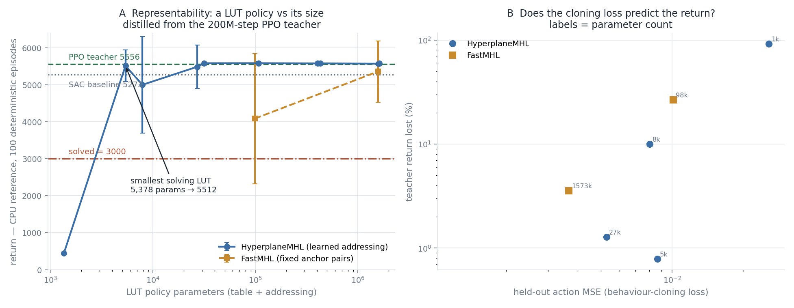
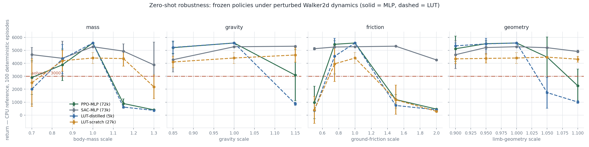
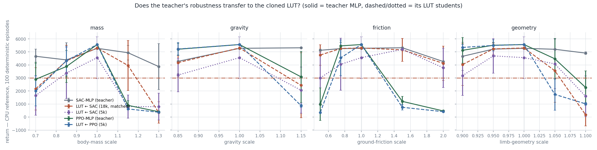

# Walker2d-v5 baselines — results (issue #75, roadmap step 1)

Both baselines are **solved** by the issue's definition (mean return ≥ 3000 over 100
deterministic episodes). Everything below was measured on gpustar (RTX 5090).

## Headline

| baseline | env-steps | wall-clock | 100-ep deterministic eval | solved |
|---|---:|---:|---|:--:|
| **SAC** (SB3, CPU-env, the pinned reference) | 1M | 1.76 h | **5273.4 ± 33.9** | ✅ |
| **MJX/PPO** (GPU-parallel, solver 10/8) | 200M | **0.46 h** | **5555.5 ± 34.4** *(in the CPU reference env)* | ✅ |

Read this as a **wall-clock and throughput** result, not a sample-efficiency one: PPO
used 200× the environment steps. What it buys is that a full Walker2d run costs **27
minutes** instead of 1.8 hours — which is the property the CMA-ES LUT arm (roadmap
step 3) actually needs, since that arm's cost is dominated by rollouts.

## SAC baseline (`exp_c01_sac_baseline`)

Issue spec, verbatim: MLP [256,256] ReLU, lr 3e-4, buffer 1e6, batch 256, γ 0.99,
τ 0.005, train_freq 1, gradient_steps 1, learning_starts 10k, auto-entropy
(target −6), 1M steps, seed 0.

* **Final: 5273.4 ± 33.9** over 100 deterministic episodes (`run_seed0/summary.json`).
* Sample-efficiency milestones (the issue's checkpoints), 10-episode eval:

  | steps | return |
  |---:|---:|
  | 100k | 520.4 |
  | 300k | 3898.8 |
  | 1M | 5274.6 |

* Wall-clock 1.76 h at 157.6 fps. Full curve in `sac_curve.csv`.
* Seeds 1 and 2 were started and then **stopped at 125k steps** once the GPU-parallel
  track became the main path; seed 0 alone is the pinned reference. Their partial logs
  remain in the run dirs.

**Throughput note worth keeping.** SAC's wall-clock here is *not* simulator-bound.
Profiled per env-step: `env.step` 0.067 ms (1.2%), actor inference 0.262 ms (4.8%),
**SAC gradient step 5.105 ms (93.9%)**. And the update is launch-latency-bound, not
compute-bound — batch 256 → 4096 costs only 3% more time (16× the arithmetic for
nothing). Two consequences: vectorising the environment would buy ~3%, and the default
CPU run collapses to 20 fps from torch thread-pool thrash unless threads are pinned
(pinned: 184 fps CPU, 233 fps CUDA — a 9× swing from one env var).

## MJX/PPO baseline (`exp_c02_mjx_scaffold`)

MuJoCo MJX (JAX) stepping thousands of environments in one batched GPU kernel, with a
compact purejaxrl-style PPO. 4096 envs × rollout 32 = 131,072 env-steps/iteration,
1526 iterations = **200,015,872 env-steps in 27.4 min** (~121,686 env-steps/s
end-to-end, ~130k steady-state).

* **CPU-reference eval: 5555.5 ± 34.4** over 100 deterministic episodes — evaluated in
  gymnasium's CPU `Walker2d-v5`, *not* in MJX, so it is directly comparable to SAC.
* Curve in `ppo_curve.csv` (downsampled 1/25).

### Batched-simulation throughput

Env-steps/s (**not** physics steps — Walker2d-v5 has `frame_skip=4`, so one env-step is
four `mjx.step` calls) against the measured **14,835 env-steps/s** single-env CPU
baseline:

| solver | 4,096 envs | 16,384 envs | 32,768 envs |
|---|---:|---:|---:|
| 100/50 (stock XML) | 79,569 (5.4×) | 183,733 (12.4×) | 175,497 (11.8×) |
| **10/8 (adopted)** | 158,802 (10.7×) | **340,190 (22.9×)** | 317,702 (21.4×) |
| 4/4 | 178,350 (12.0×) | 388,124 (26.2×) | 390,822 (26.3×) |

GPU memory stays trivial — 4.9 GB of 32 GB at 32,768 envs. Fusing the four frame-skip
physics steps into a single jitted `lax.scan`, rather than four dispatches, was worth
**3×** on its own.

### The 10/8 solver decision, and its cross-check

`walker2d_v5.xml` ships `solver iterations=100 / ls_iterations=50`. Reducing them is
standard MJX practice for GPU throughput but **changes the dynamics**, so it was
measured rather than assumed (`cross_check.py`).

**Open-loop** — identical initial state and action sequence, 200 env-steps, mean |Δqpos|:

| comparison | mean | @50 | @200 |
|---|---:|---:|---:|
| MJX @100/50 vs CPU | 0.3399 | 0.0469 | 1.4921 |
| MJX @10/8 vs CPU | 0.3409 | 0.0468 | 1.5888 |
| MJX @10/8 vs MJX @100/50 | 0.0319 | 0.0004 | 0.1261 |

The reduced solver is **not** the source of the disagreement. MJX@100/50 already
diverges from CPU MuJoCo by 0.3399 — that is the MJX-vs-MuJoCo-C engine gap, present
at any solver setting. Going to 10/8 moves it to 0.3409, i.e. **+0.3%**, while 10/8 vs
100/50 *within* MJX differs an order of magnitude less than either differs from CPU.
The comparability cost was paid by choosing MJX at all; 10/8 adds essentially nothing.

**Closed-loop** — the same policy evaluated in three engines:

| engine | return |
|---|---|
| MJX @10/8 (trained in) | 1160.7 ± 55.4 |
| MJX @100/50 (stock) | 1157.9 ± 50.5 |
| **CPU Walker2d-v5 (reference)** | **1178.3 ± 51.5** |

**Transfer gap 10/8 → reference: +1.5%**, inside the ±51 spread and in the *favourable*
direction. Confirmed again at full scale: the 200M-step policy scored ~5272 by the
in-training proxy under MJX@10/8 and **5555.5 in the CPU reference**.

## Two measurement traps recorded

1. **The in-training proxy overestimates.** `mean reward/step × 1000` assumes every
   episode survives 1000 steps. For a weak policy it is badly optimistic (proxy 2678 vs
   deterministic 1161); once the policy stops falling the two converge (5272 vs 5555).
   Quote the deterministic eval, not the proxy.
2. **Physics steps ≠ env-steps.** `frame_skip=4`, so a raw `mjx.step` count overstates
   throughput 4× against the CPU baseline. All numbers here are env-steps.

## Artifacts not in git

Excluded by `.gitignore` (see it for the list) and regenerable:

| artifact | where | regenerate |
|---|---|---|
| SAC checkpoints (21 × 3.2 MB) | `exp_c01_sac_baseline/run_seed0/ckpt/` | `launch.sh 0 1000000` (1.8 h) |
| PPO policy weights (570 KB) | `exp_c02_mjx_scaffold/ppo_policy_full.msgpack` | `ppo_mjx.py --iters 1526 …` (27 min) |
| Gait videos (1.6 MB each) | `walker2d_sac_step650000.mp4`, `walker2d_mjx_ppo_200M_trackcam.mp4` | `eval_and_render.py` / `render_cpu.py` |
| Full per-iteration PPO log | `ppo_mjx_full.json` (482 KB) | downsampled copy **is** committed as `ppo_curve.csv` |

Both gait videos were posted to the Slack thread; happy to attach them to issue #75 on
request rather than committing them.

**Rendering gotcha:** render with the model's own camera (`camera="track"` — the
`<camera name="track" mode="trackcom">` defined in `walker2d_v5.xml`), *not* a camera
reconstructed from `DEFAULT_CAMERA_CONFIG`. Gymnasium uses the model camera
(`cam.type == mjCAMERA_FIXED`, `fixedcamid == 0`), which makes those config keys inert;
using the model camera reproduces gymnasium's frames **pixel-identically** (verified,
mean |diff| = 0.0), whereas a reconstructed one does not.

---

# Phase 1–2: LUT distillation and the representability curve (exp_c03)

**The keystone result: a LUT policy can represent this controller, and at a fraction of
the teacher's size.** Every number below is the deterministic 100-episode return in the
**CPU reference env** — never a training proxy.

Teacher: the 200M-step MJX/PPO policy (**5555.5 ± 34.4**). Dataset: 4,001,792
(obs → clipped teacher action) pairs, collected in batched MJX at 126k pairs/s (32 s),
half the envs driven with exploration noise for DAgger-style state coverage.

## The curve

| config | params | rows | held-out action MSE | return (CPU ref, 100 ep) | teacher retention | solved |
|---|---:|---:|---:|---|---:|:--:|
| hyperplane nap4 tph8 | 1,346 | 16 | 0.0255 | 441 ± 31 | 7.9% | — |
| **hyperplane nap4 tph32** | **5,378** | 16 | 0.0086 | **5512 ± 431** | **99.2%** | **✅** |
| hyperplane nap6 tph16 | 7,874 | 64 | 0.0080 | 4999 ± 1301 | 90.0% | ✅ |
| hyperplane nap8 tph16 | 26,882 | 256 | 0.0053 | 5484 ± 589 | 98.7% | ✅ |
| hyperplane nap6 tph64 | 31,490 | 64 | 0.0030 | 5583 ± 29 | 100.5% | ✅ |
| *fast* nap8 tph64 | 98,306 | 256 | 0.0101 | 4084 ± 1764 | 73.5% | ✅ |
| hyperplane nap8 tph64 | 107,522 | 256 | 0.0020 | 5584 ± 38 | 100.5% | ✅ |
| hyperplane nap10 tph64 | 404,738 | 1024 | 0.0015 | 5577 ± 38 | 100.4% | ✅ |
| hyperplane nap8 tph256 | 430,082 | 256 | 0.0012 | 5579 ± 33 | 100.4% | ✅ |
| *fast* nap10 tph256 | 1,572,866 | 1024 | 0.0037 | 5359 ± 828 | 96.5% | ✅ |
| hyperplane nap12 tph64 | 1,586,690 | 4096 | 0.0012 | 5569 ± 39 | 100.2% | ✅ |
| hyperplane nap10 tph256 | 1,618,946 | 1024 | 0.0013 | 5575 ± 32 | 100.4% | ✅ |

**Smallest LUT clearing 3000: 5,378 parameters → 5512 ± 431 (99.2% of teacher).**
For scale, the SAC actor is 73,484 parameters — so the smallest solving LUT is **~14×
smaller than a comparable MLP policy**, and it also beats the SAC baseline (5273.4).

Three things the curve says:

1. **The transition is a cliff, not a slope.** 1,346 params gives 441 (a policy that
   falls immediately); 5,378 gives 5512. Between those two points the policy goes from
   useless to essentially teacher-equivalent. Below the cliff the table cannot address
   finely enough to separate the states that matter.
2. **It saturates immediately above the cliff**, at ~5580 (100.4–100.5% of teacher)
   from 31k params onward — 300× more parameters buys nothing. Several configs slightly
   *exceed* the teacher, plausibly because behaviour cloning smooths the PPO mean.
3. **Learned addressing matters far more than table size.** At comparable size,
   FastMHL's fixed anchor pairs give 4084 ± 1764 where HyperplaneMHL gives 5584 ± 38 —
   and even at 1.57M params FastMHL only reaches 5359 ± 828. Note the *variance*: the
   fixed-anchor policies are erratic (±1764) where the learned ones are metronomic
   (±38). Spending parameters on *where to look* beats spending them on *what to store*.

Variance is itself a readout of competence here: every config at ≥100% retention has
σ ≈ 30–40 (never falls), while marginal ones sit at σ = 400–1800 (falls sometimes).

## Two bugs that had to be fixed before any of this worked

Both produced a *silently* untrainable setup rather than an error, so they are worth
recording:

1. **The labels were outside the action space.** The PPO head is an unbounded Gaussian
   mean, but the environment applies `clip(a, -1, 1)` — so the teacher's *behaviour* is
   the clipped action. Regressing the raw mean put 63% of targets outside the reachable
   set (`mean(y²) = 7.53` vs 0.86 clipped) and weighted the loss towards magnitudes the
   env discards.
2. **A `tanh` on the student head.** The clipped teacher sits *exactly* at ±1 about 63%
   of the time; `tanh` reaches ±1 only asymptotically, so MSE demanded ever-growing
   pre-activations and the gradient died. The LUT stores arbitrary reals — emit raw and
   let the env clip, exactly as the teacher is clipped.

Before: action MSE 3.23 (*worse than predicting zeros*, whose MSE is 0.86) and a return
of 405. After: MSE 0.006 and a solved policy.

## Scaling limit found

`hyperplane nap12 tph256` (6.3M params) **OOMs at batch 4096**: the always-soft backward
materialises a full-K surrogate of shape [batch, n_tables, K] = 4096 × 256 × 4096, which
is ~17 G elements. This is a property of the soft-backward *training* path, not of the
LUT itself — the hard forward at that size is cheap. Rerunning at a smaller batch; the
curve has saturated far below this point regardless.

---

# The JAX LUT port (exp_c04)

The hard forward of `HyperplaneMultiHeadLUT` ported to JAX in ~10 jittable lines, so a
LUT policy can be evaluated inside the MJX rollout loop (gradient-free search needs only
the forward).

**Verified bit-for-bit against torch**, fp32, autocast off:

| config | max abs diff (JAX − torch) | verdict |
|---|---:|---|
| nap4 tph8 h1 | 0.000e+00 | **exact** |
| nap6 tph16 h1 | 0.000e+00 | **exact** |
| nap8 tph64 h1 | 0.000e+00 | **exact** |
| nap10 tph256 h1 | 1.073e-06 | fp32 sum-order (bound 8.0e-06) |
| nap12 tph64 h2 | 0.000e+00 | **exact** |

**The first attempt failed at max |Δ| = 1.4e-1** — table-entry-sized, i.e. *wrong rows*,
not arithmetic drift. Cause: **JAX defaults to TF32 for fp32 matmuls on GPU and torch
does not.** TF32's ~10-bit mantissa perturbs the pre-activation `aᵢ`, and near a decision
boundary that flips `1[aᵢ > 0]`, selecting a different row. The fix —
`precision=jax.lax.Precision.HIGHEST` — is a **correctness requirement for a rank-coded
primitive, not a performance knob**, and is commented as such in `jax_lut.py`. This is
the same discrete-flip failure the torch module's own docstring warns about for bf16,
arriving from the other framework.

The verification harness deliberately distinguishes "wrong row" from "sum-order noise"
and fails loudly rather than passing on a loose tolerance; the torch↔JAX handoff is an
.npz because the two frameworks live in separate venvs.

---

# Phase 3: the gradient-free ceiling (exp_c05)

Scalable ES over batched MJX rollouts. **Vanilla CMA-ES is inapplicable here** — it
maintains a d×d covariance, which at d ≈ 5–8k is 25–64 M entries and O(d³) per update —
so this uses OpenAI-ES (antithetic mirrored sampling + rank normalisation) and
sep-CMA-ES (diagonal covariance), both O(d).

Each run: 150 generations × 128 population × 2 episodes × horizon 400 = **15.36 M
env-steps**, ~20 min. MJX fitness is a horizon-400 proxy; the CPU-reference column is
the comparable number.

| run | params | MJX fitness | CPU reference (30 ep) | solved |
|---|---:|---:|---|:--:|
| MLP · sep-CMA-ES | 1,830 | 1391.6 | 2996.7 ± 913.8 | — (just below) |
| MLP · OpenAI-ES | 1,830 | 1353.4 | 2051.1 ± 157.7 | — |
| LUT · OpenAI-ES | 7,872 | 976.3 | 904.0 ± 222.6 | — |

**A clean negative, and a useful one.** At this budget gradient-free search does *not*
solve Walker2d — sep-CMA-ES reaches the edge of the bar with a σ of ±914, meaning it
still falls often, against PPO's 5555 and SAC's 5273. The harness demonstrably
optimises (mean fitness climbs from ~5 to ~1400 over 150 generations), which is what
Phase 3 was for; it simply needs far more budget to compete.

**The LUT is harder to evolve than the MLP** (904 vs 2051 under identical settings).
This does *not* contradict Phase 1, where a 5,378-parameter LUT represented the policy
at 99.2% retention. The gap is **searchability, not capacity**: 4.3× the search
dimension, and discrete addressing means a perturbation either changes nothing or jumps
to a different row — a rugged, partly-flat landscape that isotropic Gaussian ES handles
badly. **A LUT is easy to fill and hard to evolve.**

Single seed, one budget — indicative rather than settled.

---

# Phase 4: a LUT trained FROM SCRATCH by backprop (exp_c06)

**The headline: yes — 4406.9 ± 426.8, solved, from random init with no teacher.**

## The ported backward, and its verification

The differentiable backward is a **hybrid**, and reproducing that faithfully is the
whole job:

* **table weights** → the honest *hard* gradient: a 1-row scatter of `grad_out` at the
  row the forward actually selected (not a softmax-weighted average);
* **x, hyperplanes, temperatures** → the *soft* full-K surrogate
  `y = Σ_k softmax(ts_k/T_sel)·W[t,k,:]`, with the sign pattern pinned to the row the
  forward chose and the table weights held constant.

Rather than transcribe torch's softmax backward by hand (easy to get subtly wrong,
hard to notice), the soft path is written once as a forward function and differentiated
by JAX itself inside a `jax.custom_vjp`; `stop_gradient` on the weights reproduces
torch's `d_sel_soft` path exactly. Temperatures are parametrised as log T, as in torch,
so their gradients match without a chain-rule fixup.

**Verified against torch's custom autograd** (fp32, hard forward, autocast off):

| tensor | max abs Δ | max rel Δ |
|---|---:|---:|
| forward `y` | 0.000e+00 | **exact** |
| `grad_x` | 7.00e-07 | 8.5e-07 |
| `grad_w` (hyperplanes) | 2.03e-06 | 7.9e-07 |
| `grad_b` | 1.19e-06 | 6.0e-07 |
| `grad_weights` (table) | 2.86e-06 | 1.8e-07 |
| `grad_log_T_soft` | 7.15e-07 | 2.5e-06 |
| `grad_log_T_sel` | 7.15e-07 | 4.6e-07 |

**Worst relative disagreement 2.5e-06 — fp32 noise. PASS.**

**TF32 struck again, and more quietly this time.** The forward needed
`Precision.HIGHEST` because a TF32 sign flip picks a whole wrong row — an obvious,
loud failure. The *backward* needs it for a subtler reason: its einsums and the vjp's
GEMMs also default to TF32, which showed up as ~5e-3 relative gradient error. That is
small enough to pass a lax tolerance and be dismissed as "close enough", while
silently degrading every gradient. Pinning precision took the worst error from
**5.3e-03 to 2.5e-06 — a 2000× improvement.**

**A finite-difference caveat worth recording:** the *hard* forward is piecewise constant,
so its true derivative is 0 almost everywhere and finite-differencing it is
meaningless. The FD check therefore targets the soft surrogate — the thing the backward
actually claims to differentiate. At fp32 that probe initially reported 8e-1 relative
error on a gradient that is provably correct; it is dominated by cancellation noise
(~1e-7/ε), not by the derivative. A false alarm, not a bug.

## From-scratch training

PPO on the batched MJX loop with a random-init LUT as the policy (a small MLP critic is
scaffolding for the update, not the representation under test), gradients through the
verified surrogate.

* LUT: nap 8, tph 16 → **24,576 table + 2,304 addressing = 26,880 params**
* 600 iterations × 1024 envs × rollout 32 = **19.66 M env-steps in 5.1 min**
  (~64,600 env-steps/s)
* proxy return climbs 141 → 4245 monotonically

**CPU reference, deterministic, 100 episodes: 4406.9 ± 426.8 → SOLVED.**

## What the three routes together say

| route | LUT params | CPU reference | solved |
|---|---:|---|:--:|
| distillation from a PPO teacher | 5,378 | 5512 ± 431 | ✅ |
| **backprop from scratch (no teacher)** | **26,880** | **4406.9 ± 426.8** | **✅** |
| evolution (OpenAI-ES) | 7,872 | 904 ± 223 | ✗ |

A LUT can be **filled** (distillation), and it can be **trained** (backprop) — but at
this budget it cannot be **evolved**. The differentiable surrogate is doing real work:
it is the difference between 4407 and 904. For the #74 spiking track, that argues for
obtaining LUT tables by gradient training and *then* compiling them, rather than hoping
to search for them directly.

---

# Phase 5: zero-shot robustness under perturbed dynamics (exp_c07)

**The question:** does a lookup table — which *memorises* state→action — generalise to a
slightly different robot as well as a network that *computes* it?

**The answer is that the question is confounded, and the confound is the interesting
part: the degradation profile is inherited from the TRAINING ROUTE, not determined by
the representation.**

Four frozen policies × 4 perturbation axes × 18 settings × 100 deterministic episodes
= 7,200 episodes. No retraining; the LUT policies' stored observation standardisers are
applied unchanged (re-fitting them would leak knowledge of the new dynamics and stop
this being zero-shot).

## Nominal sanity check

The `value = 1.0` column must reproduce each policy's known score, or the harness is
contaminating the nominal case:

| policy | params | harness nominal | known | Δ |
|---|---:|---:|---:|---:|
| PPO-MLP | 71,948 | 5566.6 | 5555.5 | +0.2% |
| SAC-MLP | 73,484 | 5277.4 | 5273.4 | +0.1% |
| LUT-distilled | 5,378 | 5567.1 | 5511.9 | +1.0% |
| LUT-scratch | 26,880 | 4406.9 | 4406.9 | 0.0% |

All within 1%. (The harness draws its reset noise from its own PCG64 stream rather than
gymnasium's, so individual episodes differ; degradation is therefore measured against
each policy's own harness nominal, not against the historical number.)

## Degradation

Worst-case retained fraction of each policy's own nominal, per axis:

| policy | mass | gravity | friction | geometry | mean |
|---|---:|---:|---:|---:|---:|
| **SAC-MLP** | 73.4% | 81.0% | 80.7% | 88.4% | **80.9%** |
| LUT-scratch | 49.4% | 93.1% | 6.6% | 97.9% | 61.8% |
| PPO-MLP | 7.3% | 55.4% | 8.3% | 40.8% | 28.0% |
| LUT-distilled | 6.5% | 15.7% | 6.3% | 18.2% | 11.7% |

Range still clearing the 3000 bar:

| policy | mass | gravity | friction | geometry |
|---|---|---|---|---|
| **SAC-MLP** | **0.7–1.3 (all)** | **0.85–1.15 (all)** | **0.5–2.0 (all)** | **0.9–1.1 (all)** |
| LUT-scratch | 0.85–1.15 | 0.85–1.15 (all) | 0.75–1.0 | 0.9–1.1 (all) |
| PPO-MLP | 0.85–1.0 | 0.85–1.15 (all) | 0.75–1.0 | 0.9–1.05 |
| LUT-distilled | 0.85–1.0 | 0.85–1.0 | 0.75–1.0 | 0.9–1.0 |

## The finding: robustness is inherited, not representational

Correlating each policy's 18-point degradation profile against the others:

| | PPO-MLP | SAC-MLP | LUT-distilled | LUT-scratch |
|---|---:|---:|---:|---:|
| PPO-MLP | 1.000 | 0.413 | **0.930** | 0.730 |
| SAC-MLP | 0.413 | 1.000 | 0.238 | 0.319 |
| LUT-distilled | **0.930** | 0.238 | 1.000 | 0.610 |
| LUT-scratch | 0.730 | 0.319 | 0.610 | 1.000 |

**LUT-distilled tracks its PPO teacher at r = 0.930** — the highest off-diagonal
correlation in the matrix, and its mean absolute deviation from the teacher (566) is a
third of SAC's (1694). It fails where the teacher fails and survives where the teacher
survives. Behaviour cloning copies the teacher's *robustness envelope*, not just its
nominal return.

Meanwhile the two MLPs — same architecture class, same task, same nominal ballpark —
differ from each other more than the LUT differs from its teacher (r = 0.413).
**SAC's MLP clears the bar across the entire swept range on every axis; PPO's MLP
collapses to 7% of nominal at mass ×1.15.** That is a training-algorithm difference
(off-policy with a large diverse replay buffer and entropy regularisation, versus
on-policy PPO converged onto a narrow high-return gait), not a representation
difference.

## Plain-language verdict

* **Does the lookup table generalise worse than a neural network? Not because it is a
  lookup table.** The distilled LUT is fragile *because its teacher is fragile* — it
  reproduces PPO's failure modes almost exactly at 13× fewer parameters.
* **A LUT is not inherently brittle.** `LUT-scratch`, trained directly rather than
  cloned, retains 61.8% on average against PPO-MLP's 28.0%, and is *more* robust than
  that MLP on three of four axes — including 93% on gravity and 98% on geometry.
* **The dominant variable is the training route.** SAC ≫ everything else, and it is the
  only policy that never drops below the bar anywhere in the swept range.
* **Practical consequence for the #74 spiking track:** if a compiled LUT needs to
  tolerate hardware or body variation, the lever is *which policy you clone and how it
  was trained*, not the table itself. Distilling from SAC rather than PPO is the obvious
  next experiment, and it is cheap — distillation takes 39 seconds.

Caveats: single seed per policy; the geometry axis also shifts the observation
distribution, so it confounds dynamics change with input-distribution shift; and the
friction axis collapses *every* policy at ×1.5–2.0, which looks like a task limit rather
than a policy property.

---

# Phase 6: does choosing the teacher buy robustness? (exp_c08)

Phase 5 ended with a prediction: the distilled LUT was fragile because *PPO* is fragile,
so distilling from SAC — which never dropped below the bar anywhere in the swept range —
should produce a more robust table. This tests it, with everything else held identical:
same 4M-pair dataset size, same DAgger noise injection, same clipped-action labels, same
`hyperplane nap4/tph32` (5,378 params), same 6 epochs, same perturbation grid, same
frozen standardiser.

## Nominal

| policy | nominal | retention of own teacher |
|---|---:|---:|
| SAC-MLP (teacher) | 5277.4 | — |
| **LUT ← SAC** (5,378 params) | **4560.1** | 85.6% |
| PPO-MLP (teacher) | 5566.6 | — |
| LUT ← PPO (5,378 params) | 5567.1 | 99.2% |

Distillation took **8 seconds**; the SAC dataset took 195 s to collect (CPU rollouts,
batched — SAC is torch so it cannot use the MJX collector).

## Robustness

Worst-case retained fraction of each policy's own nominal:

| policy | mass | gravity | friction | geometry | mean | cells ≥3000 |
|---|---:|---:|---:|---:|---:|---:|
| SAC-MLP (teacher) | 73.4% | 81.0% | 80.7% | 88.4% | **80.9%** | **18/18** |
| **LUT ← SAC** | 17.4% | 45.2% | 65.9% | 35.0% | **40.9%** | **13/18** |
| PPO-MLP (teacher) | 7.3% | 55.4% | 8.3% | 40.8% | 28.0% | 11/18 |
| LUT ← PPO | 6.5% | 15.7% | 6.3% | 18.2% | 11.7% | 9/18 |

**Yes — the teacher choice buys robustness.** The SAC-taught LUT beats the PPO-taught
LUT on *every* axis, holds 40.9% of nominal against 11.7% (**3.5×**), and clears the bar
in 13 of 18 perturbed environments against 9. It even beats the *PPO MLP teacher*
(28.0%, 11/18) — a 5,378-parameter table is more robust than the 71,948-parameter
network it is 13× smaller than, because it learned from a better-behaved policy.

## But the inheritance is only partial — and the correlations say why

| | SAC-MLP | LUT ← SAC | PPO-MLP | LUT ← PPO |
|---|---:|---:|---:|---:|
| SAC-MLP | 1.000 | 0.522 | 0.413 | 0.238 |
| LUT ← SAC | 0.522 | 1.000 | 0.577 | 0.583 |
| PPO-MLP | 0.413 | 0.577 | 1.000 | **0.930** |
| LUT ← PPO | 0.238 | 0.583 | **0.930** | 1.000 |

The PPO-taught LUT tracks its teacher at **r = 0.930**. The SAC-taught LUT tracks its
teacher at only **r = 0.522** — it inherits SAC's *advantage* (40.9% vs 11.7%) without
inheriting SAC's *profile*, and it captures only about half the teacher's robustness
(80.9% → 40.9%, 18/18 → 13/18).

**The likely reason is visible in the datasets.** PPO saturates **63.2%** of its actions
at ±1; SAC saturates **5.5%**. PPO is close to bang-bang control, and a rank-coded table
with 16 rows per table reproduces a near-discrete policy almost exactly — hence 99.2%
retention, σ = 431, and a near-perfect profile match. SAC's policy is smooth and
continuous, which a coarse table can only *approximate* — hence 85.6% retention, and a
nominal σ of **1603** versus 431. Once the clone is an approximation rather than a copy,
its failures are driven by its own approximation error, not by the teacher's failure
modes, which is exactly what a correlation of 0.52 rather than 0.93 looks like.

## Verdict

* **Choosing the teacher works**: SAC-taught beats PPO-taught 3.5× on mean retained
  robustness and 13/18 vs 9/18 cells, for the same 5,378 parameters and 8 seconds of
  training. It is the cheapest robustness lever found so far.
* **It transfers only partially**: the student captures roughly half of SAC's envelope,
  not all of it.
* **The obstacle is representational after all** — but it is about *smoothness*, not
  robustness. A rank-coded table clones a near-bang-bang policy almost perfectly and a
  smooth one only approximately. The high variance (σ 1603 vs 431) is the signature.
* **Actionable next step:** if a SAC-taught LUT is wanted at PPO-taught fidelity, spend
  capacity on rows — the Phase-1 curve saturates at 31k params, so nap6/tph64 is
  affordable and should absorb the smoother target far better than 16 rows per table.
  That is a 40-second experiment.

Caveats: single seed per policy; the geometry axis also shifts the observation
distribution; friction ×1.5–2.0 collapses most policies, which looks like a task limit.
Note also that the SAC-taught LUT is the *only* policy whose nominal σ (1603) is large
enough that its nominal itself is unstable — its curves should be read with that in mind.

---

# Phase 7: more capacity closes the fidelity gap but NOT the robustness gap (exp_c08b)

Phase 6 ended with a hypothesis of mine: the SAC-taught LUT retained only 85.6% of its
teacher and inherited only half its robustness *because 16 rows per table cannot
represent a smooth policy*. Give it more rows, the argument went, and it should become
both faithful **and** robust.

**Half of that is right. The robustness half is wrong, and the failure is informative.**

## Capacity sweep (SAC teacher = 5273.4)

| config | params | rows | held-out MSE | nominal mean | σ | retention |
|---|---:|---:|---:|---:|---:|---:|
| nap4 tph32 | 5,378 | 16 | 0.0052 | 4512 | 1603 | 85.6% |
| nap5 tph32 | 9,026 | 32 | 0.0042 | 4275 | 1882 | 81.1% |
| nap6 tph32 | 15,746 | 64 | 0.0034 | 5157 | 628 | 97.8% |
| **nap5 tph64** | **18,050** | 32 | 0.0028 | **5305** | **41** | **100.6%** |
| nap7 tph32 | 28,610 | 128 | 0.0028 | 5248 | 485 | 99.5% |
| nap6 tph64 | 31,490 | 64 | 0.0022 | 5281 | 38 | 100.1% |

**The fidelity half of the hypothesis is confirmed.** The smallest config that matches
the teacher is **nap5/tph64 at 18,050 params → 5305 ± 41**, exceeding SAC's 5277 with the
nominal σ collapsing from **1603 → 41**, a 39× reduction. Capacity was indeed the
obstacle to faithfully cloning a smooth policy.

Note *which* capacity mattered: going 16→32 rows at fixed tph barely helped (and
nap5/tph32 was briefly *worse*), while doubling the number of **tables** at 32 rows fixed
it. More independent tables beat more rows per table for this target.

## But the robustness envelope did not follow

| policy | mass | gravity | friction | geometry | mean | cells ≥3000 | r vs SAC |
|---|---:|---:|---:|---:|---:|---:|---:|
| SAC-MLP (teacher) | 73.4% | 81.0% | 80.7% | 88.4% | **80.9%** | **18/18** | 1.000 |
| LUT ← SAC (18k, *matched*) | 6.5% | 46.0% | 77.7% | 3.3% | 33.3% | 14/18 | **0.510** |
| LUT ← SAC (5k) | 17.4% | 45.2% | 65.9% | 35.0% | 40.9% | 13/18 | 0.522 |
| PPO-MLP (teacher) | 7.3% | 55.4% | 8.3% | 40.8% | 28.0% | 11/18 | 0.413 |
| LUT ← PPO (5k) | 6.5% | 15.7% | 6.3% | 18.2% | 11.7% | 9/18 | 0.238 |

Matching the teacher at nominal bought **one extra cell** (14/18 vs 13/18) and *lowered*
mean retained robustness (33.3% vs 40.9%). Correlation with the SAC teacher is
**0.510 — statistically unchanged from the 5k clone's 0.522**, and nowhere near the
0.930 the PPO clone achieved with its teacher.

The matched clone is in fact **more brittle at the extremes**: mass ×1.3 gives 344
(against the 5k clone's 795) and geometry ×1.1 gives 173 (against 1595).

## What this says

**Nominal fidelity and robustness are separate axes, and cloning only transfers the
first.** A bigger table reproduces the teacher more precisely *on the state distribution
it was shown* — and that is exactly what makes it fit that distribution more tightly and
fall off it faster. The extra capacity was spent memorising the nominal trajectory
manifold, not the teacher's recovery behaviour, because **the dataset never contained the
teacher's responses to a heavier robot or a slipperier floor.**

This also corrects the Phase-6 reading. The high correlation of the PPO clone with its
teacher (r = 0.930) is not evidence that "cloning transfers robustness" — it is evidence
that a near-bang-bang policy is *easy to copy exactly*, failure modes included. When the
target is smooth, the clone tracks its teacher at r ≈ 0.51 no matter how much capacity it
is given. Fidelity at nominal simply does not imply behavioural agreement off-nominal.

**Practical consequence for #74:** if a compiled LUT must tolerate hardware variation,
neither a better teacher nor a bigger table is sufficient on its own. The missing
ingredient is *coverage* — the dataset has to contain the perturbed regimes. The obvious
next experiment is domain-randomised distillation: collect the SAC teacher's actions
across randomised mass/gravity/friction/geometry and distil that. It costs one more
dataset collection (~195 s) and would test directly whether the LUT's robustness ceiling
is a representation limit or a data limit. My expectation, given the above, is that it is
a data limit.

Caveats: single seed per config; the geometry axis also shifts the observation
distribution; friction ×1.5–2.0 collapses most policies (task limit).

---

# The 2×2: addressing × forward mode (exp_c10)

All cells at `nap4/tph32`, same PPO-teacher dataset, same deterministic 100-episode
CPU-reference protocol, each **trained in the mode it is evaluated in**.

| variant | params | CPU-ref mean ± σ | held-out MSE |
|---|---:|---|---:|
| **hyperplane + hybrid_smooth** | 5,378 | **5520.0 ± 356.6** | 0.0086 |
| hyperplane + hard | 5,378 | 3869.1 ± 1928.3 | 0.0144 |
| fast (anchors) + hybrid_smooth | 3,074 | 239.1 ± 4.3 | 0.0386 |
| fast (anchors) + hard | 3,074 | 261.1 ± 13.9 | 0.0537 |

And the cross number — **trained smooth, evaluated hard**:

| variant | CPU-ref mean ± σ |
|---|---|
| hyperplane, train smooth → eval hard | **462.5 ± 606.0** |
| fast, train smooth → eval hard | 255.4 ± 38.0 |

(The `fast` variants have fewer parameters because fixed anchor pairs are buffers, not
learned weights: 3,072 table + 2 temperatures, against hyperplane's extra 2,304
addressing parameters.)

## Takeaway 1 — what hard mode costs

Trained *in* hard mode, the single-read table reaches **3869 ± 1928 against 5520 ± 357**:
a **30% drop in return, and a 5.4× increase in variance.** It still clears the 3000 bar,
but it falls often rather than walking every episode.

**The cross number is the important one, and it is brutal: 5520 → 462, a 92% collapse.**
Taking a hybrid-smooth-trained table and simply switching it to single-read at inference
destroys it. The two forward modes are not interchangeable at deployment — a table must
be *trained* in the mode it will be *run* in.

That directly governs the #74 spiking track: the spiking construction implements the
**hard**, single-row, zero-multiply read. So any table destined for compilation must be
trained hard-mode from the start, and should be expected to cost ~30% against the smooth
number — not the ~0% that quoting 5520 would imply. Every LUT figure in this project
before now was hybrid_smooth; this is the correction.

## Takeaway 2 — how much learned addressing is worth

At this size, fixed anchor pairs **do not work at all**: 239 and 261, i.e. a walker that
falls immediately, against 5520 for learned hyperplanes. That is not a degradation, it is
a failure — a 23× gap.

It is consistent with, and sharper than, the earlier observation at a much larger config
(`fast` nap8/tph64 reached 4084 ± 1764 against hyperplane's 5584 ± 38). Fixed random
anchors evidently need a great deal of capacity before they can address this task at all,
while learned hyperplanes work at 5,378 parameters. **Where you look matters far more
than what you store**, and at small table sizes it is the difference between walking and
falling over.
