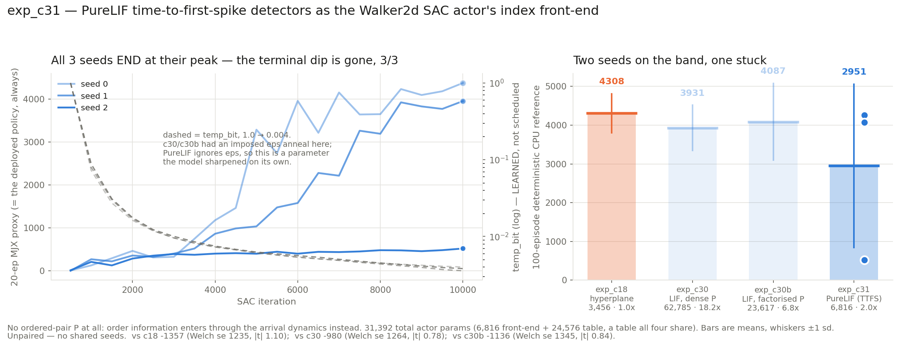

# exp_c31 — PureLIF time-to-first-spike detectors as the Walker2d SAC actor's index front-end

Third LIF front-end in this line, after exp_c30 (dense `P`) and exp_c30b (factorised `P`).
`PureLIFDetectorsMHL` on branch `exp/lif-detectors-mhl` drops the ordered-pair matrix
entirely and reads each detector by **when it first spikes**.

**Result: two of three seeds land on the baseline band; the third gets stuck at 518.**

| seed | CPU-ref 100 ep | full episodes | velocity |
|---|---:|---:|---:|
| 0 | **4262.1** ± 446.0 | 95/100 | 3.337 m/s |
| 1 | **4073.3** ± 326.8 | 99/100 | 3.103 m/s |
| 2 | **518.2** ± 24.2 | 0/100 | 1.849 m/s |
| **mean** | **2951.2 ± 2109.2** | | |

| vs | their number | delta | Welch se | \|t\| |
|---|---:|---:|---:|---:|
| exp_c18 hyperplane, 6 seeds | 4308.0 ± 500.1 | −1356.8 | 1234.7 | 1.10 |
| exp_c30 dense-P, 3 seeds | 3931.3 ± 585.8 | −980.1 | 1263.8 | 0.78 |
| exp_c30b factorised-P, 3 seeds | 4086.8 ± 991.2 | −1135.6 | 1345.5 | 0.84 |

None of those is resolvable, but that is a statement about three seeds and a bimodal
outcome, not evidence of equivalence. **The mean is not a useful summary here** — no seed
is anywhere near 2951. The honest reading is: this front-end reaches the baseline band when
it works, and it failed to on one run in three.



## Parameters — and a correction to exp_c30/c30b

| model | front-end | table | total | vs c18 total |
|---|---:|---:|---:|---:|
| exp_c18 hyperplane | 3,456 | 24,576 | 28,032 | 1.00× |
| **exp_c31 PureLIF** | **6,816** | 24,576 | **31,392** | **1.12×** |
| exp_c30b factorised-P | 23,617 | 24,576 | 48,193 | 1.72× |
| exp_c30 dense-P | 62,785 | 24,576 | 87,361 | 3.12× |

exp_c30 and exp_c30b were written against a baseline of **49,152**, which is wrong. That is
exp_c29's *table-only* count for its nap6/tph64 cells (`tph × 2**nap × 12`); exp_c29's own
totals were 56,064–70,912. exp_c18 — the 4308.0 ± 500.1 anchor — is nap6/tph32: table
24,576 plus hyperplane `w`/`b` 3,456, **total 28,032**. Corrected in both READMEs on
2026-08-03. No returns changed; the anchor was re-verified from all six checkpoints.

**Read the front-end column.** All four carry the identical 24,576-entry table, so totals
are dominated by a component none of them touches. PureLIF's addressing is **1.97×** the
hyperplane's, against 6.8× for exp_c30b and 18.2× for exp_c30 — the only LIF variant in the
chapter that is close to the baseline's addressing cost.

## What PureLIF actually is

Not a trimmed LIFDetectorsMHL. Four differences, two of which change what the trainer can do:

1. **Time to first spike.** LIFDetectorsMHL evaluates one smoothed membrane at a learned
   read time `r` and compares it to `theta`. PureLIF integrates the membrane **in arrival
   order** (hence a sort), finds the first arrival where it crosses a **fixed**
   `theta_mem = 1.0`, and uses that crossing *time*. The learned quantity is the deadline `L`.
2. **The bit is flipped** — `bit = 1[t* < L]`, early spike means detected. Opposite to
   LIFDetectorsMHL, where a larger membrane meant detected.
3. **No `P` at all.** Order information enters through the arrival dynamics rather than
   through the 55,488-param matrix exp_c30b existed to factorise.
4. **`eps` is inert.** The module accepts it for API parity and ignores it. Asserted, not
   assumed: eps=0.7 vs eps=0.05 gives **0.0** difference on both forward modes.

## The terminal dip is gone — 3 of 3, as predicted

exp_c30 and exp_c30b had an eps anneal *we* imposed, on a horizon *we* chose, and **6 of 6
runs peaked before the end and gave return back** over the final sharpening. PureLIF has no
such knob: sharpness is two trainable per-LUT parameters (`T_cross`, `temp_bit`), and
`mode="hard"` and `mode="st"` share a forward value identically at every point in training.

So there is nothing to sharpen at the end and no train/eval regime to match. **All three
seeds finish at their peak — drop exactly 0.0 for each.** `temp_bit` fell 1.0 → 0.004 on
its own in every run. This was predicted from the structure before the seeds were launched,
which is the main reason it is worth recording: the dip was an artefact of our schedule, not
a property of LIF actors.

## Seed 2 did not fail to start — it found a bad gait and stayed

Worth separating from the cold start, because the diagnostics say the opposite of what the
return suggests. At init only ~3.3% of addresses are nonzero (almost nothing crosses the
fixed threshold before the deadline, so nearly every table is pinned to row 0), and the
obvious failure mode is never escaping that. Seed 2 escaped it fastest and furthest:

| seed | row coverage | bits set | result |
|---|---:|---:|---|
| 0 | 78.4% | 39.3% | 4262.1 |
| 1 | 84.0% | 37.5% | 4073.3 |
| 2 | **87.8%** | 33.7% | **518.2** |

It has the **highest** coverage of the three. It reached ~400 by iteration 2,000 and moved
27 points over the next 8,000 — a stable, well-addressed, thoroughly bad policy: 0/100 full
episodes, mean length 182, 1.849 m/s. It falls over quickly and consistently. Coverage and
bit-occupancy are therefore *not* sufficient health checks for this actor; they were
designed to catch the cold-start trap and they do, but they say nothing about gait quality.

Collapsed seeds are not new in this chapter — exp_c13 nap6/tph32 s1 hit 917.6, nap8/tph32 s0
1063.3, exp_c29 wave-3 grid s2 1331.4 — so this is not unique to PureLIF. But it is 1 in 3
here against 0 in 6 for the exp_c18 anchor, and three seeds cannot tell those apart. **More
seeds is the single most useful next step**, and cheaper than it was: see below.

## Cost

348–364 min per seed, all three concurrent, finishing 19:58–20:43Z from a 14:38Z start.

Running them concurrently rather than queued was worth it, but by less than first measured.
A controlled 1-vs-3 test gave **2.33×**, which flattered the result because JIT compile time
parallelises across CPU cores and dominates short probes; steady-state came out nearer
**1.5×** (~6.4 h wall against ~9 h sequential). The important part is that concurrency is
possible at all: `XLA_PYTHON_CLIENT_PREALLOCATE=false` drops per-seed VRAM from JAX's
default 75%-of-card grab (24.9 GB) to a true **1.9 GB peak**, so ~16 seeds would fit.

Per-step, PureLIF is the most expensive front-end in the chapter — the sort's scatter
backward costs ~4× exp_c30 per iteration — while having the second-smallest front-end.
Parameter count and wall clock keep moving in opposite directions in this line.

## Files

| file | what |
|---|---|
| `jax_pure_lif.py` | the JAX port |
| `torch_ref_dump.py` / `parity_check.py` / `run_parity.sh` | two-venv parity, **26/26** |
| `pure_lif_sac.py` | exp_c30's trainer, repointed at this module |
| `eval_pure_cpu.py` | 100-episode deterministic CPU reference — **the only number quoted** |
| `measure_mem.py` | per-front-end peak GPU memory, one subprocess per model |
| `run_parallel_c31.sh` / `collect.py` / `plot_c31.py` / `slack_bar_c31.py` | sweep, table, figure, bar |

Parity: forwards ≤3.4e-07, `st == hard` ≤3.6e-07, all 7 gradients ≤1.5e-06, **`grad table`
exactly 0.0**, table gradient a hard scatter, nothing dead — over two cases, `init` and a
fully perturbed one. `init` alone is insufficient: every per-table parameter is identical
there and `delay` is zero, so the `(n_tables, nap)` grouping would be invisible.

## Reproduce

```bash
./run_parity.sh                      # must print PARITY OK first
nohup ./run_parallel_c31.sh > run_parallel_c31.log 2>&1 &
python collect.py                    # mjx venv
MPLCONFIGDIR=/tmp/mplcfg python plot_c31.py   # spiky venv (matplotlib)
```

SAC recipe, determinism flags and eval convention: identical to exp_c30/c30b. Only the
index front-end differs.
