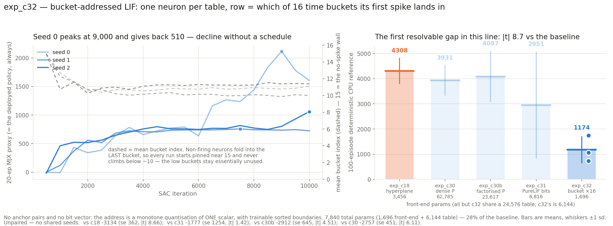

# exp_c32 — bucket-addressed LIF as the Walker2d SAC actor's index front-end

Fourth LIF front-end in this line. `BucketLIFDetectorsMHL` gives each table **one** LIF
neuron and uses **which of 16 time buckets its first spike lands in** as the row index.

**Result: the first clearly negative result in this chapter. 1174.4 ± 517.2, |t| 8.66
against the baseline, and not one of 300 evaluation episodes ran to full length.**

| seed | CPU-ref 100 ep | full episodes | velocity | mean length |
|---|---:|---:|---:|---:|
| 0 | 1739.9 ± 341.4 | 0/100 | 2.487 m/s | 497 |
| 1 | 725.5 ± 13.7 | 0/100 | 2.227 m/s | 225 |
| 2 | 1057.7 ± 200.9 | 0/100 | 2.386 m/s | 311 |
| **mean** | **1174.4 ± 517.2** | **0/300** | | |

| vs | their number | delta | Welch se | \|t\| | size (total / front-end) |
|---|---:|---:|---:|---:|---:|
| exp_c18 hyperplane, 6 seeds | 4308.0 ± 500.1 | −3133.6 | 361.7 | **8.66** | 0.28× / 0.49× |
| exp_c30 dense-P, 3 seeds | 3931.3 ± 585.8 | −2756.9 | 451.2 | 6.11 | 0.09× / 0.03× |
| exp_c30b factorised-P, 3 seeds | 4086.8 ± 991.2 | −2912.4 | 645.5 | 4.51 | 0.16× / 0.07× |
| exp_c31 PureLIF, 3 seeds | 2951.2 ± 2109.2 | −1776.8 | 1253.8 | 1.42 | 0.25× / 0.25× |

Every earlier comparison in this line came back "not resolvable at these seed counts". This
one is resolvable and it is negative. **0/300 full episodes** is the cleanest statement of
it: the policies move forward at 2.2–2.5 m/s but topple, averaging 225–497 steps of a
1,000-step episode. They are not slow walkers, they are fallers.



## Read this before attributing the result

**The requested configuration changes two things at once.** Against exp_c31 it swaps the
addressing scheme *and* cuts capacity: rows per table are `n_buckets` = 16, not `2**nap`
= 64. So the table dropped from 24,576 to 6,144 at the same time as the address became a
bucket index. **This result cannot separate "bucket addressing is worse" from "a 16-row
table is too small."** That follows from the config that was asked for, and the clean
follow-up is **64 buckets** — same scheme, same row count as the rest of the chapter,
about 10.5k params. Until that runs, the scheme itself is not convicted.

The two numbers do at least bracket the question: at 0.28× the baseline's total parameters
this is the smallest actor here by a wide margin, and the front-end alone is 0.49× — so if
the addressing were as good, the model would be winning on parameters and it is not.

## Parameters

| model | front-end | table | total | vs c18 |
|---|---:|---:|---:|---:|
| **exp_c32 bucket ×16** | **1,696** | **6,144** | **7,840** | **0.28×** |
| exp_c18 hyperplane | 3,456 | 24,576 | 28,032 | 1.00× |
| exp_c31 PureLIF | 6,816 | 24,576 | 31,392 | 1.12× |
| exp_c30b factorised-P | 23,617 | 24,576 | 48,193 | 1.72× |
| exp_c30 dense-P | 62,785 | 24,576 | 87,361 | 3.12× |

This is the only entry in the chapter whose **table** differs, which is why both columns
are quoted everywhere. Front-end 1,696 = delay 544 + w 544 + beta_raw 480 + four per-LUT
vectors of 32.

## What the model is

Not a trimmed PureLIF. The constructor **has no `n_anchor_pairs`** — passing `nap=6` is a
`TypeError`, not a no-op — and the differences follow from that:

- **One LIF neuron per table**, so `delay`/`w` are (32, 17) rather than (192, 17).
- **The row is a monotone quantisation of one scalar.** Every other front-end in this
  chapter addressed with independent sign tests, so rows were an unordered set and row 5
  had nothing to do with row 4. Here row *m* means "fired in the *m*-th time interval" and
  **adjacent rows are adjacent in time**. The trust region on row deltas is operating in a
  genuinely different geometry.
- **Boundaries are trainable and sorted by construction**: `beta_base + cumsum(softplus(
  beta_raw))`. softplus is strictly positive, so no projection step exists and no optimiser
  step can produce a crossed pair. `eval_bucket_cpu.py` asserts it at load anyway.
- **No `temp_bit`**; `T_bkt` (bucket-partition softness) plays that role. Both it and
  `T_cross` are trainable per-LUT, init 1.0, unfrozen.

## The low buckets never get used

The most concrete mechanical finding, and the one worth carrying into the 64-bucket run.
Non-firing neurons fold into the **last** bucket by construction, so every run starts pinned
near index 15 — the torch reference reaches only 7 of 16 buckets at init. All three seeds
escape that wall, but only partway:

| seed | bucket mean ± sd (final) | row coverage |
|---|---:|---:|
| 0 | 11.10 ± 3.83 | 87.5% |
| 1 | 10.01 ± 4.14 | 85.0% |
| 2 | 11.39 ± 4.15 | 83.0% |

The mean never falls below ~10 of 15. Cumulative coverage of 83–88% is measured over
training, but the *distribution* sits in the top third of the range throughout: the low
buckets — early spikes, i.e. strongly-driven neurons — are essentially unused. The model is
addressing with roughly the top third of its already-small table. `T_bkt` self-sharpened
1.0 → 0.005 in every seed, so this is not a softness artefact; the hard indices really are
concentrated there.

## Correcting an over-general reading of exp_c31

exp_c31 ended at its peak in 3 of 3 seeds, and I framed that as the terminal dip being gone
because there is no imposed schedule to sharpen. **That was too strong.** Here:

| seed | peak | final | given back |
|---|---:|---:|---:|
| 0 | 2117.0 @ 9,000 | 1607.4 | **509.6** |
| 1 | 757.9 @ 7,500 | 724.7 | 33.2 |
| 2 | 1059.6 @ 10,000 | 1059.6 | 0.0 |

Two of three decline from peak with no schedule anywhere in the model. The defensible claim
is narrower: removing the anneal removed the **systematic** dip that hit 6 of 6 runs in
exp_c30/c30b, but it does not prevent ordinary late-training decline. exp_c31's 3/3 was a
real observation about those three runs, not a structural guarantee.

## Verification

`run_parity.sh` → **40/40** over two cases (`init` and fully perturbed), against the torch
module staged read-only from `exp/lif-detectors-mhl`. Beyond forwards and gradients it
compares the **intermediates** — `boundaries`, `t_hard`, `t_soft`, the soft partition `g` —
because a boundary cumsum along the wrong axis would still place every sample in *some*
bucket, leaving the output wrong rather than malformed. Two structural invariants are
asserted directly: the partition sums to 1 (max|Σg−1| = 1.2e-07; a partition summing to
0.97 would train happily while silently scaling every addressed row) and the boundaries are
strictly increasing (min gap 1.31 perturbed). `grad table` is bit-identical to torch at
rel 0.0, the table gradient is a hard one-row-per-table scatter, and all 8 parameters
receive gradient. `eps` verified inert: 0.7 vs 0.05 → 0.0 on both forward modes.

The 5090 `Tensor.prod` problem that bit exp_c30 **cannot arise here** — this model
addresses by comparison, not by a product of Bernoullis. Nothing on nucstar's branch was
modified.

## Cost

83.3–85.2 min per seed, all three concurrent, 21:54Z → 23:21Z (**1.44 h**). Peak GPU memory
**1,348 MiB per seed** with `XLA_PYTHON_CLIENT_PREALLOCATE=false` — the smallest in the
chapter; three seeds used ~4.0 GB of 32.6 GB. My ETA of ~3.1 h was pessimistic by 2×, the
opposite error to exp_c31, where I was optimistic by 1.6×.

## Files

| file | what |
|---|---|
| `jax_bucket_lif.py` | the JAX port |
| `torch_ref_dump.py` / `parity_check.py` / `run_parity.sh` | two-venv parity, **40/40** |
| `bucket_sac.py` | exp_c31's trainer, repointed at this module |
| `eval_bucket_cpu.py` | 100-episode deterministic CPU reference — **the only number quoted** |
| `run_parallel_c32.sh` / `collect.py` / `plot_c32.py` / `slack_bar_c32.py` | sweep, table, figure, bar |

## Reproduce

```bash
./run_parity.sh                      # must print PARITY OK first
nohup ./run_parallel_c32.sh > run_parallel_c32.log 2>&1 &
python collect.py                    # mjx venv
MPLCONFIGDIR=/tmp/mplcfg python plot_c32.py   # spiky venv (matplotlib)
```

SAC recipe, determinism flags and eval convention: identical to exp_c30/c30b/c31.
