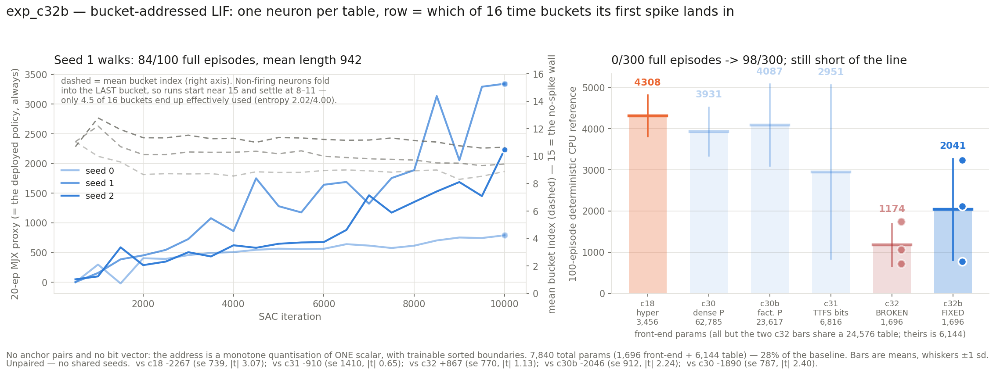

# exp_c32b — the CORRECTED bucket-addressed LIF actor

Re-run of exp_c32 against `exp/lif-detectors-mhl` @ 0024b81f, which fixed three flaws in
the version exp_c32 ran. Same 16 buckets × 32 tables, same SAC recipe, same 7,840 params.

**Result: the fixes rescued it qualitatively but not to the line.**

| seed | c32b FIXED | full ep | vel | mean len | | c32 BROKEN |
|---|---:|---:|---:|---:|---|---:|
| 0 | 777.1 ± 70.7 | 0/100 | 2.301 | 235 | | 1739.9 |
| 1 | **3234.2 ± 749.0** | **84/100** | 2.434 | **942** | | 725.5 |
| 2 | 2112.2 ± 850.2 | 14/100 | 2.581 | 583 | | 1057.7 |
| **mean** | **2041.2 ± 1230.1** | **98/300** | | | | **1174.4 ± 517.2** |



**Read the full-episode column, not the mean.** Broken c32 finished **0 of 300** episodes —
every policy was a faller. Fixed c32b finishes **98 of 300**, and seed 1 completes **84 of
100** at a mean length of 942 of 1,000. That is the difference between falling over and
walking, and it is the honest headline.

On the mean the improvement is **+866.8, Welch se 770.4, |t| 1.13** — *not* resolvable at
three seeds. Both things are true: the qualitative rescue is unambiguous, the quantitative
gain is not yet established.

| vs | delta | Welch se | \|t\| |
|---|---:|---:|---:|
| exp_c18 hyperplane 4308.0 ± 500.1 (6) | −2266.8 | 738.9 | **3.07** |
| exp_c30b factorised-P 4086.8 ± 991.2 | −2045.6 | 912.1 | 2.24 |
| exp_c30 dense-P 3931.3 ± 585.8 | −1890.1 | 786.6 | 2.40 |
| exp_c31 PureLIF 2951.2 ± 2109.2 | −910.0 | 1409.7 | 0.65 |
| exp_c32 BROKEN 1174.4 ± 517.2 | **+866.8** | 770.4 | 1.13 |

Still resolvably below the baseline. Only the c31 comparison is a wash, and c31's own mean
is bimodal (4262/4073/518) so that one is weak in both directions.

## The three fixes, and which one did the work

1. **Bounded excitatory synapses.** `w = w_max·sigmoid(w_raw)`, w_max = 2, so 0 ≤ w ≤ 2 and
   the parameter is `w_raw`. Previously `w = 0.2·randn` — **free-signed**, and that is the
   flaw behind everything exp_c32 showed. With signed weights the membrane is a sum of 17
   terms of mean zero, so it rarely reaches the fixed `theta_mem = 1.0`, the neuron does not
   spike, and a non-spiking neuron folds into the LAST bucket by construction.
2. **Hot init** `w_raw ~ N(-2.2, 0.5)`. sigmoid(-2.2) ≈ 0.0998, so the effective weight
   still starts near 0.2 — the same *scale*, all of one *sign*.
3. **tau floor 1e-3 → 1.0**, so the membrane cannot decay inside a single arrival step.

Measured at init, the first fix dominates: **no-spike mass 0.97 → 0.030**, mean bucket index
**14.97 → 7.58**. Bucket coverage now runs 83–87% through training instead of starting
pinned at the wall.

## The remaining gap has a measured cause, and it is NOT bucket count

On the trained seed-1 actor, over 8,192 states the deployed policy visits:

```
middle 50% of first-spike times span   3.27 of 32 time units   (10% of the window)
occupancy entropy                       2.02 of 4.00 bits
EFFECTIVE buckets used (2**entropy)     4.5 of 16   ->  72% of capacity unused
no-spike mass still in the last bucket  20.0%
```

Uniform boundaries spread 15 cuts evenly over (0, 32), but essentially all the probability
mass lands in a ~3-unit band. **Most of the table is addressable in principle and
unreachable in practice.** Two follow-ups fall straight out of this and are running:

- **exp_c33** — 64 buckets. Restores the chapter's standard 64 rows/table and is
  *param-matched*: 27,808 total = 3,232 front-end + 24,576 table, **99.2% of exp_c18's
  28,032**. Separates "bucket addressing is worse" from "16 rows is too small", which
  exp_c32/c32b confound.
- **exp_c34** — quantile boundaries at 16 buckets, so it differs from this run in *only*
  the boundary placement. At init it already reaches **2.97 of 4.00 bits = 7.8 effective
  buckets**, 1.7× this run's *trained* value.

## Verification

`run_parity.sh` → **40/40** over two cases against the torch reference, re-run fresh after
each of nucstar's two pushes (the fixes, then the O(N²) removal). Beyond forwards and
gradients it compares the **intermediates** — `boundaries`, `t_hard`, `t_soft`, the soft
partition — and asserts two structural invariants: the partition sums to 1 (1.2e-07) and the
boundaries are strictly increasing. `grad table` bit-identical at rel 0.0, table gradient a
hard scatter, all 8 parameters live, `eps` verified inert.

**Our membrane is linear and independently derived.** nucstar's module materialised a
(B,T,N,N) pairwise tensor at the time we ported it; we replaced it with the exact
sorted-arrival recurrence `V_k = w_k + exp(-(a_k−a_{k−1})/tau)·V_{k−1}` via
`associative_scan`. He later pushed a linear version too, using the *cumsum* factorisation
`exp(-a/tau)·cumsum(w·exp(a/tau))`. The two are algebraically identical and agree to 6.2e-07;
ours cannot overflow, his depends on the tau floor (measured: breaks below tau ≈ 0.36 at
t_window = 32, or above t_window ≈ 88 at tau = 1.0). Ours is **1.11× slower** at N=17 with
identical activation memory — see `bench_scan_vs_cumsum.py`.

## The seed-0 dip was not numerical

Seed 0 read −21.8 at iteration 1,500 and recovered to 402.8 — a new best — by 2,000. No
NaN/inf in any log or in the checkpoint; `log_std` nowhere near its rails (0.0% at either);
bucket coverage rose monotonically *through* the dip. Ordinary RL transient. `diagnose_seed0.py`
holds the full audit.

Lesson applied to later runs: `_actor.npz` is rewritten at every eval, so by the time anyone
looked at the dip the state that produced it was gone. exp_c33/c34 also save
`_best_actor.npz`.

## Files

| file | what |
|---|---|
| `jax_bucket_lif.py` | the JAX port — linear membrane, plus cumsum and quadratic variants for benchmarking |
| `run_parity.sh` / `torch_ref_dump.py` / `parity_check.py` | two-venv parity, 40/40 |
| `bucket_sac.py` / `eval_bucket_cpu.py` | trainer, 100-episode deterministic CPU reference |
| `spike_distribution.py` | the bucket-starvation analysis that motivated exp_c34 |
| `compare_membranes.py` | recurrence vs cumsum: agreement and overflow margin |
| `bench_scan_vs_cumsum.py` / `bench_linear.py` | cost of each membrane formulation |
| `diagnose_seed0.py` | the dip autopsy |
