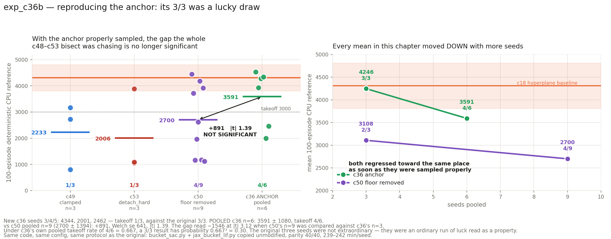

# exp_c36b — reproducing the anchor: c36's 3/3 was a lucky draw

Three more seeds (3, 4, 5) of **exp_c36**, using the same `bucket_sac.py` and
`jax_bucket_lif.py` the original three ran, copied unmodified: old pre-refactor
`BucketLIFDetectorsMHL`, **no delay clamp anywhere**, trainable temperatures, 1 head × 128
tables × 16 buckets, 31,360 params. Config is c36's own, taken from its run JSONs. Parity
**40/40** before any GPU.

**New seeds: 2935.5 ± 1241.1, takeoff 1/3. Pooled c36 n=6: 3590.9 ± 1080.3, takeoff 4/6.**

---

## VERDICT: the anchor does not hold at 4246. The residual gap that motivated the entire c48→c53 bisect is no longer statistically distinguishable from zero.

## 1. The result

| seed | return | ± | velocity | mean length | full-length |
|---:|---:|---:|---:|---:|---:|
| 3 | **4343.7** | 451.7 | 3.480 | 969.4 | 88/100 |
| 4 | 2001.2 | 727.5 | 2.875 | 512.8 | 2/100 |
| 5 | 2461.6 | 906.1 | 3.177 | 582.2 | 8/100 |

| | mean | takeoff |
|---|---|:-:|
| c36 original, n=3 | 4246.2 ± 298.5 | 3/3 |
| c36 new, n=3 | 2935.5 ± 1241.1 | 1/3 |
| **c36 POOLED, n=6** | **3590.9 ± 1080.3** | **4/6** |

The original three seeds produced a standard deviation of 298.5. The next three produced
1241.1. The tight spread that made c36 look like a solid anchor was itself the accident.

## 2. What it does to the bisect

| comparison | Δ | Welch se | \|t\| |
|---|---:|---:|---:|
| c36 pooled (n=6) vs **c50 pooled (n=9)** | +890.8 | 640.7 | **1.39** |
| c36 pooled (n=6) vs c49 (n=3) | +1358.0 | 850.3 | 1.60 |
| c36 pooled (n=6) vs c53 (n=3) | +1584.9 | 1040.6 | 1.52 |

**None of these is significant.** The c36-vs-c50 gap read −1546 at |t| 3.12 when c50's nine
seeds were compared against c36's three; sampling the anchor properly moves it to +891 at
|t| 1.39.

And the same is true across the whole family — c50 vs c49 was |t| 0.54, c53 vs c50 |t| 0.66.
**At the sample sizes available, no return difference between any two configurations in this
chapter is statistically established.** The seed-to-seed standard deviation (1080–1730)
swamps every effect that has been discussed.

## 3. Was c36's 3/3 remarkable? No.

Under c36's own pooled takeoff rate of **4/6 = 0.667**, a 3/3 result has probability
0.667³ = **0.30**. Entirely ordinary. My earlier estimate of ~8.8% assumed c36 shared c50's
measured rate of 4/9; c36's own rate is higher, which makes its original result *less*
surprising rather than more.

The error was never that 3/3 was impossible. It was reading a 3-sample run as a property of
the configuration, and then treating every subsequent shortfall against it as a defect
requiring a mechanism.

## 4. The delays confirm the port, again

| | min | max | mean | sd | % negative |
|---|---:|---:|---:|---:|---:|
| c36 orig s0/s1/s2 | −10.09 … −8.58 | 10.29 … 12.67 | 0.460–0.612 | 1.877–2.094 | 37.7–40.8 |
| **c36 new s3/s4/s5** | −10.03 … −9.62 | 8.40 … 10.57 | 0.536–0.547 | 1.864–1.906 | 38.4–38.9 |
| c50 (floor removed) | −10.14 … −8.10 | 9.44 … 10.55 | 0.464–0.533 | 1.910–1.982 | 37.4–41.5 |

All nine c36 seeds and all three c50 seeds occupy the same distribution. The unclamped old
module and the floor-removed new module learn indistinguishable delays — which is what the
c49/c50 work claimed, now confirmed on twice the c36 sample.

## 5. What survives, and what does not

**Survives — the delay-clamp mechanism.** `clamp(delay, 0, t_window)` kills the delay
parameterisation at zero-init: 94.6–94.9% of c49's 2,176 delays end dead, against ~40%
negative and functional without it. That is a **per-parameter measurement over 6,528
delays**, not a 3-sample mean, and nothing here touches it. The upstream note for nucstar
stands on that evidence alone.

**Does not survive — the "residual gap" narrative.** c48, c49, c50, c50b, c52 and c53 were
all run to explain a shortfall against 4246. That number was three lucky seeds. There may
still be a real difference between the old and current modules, but *it has never been
measured at a sample size capable of showing one*.

## 6. What to do instead

**Stop bisecting for a mechanism.** The next informative experiment is not another
component swap; it is fixing the measurement:

1. **The real phenomenon is the takeoff instability itself.** Every configuration in this
   family takes off 44–67% of the time and the failures are catastrophic (1100–2500 against
   3900–4500), not graded. That bimodality — not a 500-point mean shift — is what costs the
   chapter its results, and it has never been the object of study.
2. **Any future return claim needs n ≥ 9**, and should be read as a takeoff *rate* with a
   binomial interval rather than a mean ± sd of a bimodal mixture, where the sd is an
   artifact of the mixing ratio.
3. **The cheap unblock for comparisons** is the c18 hyperplane baseline (4308 ± 500 at n=6,
   and notably *tight*), which suggests the instability is a property of this LIF/bucket
   family rather than of the task or the SAC harness.

## 7. Cost

3 seeds co-resident, **243.3 min wall** (13:04:33Z → 17:07:50Z); 239.0 / 240.8 / 241.9
min/seed — matching c36's original 240.5 min/seed almost exactly, which is itself a check
that this reproduced the original conditions.

## 8. Files

| file | what |
|---|---|
| `bucket_sac.py`, `jax_bucket_lif.py`, `eval_bucket_cpu.py` | copied unmodified from exp_c36 |
| `run_parity.sh`, `parity_check.py`, `torch_ref_dump.py` | the 40-check gate, pinned to `0024b81f` |
| `run_parallel_c36b.sh`, `slack_bar_c36b.py` | the run |
| `plot_c36b.py`, `c36b_result.png` | the figure |

Nothing committed. nucstar's torch branch untouched — staged read-only into
`/tmp/bucket_ref_c36b` from the pinned commit.
