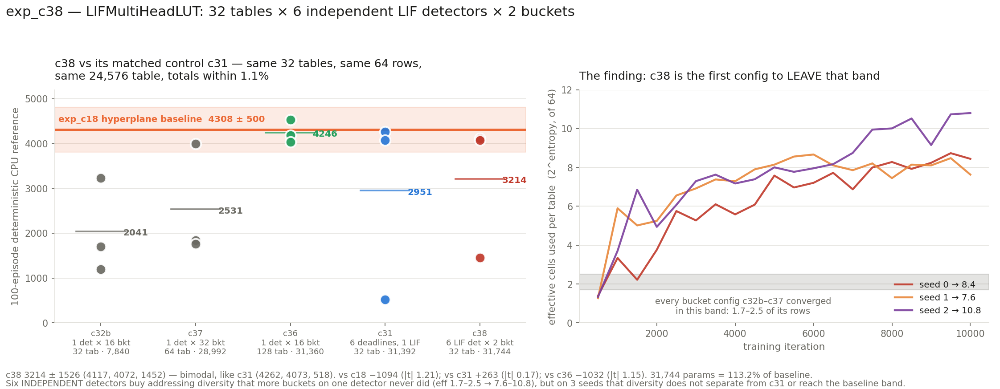

# exp_c38 — LIFMultiHeadLUT: 32 tables × 6 LIF detectors × 2 buckets

Reference: `LIFMultiHeadLUT`, branch `exp/lif-detectors-mhl` @ `24c0e60a`,
`src/spiky/lutorch/lif_multi_head_lut.py`. Staged read-only out of git; nothing on that
branch is modified and nothing is checked out.

**Config:** `n_heads=1, tables_per_head=32, n_det=6, n_buckets=2, freeze_temperature=True,
delay_init_std=4`.
**Params:** 31,744 total (31,680 trainable) = 7,168 front-end + 24,576 table =
**113.2%** of the 28,032 hyperplane baseline.
**Parity:** 80/80 checks, 3 cases, all within 2e-05 relative.

---

## 1. What LIFMultiHeadLUT actually generalises

nucstar has collapsed the whole LIF-detector line into one class. Where we previously
ported four separate torch modules, there is now one with **three nested structural
levels**:

| level | meaning |
|---|---|
| `n_heads` | output heads; the forward always returns `(B, n_heads, n_outputs)` |
| `tables_per_head` | tables **summed** within each head (`n_tables = heads × tph`) |
| `n_det` | LIF detectors **per table**, each emitting one of `n_buckets` digits; the digits combine **mixed-radix** into an index over `n_buckets**n_det` cells |

The third level is the genuinely new axis. Everything else is machinery we had already
ported and validated in c31/c32b. The retired classes fall out as special cases:

| setting | is exactly |
|---|---|
| `n_det = 1` | `BucketLIFDetectorsMHL` — c32b / c33 / c34 / c35 / c36 / c37. One LIF per table, M ordered buckets, rows = M. |
| `n_det = D, n_buckets = 2` | D independent LIF detectors per table, each thresholded against one trainable boundary, packed MSB-first into 2**D rows. **This experiment.** |
| `n_det > 1, n_buckets > 2` | the retired `ProductBucketLIFMHL` — a mixed-radix product of several ordered time quantisations. |

### How the shipped config maps onto it

`1 × 32` tables, `n_det=6`, `n_buckets=2` → **32 tables, 6 detectors each, 2⁶ = 64 cells
per table**, table `(32, 64, 12)` = 24,576 — the chapter's standard table size, reached by
a third route.

That makes this **the cleanest controlled comparison in the chapter**. Against exp_c31:

| | exp_c31 PureLIF | exp_c38 MHL |
|---|---|---|
| tables | 32 | 32 |
| rows per table | 64 | 64 |
| table params | 24,576 | 24,576 |
| front-end params | 6,816 | 7,168 |
| **total** | **31,392** | **31,744** (+1.1%) |
| where the 6 bits come from | **one** LIF; its single spike time `t*` vs 6 learned deadlines `L_k`, bits `1[t* < L_k]` | **six** LIFs, each with its own 17 delays, 17 synapses and tau, each vs its own boundary |

Same SAC recipe, critic, replay, trust region, learning rates and eval protocol. **One
variable differs: whether the six address bits are six views of one scalar, or six
independent scalars.** c31's six bits are really a thermometer code on one number and
cannot be independent; c38's are.

The second comparison is exp_c36, within 1.2% on parameters (31,360) and the only bucket
configuration to match the baseline (4246.1 ± 298.4). c36 bought capacity by adding
**tables** — 128 of them, each a separate summand. c38 buys it by adding **detectors
inside** a table, which multiplies the row count and adds *no* summand. The c36 finding
was that per-table addressing entropy predicts nothing and the number of independent
indices **summed** predicts everything; c38 tests whether "summed" was load-bearing in
that sentence. The two readings make opposite predictions here, which is why the
configuration is worth the GPU.

## 2. What is new relative to our exp_c32b port

Each item is a place a port can be silently wrong, so each is asserted in
`parity_check.py` rather than trusted.

1. **The detector axis is always present.** `delay`, `w_raw` are `(T,D,N)`; `tau_raw` is
   `(T,D)`; `beta_base` is `(T,D,1)`; `beta_raw` is `(T,D,M-1)`. The reference keeps `D=1`
   as a real axis rather than special-casing it, and so does the port.
2. **The temperatures stayed per-TABLE.** `log_T_cross`, `log_T_bkt` are `(T,)`, *not*
   `(T,D)` — all D detectors of a table share one crossing sharpness and one partition
   softness. A port that gave them a detector axis would still train.
3. **Latency coding is fixed, slope pinned at α=3:** `clip(t_window·(0.5 − 3x/32), 0,
   t_window)`. At `t_window=32` this is `clip(16 − 3x, 0, 32)` — numerically identical to
   c32b. The change is that `latency_c` and `latency_alpha` no longer exist.
4. **The delay is clamped to `[0, t_window]` inside the forward** (causal, and it keeps
   arrivals inside `[0, 2·t_window]`), and `delay_init_std > 0` seeds it from a
   half-normal instead of zeros.
5. **The row index is mixed-radix, MSB-first:** `idx = Σ_d b_d · M**(D−1−d)`; table is
   `(T, M**D, O)`.
6. **The soft address readout is a rank-1 tensor contraction**, peeling one detector axis
   per einsum against the detached table — the joint `(B,T,M,…,M)` distribution is never
   formed.
7. **`eps` is gone from the signature entirely.** c31/c32b accepted and ignored it.
8. **`freeze_temperature`** pins `log_T_cross`/`log_T_bkt` at 0.0 (T=1.0) and
   `requires_grad=False`. JAX has no such flag, so the trainer masks those two gradients
   (Adam of an identically-zero gradient leaves both moments at zero, so they are frozen
   in the strict sense, not merely slowed).
9. **The `mode=` string is gone.** `forward(x)` branches on `self.training`: train is
   straight-through, eval is a `no_grad` hard path with no softmax and no temperatures.
   There is no `"soft"` forward any more — the soft readout survives only as the internal
   address-gradient term. Our port keeps one argument to select the branch but names it
   after the reference's own semantics, `mode="train"` / `mode="eval"`, and `"soft"` is
   rejected.

Carried over unchanged and therefore already validated: bounded excitatory
`w = w_max·sigmoid(w_raw)` with the hot init `w_raw ~ N(−2.2, 0.5)`;
`tau = softplus(tau_raw) + 1.0`; the fixed `theta_mem = 1.0` buffer; the smooth
first-success soft spike time; strictly-increasing boundaries by softplus-cumsum; and the
decoupled straight-through decode `y = y_hard + y_addr − stop_gradient(y_addr)`, which
needs no custom VJP.

## 3. Parity — 80 checks, 3 cases

```
PARITY OK — 80 checks over 3 cases, all within 2e-05 relative
```

Three cases, each catching a different class of port bug:

- **`run`** — the exact shipped configuration at its own init, checked as-is rather than
  in a convenient surrogate shape.
- **`perturbed`** — same shape, temperatures *unfrozen*, every tensor given a distinct
  value. Not redundant: at init every per-table and per-detector parameter is identical
  across tables, so a port that transposed the `(T,D)` axes or built the boundary cumsum
  along the wrong dimension would reproduce `run` exactly and fail on anything real. And
  with the temperatures frozen, `run` cannot test their backward paths at all. Delays are
  drawn **signed** with two entries forced out of range, so the new `[0, t_window]` clamp
  is exercised on both rails.
- **`radix`** — a different shape entirely (2 heads × 3 tables, 2 detectors, 8 buckets).
  At M=2 the soft partition's middle term is empty and the radix is a bit-shift, which is
  the one arrangement where several plausible indexing mistakes coincide with the right
  answer.

Beyond the usual forward/gradient pairing: both forwards against `m.train()` and
`m.eval()`; the bucket digits and the mixed-radix cell index compared for **exact integer
equality** (0 of 4608 and 0 of 768 differ); the two halves of the ST decode compared
separately; gradient parity on all 8 tensors; the partition summing to 1 exactly; the
table gradient confirmed to be a **hard scatter** (133 of 2048 cells touched, 1915
*exactly* 0.0 — the detach is real, and the count matches torch's); and the freeze shown
to suppress a **live** gradient (unmasked |grad|max 1.41 and 1.06) rather than sitting on
a path that never carried one.

## 4. Cost — and the sort that was 95% of it

### Head-to-head against the torch reference

Idle GPU, batch 512, fp32, RTX 5090, steady state with compile excluded
(`run_headtohead.sh`). The number that decides training throughput is **train fwd+bwd** —
SAC pays it twice per update:

| | eval fwd | train fwd | **train fwd+bwd** |
|---|---:|---:|---:|
| torch, `@torch.compile` (as shipped) | 0.043 | 0.333 | **1.092** |
| torch, eager | 0.481 | 1.150 | 2.531 |
| JAX, `SORT_FORM="argsort"` — *the c30–c37 spelling* | 5.942 | 5.671 | **7.125** |
| JAX, `SORT_FORM="rank"` — **shipped** | 1.442 | 1.371 | **0.677** |

**Before the fix the JAX port was 6.5× slower than `torch.compile` on the training step;
after it, it is 1.6× faster.** End to end the trainer went **0.74 → 0.24 s/iter** with 3
seeds co-resident (3.1×), and the sweep went from a projected ~4 h to a measured **39 min**.

torch still wins the *eval* forward by a wide margin (0.043 vs 1.442) — inductor fuses the
whole `no_grad` path into essentially one kernel. That path is ~16% of a run and is not
where training time goes; see the offered optimisation below.

### The hotspot was the sort — specifically, its gradient

Decomposing at the shipped shape (512 × 32 tables × 6 detectors × 17 synapses = 1.67M
arrivals) shows it is not the detector axis, not the mixed-radix readout, and nothing
XLA failed to fuse. The six-einsum soft readout costs **0.02 ms**. `jnp.argsort` alone
costs **19–22 ms** while the gathers that follow cost **0.18 ms** — the sort *is* the cost.

Worse, **both** sort spellings transpose to a **scatter** in the backward, and
`XLA_FLAGS=--xla_gpu_deterministic_ops=true` — which every run in this chapter sets — must
serialise it. Under the flag:

| spelling | membrane fwd | **gradient** |
|---|---:|---:|
| `argsort` + gather | 25.7 ms | 23.9 ms |
| `lax.sort`, 2 operands | 0.97 ms | **hangs, >400 s** |
| `rank` (sort-free) | 5.6 ms | **0.82 ms** |

That `lax.sort` row is what cost a stalled sweep: the run reached iteration 500 and did not
reach 1,000 in 45 minutes. **The forward is fine under the flag (0.55 ms) — only the VJP
dies**, so a forward-only benchmark not merely misses the problem, it reports the broken
option as 26× *faster*.

### The fix: order the arrivals without a sort

`rank_k = #{j : a_j < a_k}` with ties broken by index is exactly the stable sort position
of element *k* — a pairwise comparison over the N=17 axis, 289 comparisons per
(sample, table, detector), no sort primitive. It is then *applied* as a contraction against
the one-hot `P[r,k] = 1[rank_k == r]`, i.e. a matmul. **A matmul's transpose is a matmul**,
so the backward is a matmul: no scatter, nothing for the determinism flag to serialise.

Output is **bit-identical** to the argsort form (max|diff| exactly 0.0 on both the arrivals
and the weights), and the parity gate re-passes at 80/80. Gradients are correct because `P`
is piecewise-constant in `a`, exactly as `torch.sort`'s permutation is treated as constant.
The cost is memory — `P` is `(B,T,D,N,N)` = 28.4M floats = 114 MB — which is affordable
only because N=17; at large N, `lax.sort` with the flag dropped is the right choice instead.

**This is a chapter-wide finding.** c30–c37 all use the `argsort` spelling, so the same
substitution should speed up every LIF front-end we have.

### The same trap, a second time: the hard table read

The torch reference writes it as advanced indexing, `self.table[tt, idx]`. Spelled that way
in JAX the VJP is a **scatter-add**, serialised by the same flag. Replaced with the one-hot
contraction the rest of the chapter uses — selecting row *c* *is* `onehot(c) @ table`.
Above `ONEHOT_MAX_CELLS = 4096` the gather is used instead.

### Measured cost of the run

- **1,880 MiB** per trainer process with `XLA_PYTHON_CLIENT_PREALLOCATE=false`; 3 seeds
  use 5.6 GB of 32.6. The `(B,T,D,N,N)` tensor did not move this — XLA fuses it.
- **0.24 s/iter** with 3 seeds co-resident → **39 min wall for the whole sweep**.
- **The detector axis is free.** An A/B at identical cell count — `6 det × 2 bkt` vs
  `1 det × 64 bkt`, identical table shape — times the same to within noise.

### Offered, not applied

The eval forward could use `lax.sort` even under the determinism flag, because **no
gradient is ever taken through it** — `mode="eval"` is used only by `eval_mjx` and the CPU
reference. That is 1.442 → 0.172 ms, an 8.4× cut on ~16% of a run. Not applied: it would
change the module after the run that produced the numbers below, and it adds a mode that
silently breaks if anyone differentiates it.

## 5. Result

**3213.9 ± 1525.9** over 3 seeds — **bimodal**, exactly as its matched control c31 is.

| seed | CPU-ref 100 ep | ep-sd | full episodes | velocity |
|---:|---:|---:|---:|---:|
| 1 | **4117.4** | 49.5 | 100/100 | 3.120 m/s |
| 2 | **4072.3** | 1006.9 | 70/100 | 3.567 m/s |
| 0 | **1452.1** | 556.0 | 0/100 | 2.522 m/s |

| vs | delta | Welch se | \|t\| |
|---|---:|---:|---:|
| exp_c18 hyperplane 4308.0 ± 500.1 (n=6) | −1094.1 | 904.3 | 1.21 |
| exp_c31 PureLIF 2951.2 ± 2109.2 — **the matched control** | +262.7 | 1503.0 | **0.17** |
| exp_c36 bucket 16×128 4246.1 ± 298.4 | −1032.2 | 897.7 | 1.15 |
| exp_c37 bucket 32×64 2531.1 ± 1266.1 | +682.8 | 1144.8 | 0.60 |
| exp_c32b bucket 16×32 2041.2 ± 1230.1 | +1172.7 | 1131.6 | 1.04 |



### What it says

**Bit independence is not what c31 was missing.** c38 is c31's matched control — same 32
tables, same 64 rows, same 24,576-entry table, totals within 1.1%, differing only in
whether the six address bits come from six deadlines on one LIF or six independent LIFs —
and it lands **+263 with |t| = 0.17**, the tightest non-difference in the chapter. Both are
bimodal, both put two seeds in or near the baseline band and one far below (c31: 4262,
4073, 518; c38: 4117, 4072, 1452). Making the bits genuinely independent changed the
failure *depth* (518 → 1452) and nothing else that three seeds can see.

**But the addressing diagnostic moved, and it is the first time it has.** `eff` — the
number of cells a table actually uses, 2^entropy of its occupancy — converged to **1.7–2.5
in every bucket configuration from c32b to c37**, regardless of bucket count (16 vs 64),
boundary placement (uniform vs quantile) or freezing. That invariance was the c36
conclusion: per-table addressing entropy is pinned and predicts nothing. **c38 reaches
7.6–10.8 of 64** and is still climbing at iteration 10,000. Six independent detectors buy
addressing diversity that more buckets on one detector never did.

So the two facts sit together awkwardly and both belong in the record: **the intervention
did what it was supposed to do mechanically, and it did not convert into return.** That is
evidence *for* the c36 reading — what predicts return is the number of independent indices
**summed**, and c38 added independent *digits within* a table (which multiply the row count)
rather than independent *tables* (which add summands). c36, the only configuration to match
the baseline, is also the only one that added summands.

Health diagnostics all moved the right way and rule out the c32-style failure: no-spike
mass 0.53 → 0.08, `bit1` 0.99 → 0.57 (detectors balanced, not collapsed), cell coverage
86–89%. The temperature freeze held exactly — `Tbkt` and `Tcr` read 1.000 at every one of
the 20 evals in all three seeds.

**On the terminal dip:** no systematic late decline. Seeds 1 and 2 ended at or near their
best; seed 0 was still improving at the end (1763 at iteration 8,500, best 2152). The
freeze removes the last degree of freedom by which the soft surrogate could drift from the
hard forward, and nothing in these three runs contradicts that — but c31/c32b were already
free of the *systematic* dip, so this is consistent evidence, not new evidence.

## 6. Files

| file | what |
|---|---|
| `jax_mhl_lut.py` | the JAX port of LIFMultiHeadLUT |
| `torch_ref_dump.py` | torch reference dump (spiky venv, CPU, eager) |
| `parity_check.py` | the 80 assertions (mjx venv) |
| `run_parity.sh` | both halves, end to end; stages the reference read-only from git |
| `mhl_sac.py` | the SAC trainer, carrying exp_c37's fused-scan optimisations |
| `eval_mhl_cpu.py` | 100-episode deterministic CPU reference — the only number quoted |
| `bench_forward.py` | per-stage timings of the actor |
| `bench_sort_variants.py` | the argsort / lax.sort / rank decomposition, one variant per process |
| `bench_torch_ref.py`, `bench_jax_actor.py`, `run_headtohead.sh` | the head-to-head in §4 |
| `plot_c38.py`, `c38_result.png` | the figure |
| `run_parallel_c38.sh` | 3 seeds co-resident |
| `slack_bar_c38.py` | live progress bar (file rendezvous, cage-safe) |
| `collect.py` | anchors, Welch comparisons, `results.json` |

Nothing committed. nucstar's torch branch untouched.
