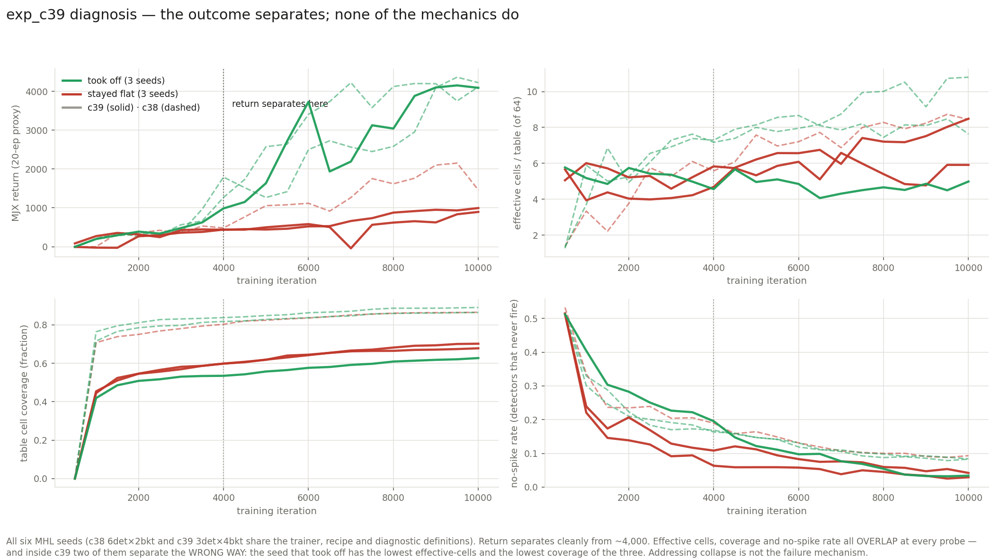
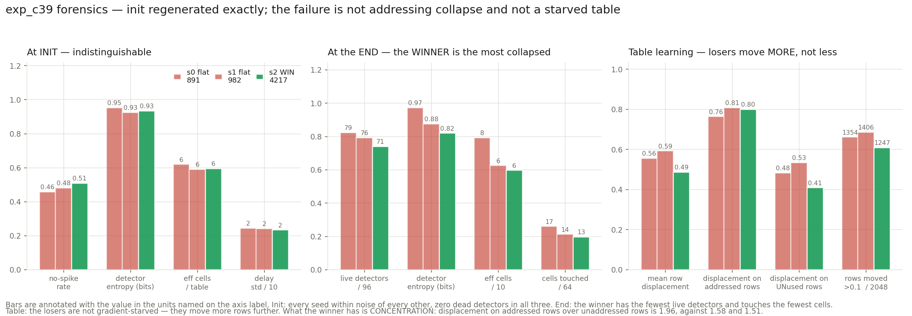
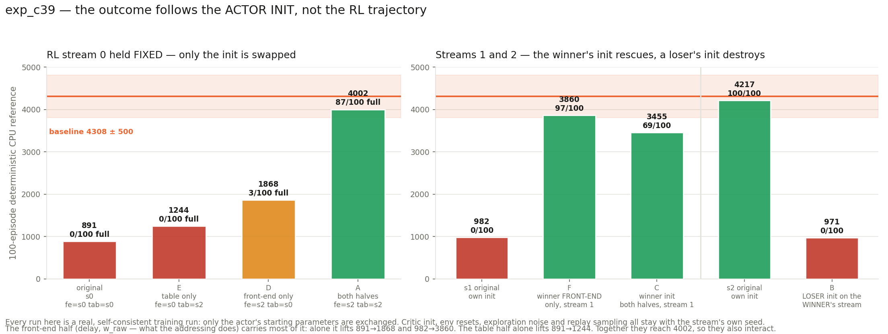

# exp_c39 — why one seed took off and two did not

Seed 2 reached 4217.3 (100/100 full episodes); seeds 0 and 1 stayed flat at 890.8 and
982.3, both **flat-never-took-off** rather than collapse-after-takeoff.

**Answer: the outcome is decided by the actor's initialisation, and none of the aggregate
init measurements can see it.** Nine transplant runs establish this; every mechanical
addressing diagnostic in the chapter fails to predict it, and two of them point the wrong
way.

---

## 1. Addressing collapse is not the mechanism

Analysing c39's three seeds alone is one winner against two losers, which cannot separate a
predictor from a coincidence. exp_c38 shares the trainer, recipe and diagnostic
definitions, so pooling gives **three takeoffs against three flats**.

| diagnostic | separates takeoff from flat? |
|---|---|
| effective cells / table | **no** — overlap at every probe |
| table cell coverage | **no** — overlap at every probe |
| no-spike rate | **no** — overlap at every probe |
| mean digit | **no** |
| MJX return | yes, from iteration ~4,000 |

And inside c39 two of them separate the **wrong way**: the seed that took off has the
**lowest** effective-cells (4.99 vs 8.48 / 5.91) and the **lowest** coverage (0.63 vs 0.68 /
0.70). c38's *loser* has the lowest of its three. Contradictory across configurations, so
there is no relation.

### A correction to the exp_c38 report

I called the effective-cells break (1.7–2.5 → 7.6–10.8) "the finding" of exp_c38. It is a
**configuration-level** finding — multi-detector configurations leave the plateau that every
single-detector bucket configuration sat on — but it does **not** track success between
seeds within a configuration. Stated without that qualification it invites exactly the
inference this analysis refutes.

## 2. The losers' tables are not gradient-starved either

Init is regenerated exactly from `PRNGKey(seed)` (the trainer never saved it, but it is
deterministic and the split order is fixed), so `table_final − table_init` is computable per
row.

| | s0 flat | s1 flat | s2 WIN |
|---|---:|---:|---:|
| mean row displacement | 0.556 | 0.593 | **0.486** |
| displacement, addressed rows | 0.764 | 0.808 | 0.801 |
| displacement, unaddressed rows | 0.483 | 0.534 | **0.409** |
| rows moved > 0.1 (of 2048) | 1354 | 1406 | **1247** |
| rows addressed at all | 533 | 436 | **405** |

The losers move **more** rows by **more** total displacement. What the winner has is
**concentration**: displacement on addressed rows over unaddressed rows is **1.96**, against
1.58 and 1.51.

## 3. At init the three seeds are indistinguishable

Only `delay` (half-normal, scale 4), `w_raw` (N(−2.2, 0.5)) and `table` (0.1·randn) differ
between seeds — `tau_raw`, `beta_base`, `beta_raw` and both temperatures are constants at
init, so **"boundaries bunched so a detector is effectively constant" cannot be a seed-level
explanation at step 0**: every detector of every table of every seed starts with boundaries
at exactly 8, 16, 24.

Measured functionally on 4,096 warmup-distribution states (uniform random actions, one fixed
key, identical for every seed):

| | s0 flat | s1 flat | s2 WIN |
|---|---:|---:|---:|
| delay mean / std | 3.143 / 2.440 | 3.146 / 2.412 | 3.190 / 2.341 |
| effective w mean | 0.219 | 0.218 | 0.215 |
| no-spike rate | 0.458 | 0.482 | 0.509 |
| detector digit entropy (bits) | 0.952 | 0.925 | 0.934 |
| **dead detectors (of 96)** | **0** | **0** | **0** |
| effective cells / table | 6.191 | 5.904 | 5.947 |
| detector pair agreement | 0.623 | 0.636 | 0.644 |

No init-level predictor. Nothing here is outside noise.

## 4. The transplant — the experiment the checkpoints cannot substitute for

At this point the aggregates say "nothing in the front-end separates them", which invites
the conclusion that the failure is in the RL rather than the model. That conclusion is
**wrong**, and only an intervention shows it.

The trainer is deterministic from `PRNGKey(seed)` and the actor's init consumes exactly one
key (`ka`), so the init and the RL trajectory can be exchanged independently. Critic init,
env resets, exploration noise and replay sampling all stay attached to `--seed`, so each run
below is a real, self-consistent training run rather than a splice of two checkpoints.

| run | front-end init | table init | RL stream | CPU-ref | full |
|---|---|---|---|---:|---:|
| s0 original | s0 | s0 | 0 | 890.8 | 0/100 |
| **E** | s0 | **s2** | 0 | 1244.4 | 0/100 |
| **D** | **s2** | s0 | 0 | 1867.5 | 3/100 |
| **A** | **s2** | **s2** | 0 | **4001.7** | 87/100 |
| s1 original | s1 | s1 | 1 | 982.3 | 0/100 |
| **F** | **s2** | s1 | 1 | **3860.3** | 97/100 |
| **C** | **s2** | **s2** | 1 | **3455.0** | 69/100 |
| s2 original | s2 | s2 | 2 | 4217.3 | 100/100 |
| **B** | s0 | s0 | 2 | 970.8 | 0/100 |

**Six transplants, six times the outcome tracks the init and ignores the RL stream.** Both
failing streams are rescued by the winner's init; the winning stream is destroyed by a
loser's.

Splitting the init into halves: **the front-end half (delay, w_raw — what the addressing
does) carries most of it.** Alone it lifts 891 → 1868 and 982 → 3860. The table half alone
lifts 891 → 1244. Together they reach 4002, so on stream 0 the two halves also interact
super-additively (+977 and +354 separately, +3111 together).

## 5. Diagnosis

**The failure is a bad draw of the front-end initialisation — specifically of `delay` and
`w_raw`, which together define which observations land in which cell.** It is not addressing
collapse, not dead detectors, not a starved table, and not RL luck.

The uncomfortable part, stated plainly: **what makes one draw good is invisible to every
aggregate we measure.** The good and bad front-ends have the same no-spike rate, the same
detector entropy, the same effective-cell count, the same pair agreement, and zero dead
detectors. Whatever distinguishes them lives in *which* states map to *which* cells — the
alignment of the partition with task-relevant structure — not in how many cells are used or
how balanced they are. Every diagnostic this chapter has built measures the latter.

### The most predictive early diagnostic

**There isn't a reliable one, and I would rather say so than promote a coincidence.** The
only quantity that strictly separates all six seeds early is the SAC entropy coefficient
`alpha` at iteration 1,000 (takeoff 0.0326 / 0.0329 / 0.0245, flat 0.1164 / 0.0700 / 0.0387
— no overlap). But that is one strict separation out of roughly 30 metric × probe
comparisons, and with three seeds per group a random split separates by chance about 10% of
the time. It is a lead, not a predictor.

The honest operational answer is different and more useful: **the outcome is fixed by the
init, so it can be decided before training by running the init forward** — no early
diagnostic is needed if a short run is cheap, and after the sort fix a full 10,000-iteration
seed is ~11 minutes solo.

### Concrete, testable suggestions

1. **Decorrelate the detectors at init.** Measured pair agreement within a table is
   **0.62–0.64** at init, against 0.25 for independent uniform digits at 4 buckets. The
   three "independent" detectors are strongly redundant at the start — they see the same
   latency-coded input and differ only by delay and weight draws. Orthogonalising the
   per-table `delay`/`w_raw` draws across detectors (e.g. spreading delays on a structured
   grid rather than i.i.d. half-normal) would make the mixed-radix product carry more
   information from step 0. This is a one-line init change and directly targets the half
   that the transplant showed carries the outcome.

2. **More detectors, fewer buckets.** The takeoff rate was **2/3 for c38 (6 detectors)** and
   **1/3 for c39 (3 detectors)**. More detectors means the addressing function averages over
   more independent draws, so it depends less on any single lucky one — which is exactly the
   failure mode identified here. Testable directly: 8 or 12 detectors × 2 buckets. Note this
   is 2 configurations, not a controlled test of detector count against reliability; it is a
   hypothesis the data suggests, not one it establishes.

3. **Cheap insurance, available today:** because the outcome is fixed by the init and a seed
   now costs ~11 minutes solo, running 6 front-end draws and keeping the best is affordable.
   Brute force rather than a fix, but it makes the configuration usable while 1 and 2 are
   tested.

## 6. Cost

| | |
|---|---|
| trajectory contrast, init + final forensics | ~3 min (CPU + one short GPU rollout) |
| transplant A/B/C (3 runs, co-resident) | **33 min** |
| init-half split D/E/F (3 runs, co-resident) | **34 min** |
| plots | ~1 min |
| **total GPU** | **~70 min**, 1,360 MiB per process, 3 co-resident |

## 7. Files

| file | what |
|---|---|
| `traj_contrast.py`, `traj_contrast.json` | the six-seed separation test |
| `forensics.py`, `forensics.json` | init regeneration, functional addressing stats, table displacement |
| `mhl_sac_transplant.py` | trainer with `--actor-seed` / `--table-seed` |
| `run_transplant.sh`, `run_split.sh` | the nine runs |
| `plot_diag.py`, `plot_transplant.py` | the three figures |
| `diag_progress_feed.py` | feeds live run progress into the Slack bar |

Nothing committed. nucstar's torch branch untouched.
