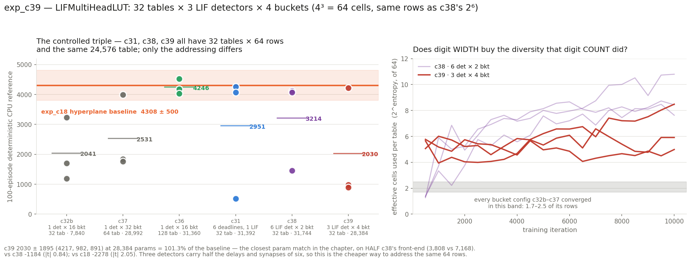

# exp_c39 — LIFMultiHeadLUT: 32 tables × 3 LIF detectors × 4 buckets

Reference: `LIFMultiHeadLUT`, branch `exp/lif-detectors-mhl` @ `24c0e60a`. Staged read-only
out of git; nothing on that branch modified, nothing checked out.

**Config:** `n_heads=1, tables_per_head=32, n_det=3, n_buckets=4, freeze_temperature=True,
delay_init_std=4` → 4³ = 64 cells per table.
**Params:** 28,384 total (28,320 trainable) = 3,808 front-end + 24,576 table =
**101.3%** of the 28,032 hyperplane baseline — the closest parameter match of any model in
this chapter, reached without being tuned for it.
**Parity:** 81/81 checks, 3 cases, all within 2e-05 relative.
**Result: 2030.2 ± 1894.7** (4217.3 / 982.3 / 890.8).

---

## 1. What this isolates

c39 completes a **controlled triple**. c31, c38 and c39 all have 32 tables, 64 rows per
table and the same 24,576-entry table, under an identical SAC recipe, critic, replay, trust
region, learning rates and eval protocol. They differ *only* in how those 64 rows are
addressed:

| | addressing | digits | width | front-end | total | result |
|---|---|---:|---:|---:|---:|---|
| c31 | one LIF, spike time vs 6 deadlines | 6 | 2 | 6,816 | 31,392 | 2951 ± 2109 |
| c38 | **six** independent LIFs, one binary test each | 6 | 2 | 7,168 | 31,744 | 3214 ± 1526 |
| c39 | **three** independent LIFs, 4-way ordered quantisation each | 3 | 4 | **3,808** | **28,384** | **2030 ± 1895** |

So c38-vs-c39 is a clean **digit-width against digit-count** trade at fixed table capacity,
and c39 does it on **half** the front-end — each detector carries its own 17 delays and 17
synapses, so three detectors cost half of six.

Three readings made different predictions. If raw addressing capacity is what matters, the
two tie. If the number of **independent scalars** matters, c39 falls back toward c31. If
the **ordered structure within a digit** matters — bucket indices are monotone in spike
time, bits are not — c39 beats c38 with fewer parameters.

## 2. Parity — 81 checks, 3 cases

```
PARITY OK — 81 checks over 3 cases, all within 2e-05 relative
```

One more check than exp_c38: at `n_buckets=4` there are three boundaries per detector, so
`boundaries strictly increasing` is a real assertion here (min gap 8.0000) rather than
vacuous as it was at M=2.

The shipped shape also exercises paths c38's could not — a **non-empty** soft-partition
middle term, and a radix of `[16, 4, 1]` rather than powers of two. The three cases:

- **`run`** — the exact shipped config at its own init. Bucket digits exact (0 of 2304
  differ), mixed-radix cell index exact (0 of 768), 23/64 cells used at init, no-spike mass
  0.225, table gradient a hard scatter (210 of 2048 cells touched, **1838 exactly 0.0**),
  freeze suppressing a **live** gradient (unmasked |grad|max 1.30 and 0.83).
- **`perturbed`** — same shape, temperatures unfrozen, every tensor perturbed, delays drawn
  *signed* with two entries forced out of range so the `[0, t_window]` clamp is exercised
  on both rails. This is the only case that can test the temperature backward paths, since
  the shipped config freezes them.
- **`alt`** — 2 heads × 3 tables, 6 det, 2 buckets. Checks the head/tph reshape is not
  silently transposed, covers the M=2 edge case (empty middle term, radix degenerating to
  powers of two — the one arrangement where several plausible indexing bugs coincide with
  the right answer), and cross-checks against exp_c38's known-good layout.

## 3. Cost

Carries exp_c38's sort-free `rank` arrival ordering (`SORT_FORM = "rank"`), not the
`argsort` spelling — that substitution is what made the port faster than the
`torch.compile` reference.

- **1,350 MiB** per trainer process (vs c38's 1,880 — three detectors make the
  `(B,T,D,N,N)` rank tensor half the size); 3 seeds use 4.1 GB of 32.6.
- **~0.19 s/iter** with 3 seeds co-resident; **32 min per seed, 33 min wall** for the whole
  sweep including the 100-episode CPU references.

## 4. Result

**2030.2 ± 1894.7** — and this time only **1 of 3** seeds took off, where c38 and c31 each
managed 2 of 3.

| seed | CPU-ref 100 ep | ep-sd | full episodes | velocity |
|---:|---:|---:|---:|---:|
| 2 | **4217.3** | 16.8 | 100/100 | 3.220 m/s |
| 1 | 982.3 | 66.6 | 0/100 | 2.175 m/s |
| 0 | 890.8 | 87.8 | 0/100 | 2.633 m/s |

| vs | delta | Welch se | \|t\| |
|---|---:|---:|---:|
| exp_c18 hyperplane 4308.0 ± 500.1 (n=6) | −2277.8 | 1112.8 | **2.05** |
| exp_c38 mhl 6det × 2bkt — **the matched control** | −1183.7 | 1404.5 | 0.84 |
| exp_c31 PureLIF 2951.2 ± 2109.2 | −921.0 | 1636.9 | 0.56 |
| exp_c36 bucket 16×128 4246.1 ± 298.4 | −2215.9 | 1107.4 | **2.00** |
| exp_c37 bucket 32×64 2531.1 ± 1266.1 | −500.9 | 1315.7 | 0.38 |
| exp_c32b bucket 16×32 2041.2 ± 1230.1 | −11.0 | 1304.2 | 0.01 |



### What it says

**Fewer, wider digits is worse than more, narrower ones — but three seeds cannot prove it.**
c39 lands −1184 below c38 at |t| 0.84. That is the direction the "independent scalars"
reading predicts and against the "ordered structure" reading, but it is not a separated
result. What is harder to dismiss is the **takeoff count**: 1 of 3 versus 2 of 3, with the
two failures landing at 891 and 982 — lower than c38's single failure at 1452 and far below
its successes. The failure mode did not change in kind, only in frequency.

**The addressing diagnostic tracks detector count, not cell count.** `eff` — effective
cells used per table, 2^entropy of occupancy — is the sharper signal here because it is a
mechanical measurement rather than a noisy return:

| | c32b–c37 | c38 (6 det) | c39 (3 det) |
|---|---|---|---|
| effective cells per table (of 64) | 1.7–2.5 | **7.6–10.8** | **5.0–8.5** |

Both MHL configurations break the plateau that *every* single-detector bucket configuration
sat on, so the break is caused by having **multiple independent detectors at all**, not by
the total cell count (identical at 64) and not by bucket width. And within the break, c39
sits systematically below c38 — halving the detector count costs addressing diversity even
though the addressable space is unchanged. Read together with the returns, **the number of
independent LIF detectors is what moves both the diagnostic and the outcome.**

That is a third piece of evidence for the c36 reading. The quantity that predicts return in
this chapter is the number of **independent indices**, and c39 has fewer of them than c38
despite the identical row count and a near-perfect parameter match to the baseline.

**Health, freeze, and the terminal dip.** No c32-style failure anywhere: no-spike mass fell
0.23 → 0.03, `digit` fell from ~3 (a non-firing detector folds into the last bucket) to a
balanced ~2.0, cell coverage 63–70%. The temperature freeze held **exactly** — `Tbkt` and
`Tcr` read 1.000 at all 20 evals in all three seeds. No terminal dip: all three seeds ended
at or within 1.5% of their best (895/895, 995/995, 4153/4091). Both failing seeds were
*flat*, not declining — they never took off rather than taking off and collapsing, which is
the same signature as c31 seed 2 and c38 seed 0.

**The parameter story is the one bright spot.** At 28,384 this is the closest parameter
match to the hyperplane baseline in the chapter, and its best seed (4217.3, 100/100 full
episodes, 3.22 m/s) sits inside the baseline band. The configuration can reach the band at
baseline cost; it just does so 1 time in 3.

## 5. Files

| file | what |
|---|---|
| `jax_mhl_lut.py` | the JAX port (`SORT_FORM = "rank"`) |
| `torch_ref_dump.py` | torch reference dump (spiky venv, CPU, eager) |
| `parity_check.py`, `run_parity.sh` | the 81 assertions, both venvs, end to end |
| `mhl_sac.py` | the SAC trainer |
| `eval_mhl_cpu.py` | 100-episode deterministic CPU reference — the only number quoted |
| `run_parallel_c39.sh` | 3 seeds co-resident |
| `slack_bar_c39.py` | live progress bar (file rendezvous, cage-safe) |
| `collect.py`, `results.json` | anchors and Welch comparisons |
| `plot_c39.py`, `c39_result.png` | the figure |
| `bench_jax_actor.py` | actor timing at this shape |

Nothing committed. nucstar's torch branch untouched.
