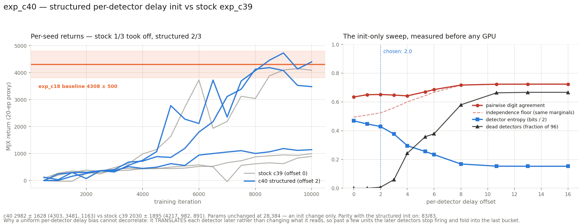

# exp_c40 — structured per-detector delay init

The exp_c39 config with one change: **detector *d* gets `d × 2.0` added to all 17 of its
synapse delays**, on top of the i.i.d. half-normal jitter. An initialisation change only —
architecture, parameter count and every hyperparameter are identical to exp_c39.

**Params 28,384 (unchanged). Parity 83/83. Result 2982.2 ± 1628.3, 2/3 seeds took off**
(stock c39: 2030.2 ± 1894.7, 1/3).

Scratch work — nothing committed, nucstar's branch never modified (the torch reference is
patched only in its `/tmp` staging copy, by `patch_torch_ref.py`).

---

## 1. Why this was tried, and why the premise was weaker than I said

exp_c39's transplant established that the **front-end init decides takeoff**: the winner's
init rescued both losing RL streams and a loser's init destroyed the winning one. `delay`
and `w_raw` are 85.7% of the front-end and the only seed-dependent part of it. I proposed
decorrelating the detectors, citing within-table pairwise digit agreement of 0.62–0.64
"against 0.25 for independent uniform digits".

**That 0.25 was wrong.** The digit marginals are far from uniform — the no-spike mass folds
into the last bucket — so the correct floor is the agreement two *independent* digits with
those same marginals would produce, which is **0.495**. The redundancy to be removed was
therefore **0.140 of excess agreement, not 0.38.** A much smaller target than I presented.

## 2. Choosing the offset — measured, not guessed

Pairwise agreement is computable **at init with no training**, so the offset was chosen by
sweeping 11 values × 3 seeds on 4,096 warmup-distribution states, in seconds
(`offset_sweep.py`). Minimising agreement alone would be a trap: pushing detectors later
stops them firing, a non-firing detector folds into the last bucket as a *constant* digit,
and that drives agreement back **up** while entropy collapses. So four quantities were
tracked together.

| offset | agreement | indep. floor | entropy (bits) | dead of 96 | eff cells |
|---:|---:|---:|---:|---:|---:|
| 0.0 | 0.634 | 0.495 | 0.937 | 0 | 6.01 |
| 1.0 | 0.650 | 0.508 | 0.894 | 0 | 5.47 |
| **2.0** | **0.652** | **0.524** | **0.857** | **0.7** | **5.16** |
| 3.0 | 0.648 | 0.559 | 0.753 | 5.7 | 4.39 |
| 4.0 | 0.642 | 0.601 | 0.591 | 23.3 | 3.29 |
| 5.333 | 0.670 | 0.643 | 0.511 | 34.3 | 2.84 |
| 8.0 | 0.717 | 0.716 | 0.337 | 55.7 | 2.03 |
| 16.0 | 0.724 | 0.724 | 0.305 | 64.0 | 1.90 |

**Agreement never falls.** It is flat-to-rising at every offset, and the whole apparent
"spread" past 4.0 is detectors dying.

**Chosen: 2.0.** Rationale: the per-detector separation should be comparable to the jitter
it must overcome (the half-normal at σ=4 has std 2.41), or the bias is swamped by noise and
is not a structural change at all. 2.0 is ≈0.83 of that spread while keeping essentially
every detector alive (0.7 dead of 96). **The task's suggested `t_window/(2D)` = 5.333 was
rejected on measurement**: it kills 34 of 96 detectors and halves detector entropy.

## 3. Parity — 83 checks

```
PARITY OK — 83 checks over 3 cases, all within 2e-05 relative
  run: torch delays carry the per-detector bias   per-detector min [0.002, 2.004, 4.005],
                                                  steps [2.001, 2.001]
  run: jax structured_delay applies d*offset      detector biases [0.0, 2.0, 4.0]
```

Parity loads torch's parameters, so it exercises the forward under structured delays but
not the JAX init that builds them. The two new assertions close that gap on both sides — a
`delay_offset` silently dropped in either implementation would otherwise pass everything
else in the file.

## 4. Did it decorrelate? Barely.

Measured on one common observation set, averaged over 3 seeds:

| | agreement | indep. floor | **excess** |
|---|---:|---:|---:|
| c39 stock, init | 0.634 | 0.495 | **0.140** |
| c40 structured, init | 0.652 | 0.524 | **0.128** |
| c39 stock, final | 0.354 | 0.336 | **0.018** |
| c40 structured, final | 0.375 | 0.354 | **0.021** |

Excess agreement — the only number that means "redundant" — moved **0.140 → 0.128** at
init and **0.018 → 0.021** at the end. The intervention essentially did not do the thing it
was designed to do. Note also that **training already removes almost all of the redundancy
on its own** (0.140 → 0.018), which further undercuts the premise: the detectors are not
still redundant by the time it would matter.

## 5. Result

| seed | CPU-ref 100 ep | ep-sd | full | velocity |
|---:|---:|---:|---:|---:|
| 1 | **4302.7** | 717.8 | 83/100 | 3.532 m/s |
| 0 | **3481.0** | 1702.4 | 75/100 | 3.004 m/s |
| 2 | 1162.8 | 130.4 | 0/100 | 2.606 m/s |

**2982.2 ± 1628.3**, versus stock c39's **2030.2 ± 1894.7**: **+952.0**, unpaired Welch se
1442.4, **|t| 0.66**. Takeoff count **2/3 against 1/3**; seed spread slightly tighter
(1628 vs 1895).



### The finding that matters, and it is a caution

**The seeds that took off swapped.** Stock c39: only seed 2. Structured c40: seeds 0 and 1,
and **not** seed 2 (4217 → 1163). That is exactly what exp_c39's transplant predicts — the
init decides the outcome, so *changing the init reshuffles which draws are lucky*. It is
fully consistent with the intervention having **no systematic effect at all** and simply
dealing a different hand.

At n=3 per arm, 2/3 versus 1/3 is one seed of difference and |t| 0.66 on the mean. **This
experiment cannot distinguish "modest real improvement" from "reshuffle".** Distinguishing
them needs many more seeds, not more configurations — and given that the measured mechanism
(excess agreement) barely moved, reshuffle is the more parsimonious reading.

### Diagnostics

| | c40 s0 | c40 s1 | c40 s2 | c39 range |
|---|---:|---:|---:|---|
| effective cells / table | 6.31 | 5.49 | 6.29 | 4.99–8.48 |
| cell coverage | 0.604 | 0.568 | 0.562 | 0.627–0.702 |
| no-spike | 0.040 | 0.033 | 0.044 | 0.029–0.042 |
| mean digit | 2.12 | 1.95 | 1.88 | 1.91–2.02 |
| T_bkt / T_cross | 1.000 / 1.000 | 1.000 / 1.000 | 1.000 / 1.000 | 1.000 |

**The freeze held exactly** — both temperatures read 1.000 at all 20 evals in all three
seeds. Coverage is systematically lower than stock (0.56–0.60 vs 0.63–0.70), as the sweep
predicted.

**Terminal dip: present in one seed and worth stating.** Seed 0 peaked at MJX 4188 and
finished at 3482 (−17%); seed 1 peaked 4733, finished 4402 (−7%); seed 2 was flat. The CPU
reference scores the *final* actor, so seed 0's 3481 is a post-peak number. This is ordinary
late decline, not the systematic sharpening dip that hit 6 of 6 runs in c30/c30b — there is
no anneal here and the temperatures are frozen — but it is not nothing.

## 6. Cost

| | |
|---|---|
| offset sweep (init only, 11 offsets × 3 seeds) | ~2 min |
| parity gate | ~5 min |
| 3-seed run + CPU references | **34 min wall**, ~0.20 s/iter co-resident |
| GPU memory | 1,350 MiB per process, 4.1 GB for three |

## 7. Verdict and what to try instead

**A uniform per-detector delay bias is the wrong instrument for this goal, and the sweep
shows why mechanically:** it *translates* a detector's whole arrival pattern later rather
than changing what it reads. Every synapse moves together, so the spike time shifts, the
digit drifts toward the last bucket, and past a few units the membrane stops crossing
threshold at all. It cannot make two detectors read *different structure* in the same input;
it can only make one fire later than the other.

**The better-posed version of the same idea: offset the BOUNDARIES per detector, not the
delays.** The digit is `#{boundaries ≤ t*}`, and at init all three detectors of a table use
identical boundaries (8, 16, 24). Giving detector *d* boundaries shifted by `d × offset`
makes each detector quantise a *different region of the time axis* — genuinely reading
different structure — **without touching whether or when it fires**. No detector can be
killed by it, which is the failure mode that ruined the delay version. It is the same
one-line class of change and it is the natural follow-up.

**Also worth a run, from the exp_c39 transplant's other half:** the table init is
`0.1 * randn` with **no fan-in or `tables_per_head` scaling**, so the summed head output
starts at √tph × 0.1 (0.58 at 32 tables, 1.13 at c36's 128). Swapping the table init alone
moved a failing stream 891 → 1244. `0.1/√tph` is principled, cheap, and cannot kill anything.

## 8. Files

| file | what |
|---|---|
| `jax_mhl_lut.py` | JAX port + `structured_delay()` and `delay_offset` in `init()` |
| `patch_torch_ref.py` | applies the same change to the **scratch /tmp** copy of the torch reference |
| `offset_sweep.py`, `offset_sweep.json` | the init-only offset sweep that chose 2.0 |
| `agreement.py`, `agreement.json` | pair agreement vs independence floor, init and final, c39 vs c40 |
| `run_parity.sh`, `parity_check.py`, `torch_ref_dump.py` | the 83-check gate |
| `mhl_sac.py`, `run_parallel_c40.sh` | trainer (`--delay-offset`) and the 3-seed run |
| `collect.py`, `results.json`, `plot_c40.py`, `c40_result.png` | results and figure |

Nothing committed. nucstar's torch branch untouched — the reference was patched only in
`/tmp/mhl_ref_c40`, never in the repository.
