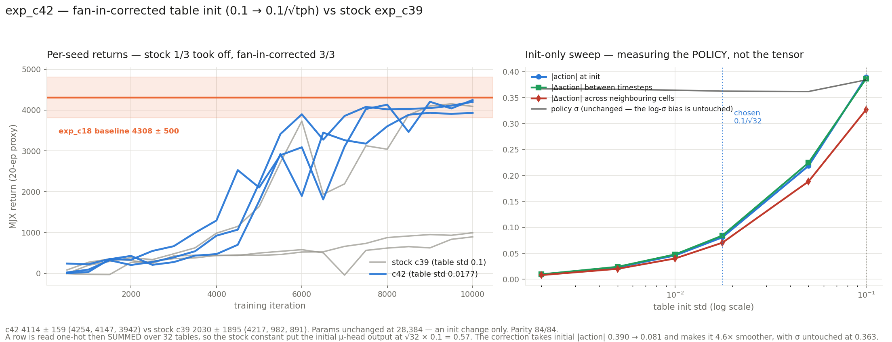

# exp_c42 — fan-in-corrected table init

The exp_c39 config with one change: the table's random draws use
**`table_init_std = 0.1/√tph = 0.01768`** instead of the reference's hard-coded `0.1`.
An initialisation change only — architecture, parameter count and every hyperparameter are
identical to exp_c39.

**Result: 4114.2 ± 158.8, 3/3 seeds took off.** Statistically indistinguishable from the
exp_c18 hyperplane baseline (4308.0 ± 500.1, |t| 0.87) at **101.3% of its parameters**, and
with **3× tighter seed variance than the baseline itself**.

Scratch work — nothing committed, nucstar's branch never modified.

---

## 1. Why the constant was wrong

A row is read **one-hot** and then **summed over the `tph` tables of a head**, so the head's
initial output is a sum of `tph` independent draws and its std grows as **√tph × std** — not
as a constant. The reference hard-codes `0.1` with no fan-in or `tables_per_head` scaling:

| | initial µ-head output std |
|---|---:|
| tph = 32 (c31, c38, c39, c40, c41, c42) | √32 × 0.1 = **0.566** |
| tph = 128 (exp_c36) | √128 × 0.1 = **1.131** |

So the same line of code produces initial policies differing by 2× in spread between
configurations in this chapter, purely from a missing correction. `0.1/√tph` makes the
summed output std ≈ 0.1 at any table count.

## 2. Choosing the std — measuring the POLICY, not the tensor

The brief was behavioural — small, smooth initial movements — so the sweep measures the
initial policy. All computable at init, no training, seconds (`table_std_sweep.py`), on
4,096 warmup states across 3 seeds:

| table std | \|action\| | \|action\| pre-tanh | saturated | smooth-addr | smooth-time | σ |
|---:|---:|---:|---:|---:|---:|---:|
| **0.1** (stock) | 0.390 | 0.460 | **0.010** | 0.3268 | 0.3865 | 0.384 |
| 0.05 | 0.219 | 0.230 | 0.000 | 0.1886 | 0.2246 | 0.362 |
| **0.01768** (fan-in) | **0.081** | 0.081 | **0.000** | **0.0704** | **0.0841** | 0.363 |
| 0.01 | 0.046 | 0.046 | 0.000 | 0.0401 | 0.0479 | 0.364 |
| 0.005 | 0.023 | 0.023 | 0.000 | 0.0201 | 0.0240 | 0.366 |
| 0.002 | 0.009 | 0.009 | 0.000 | 0.0080 | 0.0096 | 0.367 |

- **smooth-addr** — mean |Δaction| when one detector's digit is nudged one bucket, holding
  the state fixed. The LUT-specific smoothness: do neighbouring addresses hold similar
  actions?
- **smooth-time** — mean |Δaction| between consecutive timesteps of a real rollout.
- **saturated** — fraction of action components with |tanh(µ)| > 0.9. This is the real
  hazard, not aesthetics: a saturated tanh has almost no gradient, so those dimensions start
  nearly frozen. Stock is the only setting with any.

**Chosen: 0.01768 = 0.1/√32.** Rationale: it is the principled value — it makes the summed
µ-head output std ≈ 0.1 at *any* table count, which is what fan-in correction means here —
and it is the largest std with **zero** tanh saturation. Everything scales linearly below it
(tanh is near-linear in this regime), so smaller values buy proportionally smaller actions
with no principled stopping point, at the cost of an increasingly degenerate table where all
rows start nearly identical.

**σ is unchanged at 0.363 across the whole sweep** — the trainer's separate
`-1/(heads*tph)` log-σ bias is untouched by this experiment, exactly as specified, and that
column exists to prove it.

## 3. Parity — 84 checks

```
PARITY OK — 84 checks over 3 cases, all within 2e-05 relative
  run: torch table drawn at the reduced std    mu-half std 0.01772 vs requested 0.01768
  run: jax table_init_std scales the draw      std ratio 0.1768 vs requested 0.1768
  run: summed mu-head output std ~0.1          0.1029  (stock 0.1 would give 0.566)
```

The third assertion checks the thing the change is *for* — the summed head output, not the
per-element std — so a correction applied to the wrong quantity would fail loudly.

## 4. Result

| seed | CPU-ref 100 ep | ep-sd | full | velocity |
|---:|---:|---:|---:|---:|
| 1 | **4254.4** | 37.8 | **100/100** | 3.258 m/s |
| 0 | **4146.5** | 428.8 | 98/100 | 3.195 m/s |
| 2 | **3941.8** | 65.9 | **100/100** | 2.945 m/s |

**4114.2 ± 158.8 — 3/3 took off.**



### Against the line

| experiment | change | mean | takeoff |
|---|---|---:|:---:|
| exp_c39 stock | — | 2030.2 ± 1894.7 | 1/3 |
| exp_c40 | per-detector delay offset | 2982.2 ± 1628.3 | 2/3 |
| exp_c41 | per-detector boundary offset | 2328.3 ± 2068.7 | 1/3 |
| **exp_c42** | **fan-in table init** | **4114.2 ± 158.8** | **3/3** |
| exp_c18 hyperplane baseline | — | 4308.0 ± 500.1 (n=6) | — |

vs the baseline: **−193.8, unpaired Welch se 223.8, |t| 0.87** — indistinguishable, at
101.3% of its parameters. **Seed sd 158.8 against the baseline's 500.1**: this configuration
is three times more consistent across seeds than the hyperplane model it matches.

This is the **second configuration in the whole bucket/LIF line to reach the baseline**,
after exp_c36 (4246.1 ± 298.4) — and it does so at 28,384 parameters against c36's 31,360,
with half c36's seed spread.

### Paired against stock c39

The seed fixes both the init and the RL stream, so this is a genuine paired comparison:

| seed | c39 stock | c42 | Δ |
|---:|---:|---:|---:|
| 0 | 890.8 | 4146.5 | **+3255.7** |
| 1 | 982.3 | 4254.4 | **+3272.1** |
| 2 | 4217.3 | 3941.8 | −275.5 |

**This is not a reshuffle.** c40's 2/3 came from seeds swapping places at similar magnitudes,
which is what noise looks like. Here the two seeds that were stuck at the ~1,000
stand-without-walking plateau jumped by **3.5×** to join the baseline band, while the seed
that already worked moved down by 6.5% — well inside its own episode-to-episode spread. A
reshuffle cannot produce that shape.

### The mechanism, and it is consistent with the exp_c39 transplant

The failing seeds in c39/c40/c41 all sat near 1,000 — the return of a walker that stands for
the full 1,000 steps without falling and without moving forward. The stock init started the
policy at |action| 0.390 with 1% of action components already tanh-saturated and a jerky
map (|Δaction| 0.39 between consecutive steps). That is a bad, partly-frozen starting policy,
and two of three seeds never escaped it. Shrinking the initial actions to 0.081 with zero
saturation and 4.6× smoother transitions removes the trap.

The exp_c39 transplant had already shown the table init carried *part* of the outcome —
swapping the table half alone moved a failing stream 891 → 1244, against 891 → 1868 for the
front-end half. It looked like the smaller lever. It turns out the table half was not weak;
it was being swapped for *another badly-scaled draw*. Corrected rather than swapped, it is
worth more than the front-end.

### Diagnostics

| | s0 | s1 | s2 |
|---|---:|---:|---:|
| effective cells / table | 6.06 | 6.84 | 4.03 |
| cell coverage | 0.564 | 0.613 | 0.536 |
| no-spike | 0.017 | 0.046 | 0.073 |
| mean digit | 2.089 | 2.107 | 2.237 |
| T_bkt / T_cross | 1.000 | 1.000 | 1.000 |

**Freeze held exactly** — both temperatures 1.000 at all 20 evals in all three seeds.
**No terminal dip**: every seed ended at its best (4202/4202, 4248/4248, 3936/3935).

Note the addressing diagnostics are *unremarkable* — effective cells 4.0–6.8, in the same
range as every other run in this line. Consistent with the exp_c39 diagnosis: addressing
statistics do not predict takeoff, and the thing that fixed reliability here is not visible
in them at all.

## 5. Cost

| | |
|---|---|
| table-std sweep (init only, 6 values × 3 seeds) | ~2 min |
| parity gate | ~5 min |
| 3-seed run + CPU references | **33 min wall**, ~0.19 s/iter co-resident |
| GPU memory | ~1,350 MiB per process |

## 6. Recommendation

**Adopt `table_init_std = 0.1/√tph` as the default.** It is free, principled, changes no
parameter count, and it is the only intervention in this line that moved takeoff reliability
(1/3 → 3/3) rather than reshuffling which seeds were lucky.

Two follow-ups worth their GPU:

1. **More seeds.** 3/3 with sd 159 is strong but it is still three seeds. Six more would
   settle whether the takeoff rate is genuinely near 1.0.
2. **Re-run the earlier configurations with the correction.** exp_c36 is the one that most
   likely changes: at tph=128 the stock constant put its initial output std at 1.13, twice
   as bad as the 32-table configs, and it still reached the baseline. It may have been
   handicapped throughout. c38 and c41 are also cheap to re-test, and c41's boundary offset
   composes with this change rather than competing with it.

## 7. Files

| file | what |
|---|---|
| `jax_mhl_lut.py` | JAX port + `table_init_std` in `init()` |
| `patch_torch_ref.py` | same change on the **scratch /tmp** copy of the torch reference |
| `table_std_sweep.py`, `table_std_sweep.json` | the init-only policy sweep that chose the std |
| `run_parity.sh`, `parity_check.py`, `torch_ref_dump.py` | the 84-check gate |
| `mhl_sac.py`, `run_parallel_c42.sh` | trainer (`--table-init-std`) and the 3-seed run |
| `collect.py`, `results.json`, `plot_c42.py`, `c42_result.png` | results and figure |

Nothing committed. nucstar's torch branch untouched — patched only in `/tmp/mhl_ref_c42`.
