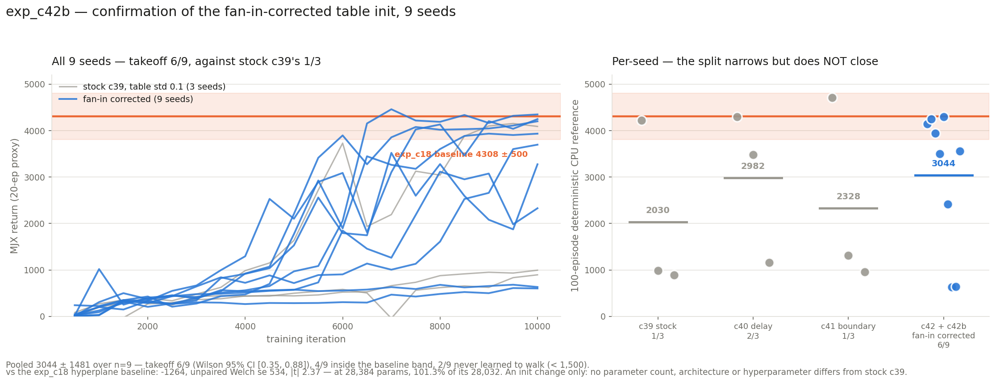

# exp_c42b — confirmation run for the fan-in-corrected table init

Six new seeds (3–8, RNG streams disjoint from exp_c42's 0–2) of the **exact** exp_c42
config: standard i.i.d. half-normal delays (`delay_init_std=4`), no delay offset, no
boundary offset, `table_init_std = 0.1/√tph = 0.01768`. Pooled to **n = 9**.

**Result: the 3/3 was substantially luck.** Six new seeds give **3/6**; pooled **6/9**,
**3043.8 ± 1480.5**.

---

## 1. Why this run existed, and what it says about the c42 report

exp_c42 gave 3/3 at 4114.2 ± 158.8, and I reported it as *"the one that worked"* and as
having *"moved reliability rather than reshuffling luck"*. That claim was too strong on
three seeds, and this run is the correction:

| | mean | takeoff |
|---|---:|:---:|
| exp_c42 (seeds 0–2) | 4114.2 ± 158.8 | **3/3** |
| exp_c42b (seeds 3–8) | 2508.5 ± 1570.3 | **3/6** |
| **pooled (n = 9)** | **3043.8 ± 1480.5** | **6/9** |

Same configuration, disjoint seeds. The tiny ±158.8 that made c42 look like a reliability
fix was a property of three lucky draws, not of the configuration: the pooled seed sd is
**1480.5**, nine times larger, and **not** tighter than the baseline's 500.1 as I claimed.

Takeoff rate 0.67, **Wilson 95% CI [0.35, 0.88]** — still compatible with a configuration
that fails a third of the time.

## 2. Results

| seed | CPU-ref 100 ep | ep-sd | full | velocity | took off |
|---:|---:|---:|---:|---:|:---:|
| c42 s0 | 4146.5 | 428.8 | 98/100 | 3.195 | YES |
| c42 s1 | 4254.4 | 37.8 | 100/100 | 3.258 | YES |
| c42 s2 | 3941.8 | 65.9 | 100/100 | 2.945 | YES |
| c42b s3 | 3504.0 | 926.0 | 72/100 | 2.918 | YES |
| c42b s4 | 4299.1 | 378.2 | 99/100 | 3.329 | YES |
| c42b s5 | 2412.6 | 760.5 | 11/100 | 2.885 | no |
| c42b s6 | 634.7 | 52.7 | 0/100 | 2.030 | no |
| c42b s7 | 637.8 | 86.5 | 0/100 | 1.830 | no |
| c42b s8 | 3562.8 | 1300.6 | 69/100 | 3.171 | YES |

Distribution over the 9: **4 inside the baseline band** (4308 ± 500), 2 more above 3,000,
1 intermediate at 2,413, **2 never learned to walk** (635, 638).

vs the exp_c18 hyperplane baseline (4308.0 ± 500.1, n=6): **−1264.2, unpaired Welch se
534.1, |t| 2.37**. On n=9 the configuration is *below* the baseline, where c42 alone read as
indistinguishable from it.

## 3. Is the correction worth anything at all? Yes, but modestly

The fair comparison is against the runs that used the stock `table_init_std = 0.1`. Nine of
those exist in this line — exp_c39, exp_c40 and exp_c41 (the latter two vary the *delay* and
*boundary* init respectively, so they are not pure stock, but all three share the stock
table std):

| | n | mean | takeoff |
|---|:-:|---:|:---:|
| stock table std 0.1 (c39 + c40 + c41) | 9 | 2446.9 ± 1675.7 | 4/9 |
| **fan-in corrected (c42 + c42b)** | 9 | **3043.7 ± 1480.5** | **6/9** |

**+596.9 on the mean, Welch se 745.4, |t| 0.80.** Takeoff 6/9 vs 4/9, **Fisher exact
two-sided p = 0.637**.

So: the direction is consistent and both the mean and the takeoff rate move the right way,
but at n=9 per arm **neither difference is statistically distinguishable from noise**. The
honest summary is that the fan-in correction is *principled, free, and probably mildly
helpful* — not the transformation the first three seeds suggested.

What survives from exp_c42 unambiguously is the **mechanical** part, which was measured at
init and does not depend on seeds: the stock constant put the initial policy at |action|
0.390 with 1% of components tanh-saturated, and the correction takes that to 0.081 with
zero saturation and 4.6× smoother transitions. That is real regardless of how the returns
came out; the error was in claiming it converted into reliability.

## 4. Diagnostics

| seed | eff cells | coverage | no-spike | digit | best → final |
|---:|---:|---:|---:|---:|---|
| s3 | 4.34 | 0.565 | 0.044 | 2.063 | 3698 → 3698 |
| s4 | 5.45 | 0.607 | 0.036 | 2.175 | 4460 → 4349 |
| s5 | 4.92 | 0.583 | 0.031 | 1.997 | 3116 → 2329 |
| s6 | 4.63 | 0.597 | 0.043 | 1.993 | 682 → 633 |
| s7 | 6.53 | 0.622 | 0.097 | 1.986 | 610 → 602 |
| s8 | 7.24 | 0.685 | 0.037 | 1.930 | 3521 → 3276 |

**The addressing diagnostics again separate nothing.** s7 has the second-highest effective
cells (6.53) and the highest coverage (0.622) and scored 638; s3 has the lowest effective
cells (4.34) and scored 3504. This is now the third independent confirmation of the exp_c39
finding.

**Freeze held exactly** — T_bkt and T_cross read 1.000 at all 20 evals in all six seeds.

**Terminal dip: present in two seeds.** s5 peaked at 3116 and finished at 2329 (−25%), which
is what moved it below the takeoff threshold; s8 peaked 3521, finished 3276 (−7%). The CPU
reference scores the final actor, so s5's 2412.6 is a post-peak number — it *did* briefly
clear 3,000 during training. s3, s4, s6, s7 ended at or near their best.

## 5. Cost

Six seeds co-resident: **~10.2 GB of 32.6**, GPU at 100%, **~0.37 s/iter each**,
**63 min wall** including the six 100-episode CPU references. Six at once cost about the
same wall-clock as two sequential batches of three would have, for one launch.

Parity re-run for this shape before any GPU: **84/84** within 2e-05, including the check
that the summed µ-head output std is 0.1029 (stock would give 0.566).

## 6. What to conclude

1. **Keep the fan-in correction.** It is free, principled, fixes a genuine scaling bug
   (initial output std growing as √tph), demonstrably improves the initial policy, and
   points the right way on both mean and takeoff. There is no argument for keeping the
   hard-coded 0.1.
2. **Do not claim it fixes reliability.** 6/9 with CI [0.35, 0.88] is not a solved problem,
   and 2 of 9 seeds still never learn to walk at all.
3. **Three seeds is not enough for a takeoff-rate claim in this chapter**, and that is the
   transferable lesson. Every configuration here is bimodal, so the per-seed outcome is
   close to a coin flip and n=3 has a ≥6% chance of showing 3/3 for a configuration that
   fails half the time. The chapter's earlier 3-seed comparisons (c38 2/3, c40 2/3, c41 1/3)
   should all be read with the same scepticism — the differences between them are almost
   certainly not resolvable at n=3.
4. **The remaining variance is where exp_c39's transplant put it**: in the `delay`/`w_raw`
   draw. Nothing tried since has moved it, and the transplant showed that swapping *that*
   changes the outcome deterministically. If reliability is the goal, that is the lever, and
   an init-selection criterion for it — which no aggregate we have measured predicts — is
   the open problem.

## 7. Files

| file | what |
|---|---|
| `run_parallel_c42b.sh` | six seeds (3–8) co-resident |
| `collect.py`, `results.json` | pooled n=9, Wilson interval, band/plateau split |
| `plot_c42b.py`, `c42b_result.png` | all 9 curves and the per-seed strip |
| `run_parity.sh`, `parity_check.py`, `torch_ref_dump.py`, `patch_torch_ref.py` | the 84-check gate |
| `mhl_sac.py`, `jax_mhl_lut.py`, `eval_mhl_cpu.py` | trainer, port, CPU reference |

Nothing committed. nucstar's torch branch untouched — patched only in `/tmp/mhl_ref_c42b`.
