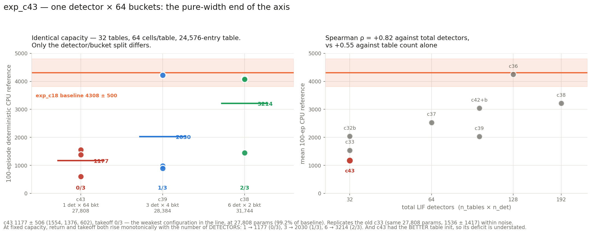

# exp_c43 — one detector × 64 buckets: the pure-width end of the axis

`n_heads=1, tables_per_head=32, n_det=1, n_buckets=64, freeze_temperature=True,
delay_init_std=4` (standard i.i.d. half-normal, no delay or boundary offset),
`table_init_std = 0.1/√tph` (the fan-in default from exp_c42).

**Result: 1177.2 ± 506.4, 0/3 takeoff — the weakest configuration in the line.**
Params **27,808** (99.2% of the hyperplane baseline). Parity **87/87**.

Scratch work — nothing committed, nucstar's branch never modified.

---

## 1. The n_det=1 special case

No mixed-radix combination at all: the radix is `[1]` and the joint cell index **is** the
single bucket digit. One LIF per table, 64 ordered buckets, 64 cells — the same capacity as
c38 (2⁶) and c39 (4³) reached by pure width.

**Parameters: 27,808** = 3,232 front-end + 24,576 table (27,744 trainable).

| tensor | shape | params |
|---|---|---:|
| `delay` | (32, 1, 17) | 544 |
| `w_raw` | (32, 1, 17) | 544 |
| `tau_raw` | (32, 1) | 32 |
| `beta_base` | (32, 1, 1) | 32 |
| **`beta_raw`** | **(32, 1, 63)** | **2,016** |
| `log_T_cross`, `log_T_bkt` | (32,) ×2 | 64 (frozen) |
| `table` | (32, 64, 12) | 24,576 |

63 boundaries per detector make **`beta_raw` 62% of the front-end** — the only configuration
in this line where the boundary ladder, not the synapses, is the bulk of it. Against c38
(31,744), c39 (28,384) and the baseline (28,032), this is the smallest of the four.

It is also **exactly exp_c33's parameter count** (27,808 / 3,232 front-end), c33 being the
same 64-bucket × 32-table shape under the older module. That makes c33 (1536.2 ± 1416.8) a
direct historical anchor.

## 2. Parity — 87 checks

```
PARITY OK — 87 checks over 3 cases, all within 2e-05 relative
  run: radix is trivial at n_det=1              radix [1]
  run: cell index == the single bucket digit    0 of 768 differ
  run: all 63 boundaries strictly increasing    min gap 0.50000 over 32x63 = 2016 gaps
  run: summed mu-head output std ~0.1           0.1029  (stock 0.1 would give 0.566)
```

## 3. A real numerical finding: the monotonicity invariant fails in float32

**Seed 1's CPU evaluation initially failed to load**, on the assertion that the boundaries
are strictly increasing. That assertion has been in this chapter since exp_c32b and every
README has justified it the same way: `boundaries = beta_base + cumsum(softplus(beta_raw))`
with softplus strictly positive, so *"there is no projection step and no way to produce a
crossed pair"*.

**That is true in exact arithmetic and false in float32**, and 64 buckets is where it first
bites. Measured on the finished checkpoints:

| seed | min softplus | boundary range | zero gaps |
|---|---:|---|---:|
| 0 | 5.9e-07 | [−1.62, 60.95] | 0 / 1984 |
| **1** | **4.9e-07** | **[−1.41, 50.95]** | **5 / 1984** |
| 2 | 9.2e-07 | [−1.44, 41.87] | 0 / 1984 |

It is **not** softplus underflow — the smallest softplus is 4.9e-07, comfortably normal.
It is **cancellation in the cumulative sum**: at a boundary magnitude of ~51 the float32
spacing is ~3.8e-06, so an increment of 4.9e-07 is below the representable step and
`cumsum` returns the same value twice. At 4 and 16 buckets the ladder never grew far enough
for this to occur.

**The consequence is benign and the assertion was wrong, not the model.** Two equal
boundaries mean an *empty bucket* — that digit value is simply never emitted. The addressing
stays monotone and well defined. What would be a genuine fault is a *decreasing* pair, which
would make the bucket index non-monotone in spike time. `eval_mhl_cpu.py` now enforces
**non-decreasing**, raises loudly on any decrease, and reports ties as a note. Seed 1
re-evaluated cleanly under the corrected check.

This is worth carrying to the rest of the chapter: any future configuration with many
buckets, or with boundaries trained far from the origin, will hit the same thing.

## 4. Result

| seed | CPU-ref 100 ep | ep-sd | full | velocity |
|---:|---:|---:|---:|---:|
| 2 | 1554.5 | 658.5 | 1/100 | 2.323 m/s |
| 0 | 1375.5 | 303.2 | 0/100 | 2.509 m/s |
| 1 | 601.7 | 11.1 | 0/100 | 1.631 m/s |

**1177.2 ± 506.4, takeoff 0/3.** vs the c18 baseline: −3130.8, Welch se 356.6, **|t| 8.78**.
vs exp_c33 at the identical parameter count: −359.0, well inside c33's own ±1416.8 — so this
**replicates** the old result with the unified class and the new table init.



### The width-vs-count axis, completed

All three at 32 tables, 64 cells/table, the same 24,576-entry table:

| | detectors | buckets | params | mean | takeoff |
|---|:-:|:-:|---:|---:|:-:|
| **c43** | **1** | **64** | 27,808 | **1177.2** | **0/3** |
| c39 | 3 | 4 | 28,384 | 2030.2 | 1/3 |
| c38 | 6 | 2 | 31,744 | 3213.9 | 2/3 |

**Monotone in detector count, on both the mean and the takeoff count.** And the comparison
is conservative: c38 and c39 ran with the *stock* table init while c43 got the
fan-in-corrected one that the c42 line found is mildly better, so c43's deficit is if
anything understated.

### What this says about the exp_c36 conclusion

exp_c36 concluded that return tracks **the number of independent indices summed** — i.e.
tables. c43 completes the other axis, and the two unify: a table with D detectors contains D
independent LIF cells, so the candidate quantity is the **total number of LIF detectors**,
`n_tables × n_det`, however distributed.

| config | tables | det/table | **detectors** | mean |
|---|---:|---:|---:|---:|
| c43 | 32 | 1 | 32 | 1177.2 |
| c33 | 32 | 1 | 32 | 1536.2 |
| c32b | 32 | 1 | 32 | 2041.2 |
| c37 | 64 | 1 | 64 | 2531.1 |
| c39 | 32 | 3 | 96 | 2030.2 |
| c42+c42b | 32 | 3 | 96 | 3043.7 |
| c36 | 128 | 1 | 128 | 4246.1 |
| c38 | 32 | 6 | 192 | 3213.9 |

**Spearman ρ = +0.82 against total detectors, against +0.55 against table count alone.**
So the refined statement is: *return tracks the number of independent LIF detectors,
whether they are spread across tables or packed within them* — and that is a better
predictor than either tables or cells on their own.

**Stated with the caveats it deserves.** Eight configurations, most with only 3 seeds, are
not a regression; ρ is ordinal and the ranking is imperfect (c38 has 192 detectors and sits
below c36's 128). The c42b lesson applies in full: at n=3 this chapter cannot resolve
takeoff-rate differences, and several of these means are within each other's noise. What the
data supports is a *direction*, and c43 is the strongest single piece of it because it is
the extreme point of a controlled triple rather than another configuration change.

### Diagnostics

| seed | eff cells | coverage | no-spike | digit (0–63) | best → final |
|---:|---:|---:|---:|---:|---|
| s0 | 4.88 | 0.803 | 0.071 | 43.97 | 1451 → 1441 |
| s1 | 7.04 | 0.766 | 0.055 | 46.57 | 607 → 607 |
| s2 | 5.76 | 0.752 | 0.051 | 49.55 | 1811 → 1348 |

`digit` here ranges **0–63** and is on a completely different scale from c38's 0–1 and c39's
0–3; the three are not comparable. Effective cells 4.9–7.0 are *above* the 1.7–2.5 band that
the earlier single-detector configs (c32b–c37) sat in — and the returns are the worst in the
line, which is a fourth independent confirmation that this diagnostic does not predict
takeoff. Cell coverage is the highest of any config here (0.75–0.80) for the same reason and
to the same effect.

**Freeze held exactly** — both temperatures 1.000 at all 20 evals in all three seeds.
**Terminal dip in one seed:** s2 peaked at 1811 and finished at 1348 (−26%); s0 and s1 ended
at their best.

## 5. Cost

3 seeds co-resident, ~0.19 s/iter, **33 min wall** including the CPU references; ~1,350 MiB
per process. Parity ~5 min before any GPU.

## 6. Files

| file | what |
|---|---|
| `jax_mhl_lut.py`, `mhl_sac.py`, `eval_mhl_cpu.py` | port, trainer, CPU reference (with the corrected monotonicity check) |
| `run_parity.sh`, `parity_check.py`, `torch_ref_dump.py`, `patch_torch_ref.py` | the 87-check gate |
| `run_parallel_c43.sh`, `slack_bar_c43.py` | the 3-seed run and its bar |
| `collect.py`, `results.json` | results, the width-vs-count triple, the detector-count test |
| `plot_c43.py`, `c43_result.png` | the figure |

Nothing committed. nucstar's torch branch untouched — patched only in `/tmp/mhl_ref_c43`.
