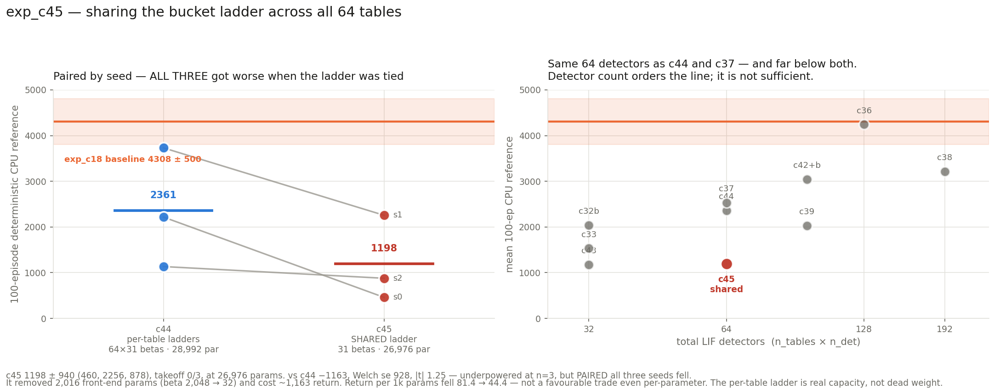

# exp_c45 — sharing the bucket ladder across all 64 tables

Identical to **exp_c44** (1 head × 64 tables × 1 LIF detector × 32 buckets,
`freeze_temperature=True`, `delay_init_std=4`, `table_init_std = 0.1/√64 = 0.0125`) with
**one change**: `beta_base` and `beta_raw` are tied across every (table, detector) — a
single global scalar plus a single 31-vector, broadcast everywhere, so all 64 tables
quantise on byte-identical boundaries.

**Result: 1198.0 ± 939.6, takeoff 0/3 — sharing HURT, on every seed.**
Params 26,976; the sharing removed **2,016** front-end parameters. Parity **90/90**.

Scratch work — nothing committed, nucstar's branch never modified.

---

## 1. The question

`beta_raw` is the single largest block of the front-end in these single-detector configs —
1,984 of c44's 4,416 (45%), and 2,016 of c43's 3,232 (62%). If every table is learning much
the same quantisation of spike time anyway, that is a lot of parameters buying nothing, and
tying them would be free. If the per-table ladders genuinely specialise, tying them should
cost.

## 2. Parameters

| | c44 (per-table) | **c45 (shared)** | Δ |
|---|---:|---:|---:|
| `beta_base` | 64 | **1** | −63 |
| `beta_raw` | 1,984 | **31** | −1,953 |
| front-end total | 4,416 | **2,400** | **−2,016** |
| **total** | 28,992 | **26,976** | −2,016 |
| vs baseline | 103.4% | **96.2%** | |

The front-end drops by **46%**; everything else is untouched.

## 3. Parity — 90 checks

```
PARITY OK — 90 checks over 3 cases, all within 2e-05 relative
  run: betas are SHARED (one global ladder)      beta_base (1,1,1), beta_raw (1,1,31)
  run: every table sees a BYTE-IDENTICAL ladder  64 tables × 1 det, max spread 0.000e+00
  run: shared ladder reaches the forward         identical spike time → identical digit
                                                 in all 64 tables
  run: radix is trivial at n_det=1               radix [1]
  run: cell index == the single bucket digit     0 of 1536 differ
  run: all 31 boundaries non-decreasing          min gap 1.00000
  run: summed mu-head output std ~0.1            0.1052
```

The `perturbed` and `alt` cases run with `share_betas=False`, so the same gate also confirms
the **unshared** path still reproduces upstream exactly — the flag is genuinely opt-in.

**One non-obvious implementation point.** Upstream reshapes the boundaries with
`bnd.view(1, T, D, M-1)`, which is an exact-element-count operation and fails outright on a
shared ladder (31 elements cannot be viewed as 64×1×31). The scratch patch replaces both
call sites with `bnd.unsqueeze(0)` — *identical* in the unshared case (boundaries is
`(T,D,M-1)`, so unsqueeze gives exactly `(1,T,D,M-1)`) and broadcasting in the shared case.
The JAX port needed no forward change at all: every consumer already broadcasts.

## 4. Result

| seed | CPU-ref 100 ep | ep-sd | full | velocity |
|---:|---:|---:|---:|---:|
| 1 | 2255.7 | 1205.9 | 21/100 | 2.785 m/s |
| 2 | 878.1 | 47.5 | 0/100 | 2.323 m/s |
| 0 | 460.1 | 6.3 | 0/100 | 1.560 m/s |

**1198.0 ± 939.6, takeoff 0/3.**



### Paired against c44 — the answer is unambiguous in direction

The seed fixes both the init and the RL stream, so this is a genuine paired comparison:

| seed | c44 per-table | c45 shared | Δ |
|---:|---:|---:|---:|
| 0 | 2217.2 | 460.1 | **−1757.1** |
| 1 | 3730.8 | 2255.7 | **−1475.1** |
| 2 | 1134.7 | 878.1 | **−256.6** |

**All three seeds got worse.** Mean −1162.9, unpaired Welch se 927.9, **|t| 1.25** —
underpowered as always at n=3, but the paired structure is 3/3 in the same direction
(sign test p = 0.125 one-sided), and takeoff went 1/3 → 0/3.

**And it is not a favourable trade even per-parameter:** return per 1,000 parameters fell
**81.4 → 44.4**. The 2,016 saved parameters bought a 49% drop in return, which is far worse
than the 7% parameter saving.

**Answer: the per-table bucket ladder carries real capacity. It is not dead weight.**

### What this qualifies about the detector-count reading

c45 has the **same 64 total LIF detectors** as c44 (2361) and c37 (2531) and scores 1198 —
below every 64-detector configuration and below two of the three 32-detector ones.

| config | detectors | mean |
|---|---:|---:|
| c43 | 32 | 1177.2 |
| **c45** | **64** | **1198.0** |
| c33 | 32 | 1536.2 |
| c32b | 32 | 2041.2 |
| c44 | 64 | 2360.9 |
| c37 | 64 | 2531.1 |
| c39 | 96 | 2030.2 |
| c42+c42b | 96 | 3043.7 |
| c36 | 128 | 4246.1 |
| c38 | 192 | 3213.9 |

Adding c45 takes Spearman ρ(total detectors) from **+0.812 (9 configs) to +0.754 (10)**.

So the honest statement is now: **detector count orders this line, but it is not
sufficient.** Two configurations with identical detector counts can differ by 1,163 if one
has per-table boundary freedom and the other does not. The reading was always ordinal and
always caveated; c45 is the first point deliberately constructed to break it, and it bends
it rather than confirming it.

### Diagnostics

| seed | eff cells | coverage | no-spike | digit (0–31) | best → final |
|---:|---:|---:|---:|---:|---|
| s0 | 3.62 | 0.682 | 0.080 | 28.51 | 503 → 462 |
| s1 | 4.97 | 0.660 | 0.054 | 28.16 | 2558 → 2173 |
| s2 | 4.29 | 0.651 | 0.281 | 28.64 | 906 → 881 |

`digit` sits at **28.2–28.6 out of 31** — much higher than c44's 21.8–24.2. With one shared
ladder the detectors cannot each place their boundaries where their own spike-time
distribution lives, so more of them fall past the top boundary and land in the last bucket.
That is the mechanism, visible directly in the diagnostic. Cell coverage is correspondingly
lower (0.65–0.68 vs c44's 0.76–0.80) and s2's no-spike rate is notably high at 0.281.

**Freeze held exactly** — both temperatures 1.000 at all 20 evals in all three seeds.
**Terminal dip:** mild, s1 2558 → 2173 (−15%); s0 and s2 ended at their best.

## 5. Cost

3 seeds co-resident, ~0.19 s/iter, **32 min wall** including the CPU references; ~1,350 MiB
per process. Parity ~5 min, run on CPU while c44 still occupied the GPU.

## 6. Files

| file | what |
|---|---|
| `jax_mhl_lut.py` | JAX port + `share_betas` in `init()` (no forward change needed) |
| `patch_torch_ref.py` | `+table_init_std +share_betas` on the **scratch /tmp** torch copy, including the `view` → `unsqueeze` fix |
| `run_parity.sh`, `parity_check.py`, `torch_ref_dump.py` | the 90-check gate |
| `mhl_sac.py` (`--share-betas`), `run_parallel_c45.sh`, `slack_bar_c45.py` | the run |
| `eval_mhl_cpu.py` | CPU reference; accepts either beta shape and notes the shared ladder |
| `results.json`, `plot_c45.py`, `c45_result.png` | results and figure |

Nothing committed. nucstar's torch branch untouched — patched only in `/tmp/mhl_ref_c45`.
