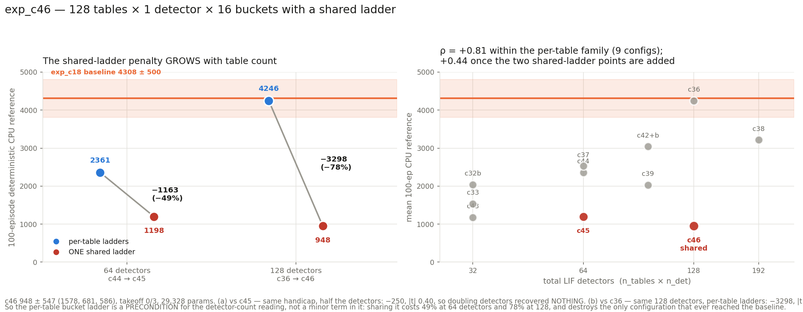

# exp_c46 — 128 tables × 1 detector × 16 buckets, shared ladder

`n_heads=1, tables_per_head=128, n_det=1, n_buckets=16, freeze_temperature=True,
delay_init_std=4` (i.i.d. half-normal, no offsets), `table_init_std = 0.1/√128 = 0.0088388`
(recomputed for tph=128, not inherited), **`share_betas=True`** — one global ladder,
`beta_base` (1,1,1) + `beta_raw` (1,1,15), broadcast to all 128 tables.

**Result: 948.2 ± 547.1, takeoff 0/3.** Params 29,328. Parity **90/90**.

Both questions this was built to answer came back clearly, and the second one is large
enough to change how the detector-count reading should be stated.

---

## 1. Parameters

| tensor | shape | params |
|---|---|---:|
| `delay` | (128, 1, 17) | 2,176 |
| `w_raw` | (128, 1, 17) | 2,176 |
| `tau_raw` | (128, 1) | 128 |
| **`beta_base`** | **(1, 1, 1)** | **1** |
| **`beta_raw`** | **(1, 1, 15)** | **15** |
| `log_T_cross`, `log_T_bkt` | (128,) ×2 | 256 (frozen) |
| `table` | (128, 16, 12) | 24,576 |
| **total** | | **29,328** (29,072 trainable) |

Front-end 4,752 = **104.6%** of the 28,032 baseline. Sharing collapses beta to **16
parameters — 0.3% of the front-end**, against c36's 2,048 for the identical 128 × 16 shape.

| | params | front-end | beta |
|---|---:|---:|---:|
| **c46** | **29,328** | **4,752** | **16** |
| c45 (64 tab, shared) | 26,976 | 2,400 | 32 |
| c44 (64 tab, per-table) | 28,992 | 4,416 | 2,048 |
| c36 (128 tab, per-table) | 31,360 | 6,784 | 2,048 |
| baseline | 28,032 | 3,456 | — |

## 2. Parity — 90 checks

```
PARITY OK — 90 checks over 3 cases, all within 2e-05 relative
  run: betas are SHARED (one global ladder)      beta_base (1,1,1), beta_raw (1,1,15)
  run: every table sees a BYTE-IDENTICAL ladder  128 tables × 1 det, max spread 0.000e+00
  run: shared ladder reaches the forward         identical spike time → identical digit
                                                 in all 128 tables
  run: radix is trivial at n_det=1               radix [1]
  run: cell index == the single bucket digit     0 of 3072 differ
  run: all 15 boundaries non-decreasing          min gap 2.00000
  run: jax table_init_std scales the draw        ratio 0.0884 vs requested 0.0884
  run: summed mu-head output std ~0.1            0.1055  (stock 0.1 would give 1.131)
```

The `perturbed` and `alt` cases run `share_betas=False`, so the gate also re-confirms the
unshared path still reproduces upstream — the flag stays genuinely opt-in.

## 3. Result

| seed | CPU-ref 100 ep | ep-sd | full | velocity |
|---:|---:|---:|---:|---:|
| 2 | 1577.5 | 391.4 | 0/100 | 2.794 m/s |
| 0 | 681.2 | 49.1 | 0/100 | 1.833 m/s |
| 1 | 585.8 | 42.9 | 0/100 | 1.961 m/s |

**948.2 ± 547.1, takeoff 0/3.** No seed cleared even 1,600.



### (a) Does more detector count recover the shared-ladder penalty? **No — not at all.**

| | detectors | mean | takeoff |
|---|---:|---:|:-:|
| c45 | 64 | 1198.0 ± 939.6 | 0/3 |
| **c46** | **128** | **948.2 ± 547.1** | **0/3** |

**−249.8, Welch se 627.7, |t| 0.40.** Doubling the detectors while keeping the shared
ladder bought nothing — if anything it is marginally *lower*, though that difference is well
inside noise. Whatever the extra detectors could contribute, they cannot contribute it
through a quantisation they are all forced to share.

### (b) How large is the shared-ladder penalty at the configuration that works? **Enormous.**

exp_c36 is the same 128 detectors, the same 128 tables × 16 buckets, and the **only**
configuration in this entire line ever to reach the hyperplane baseline (4246.1 ± 298.4).
The only structural difference is that c36 gives every table its own ladder.

**−3297.9, Welch se 359.8, |t| 9.17** — a **78% drop**. vs the c18 baseline itself:
−3359.8, |t| 8.93.

### The penalty grows with table count

| detectors | per-table | shared | penalty |
|---:|---:|---:|---|
| 64 | c44 2360.9 | c45 1198.0 | **−1163 (−49%)** |
| 128 | c36 4246.1 | c46 948.2 | **−3298 (−78%)** |

It does not saturate — forcing *more* tables onto one ladder is *worse*, which is the
opposite of what "more detectors will compensate" predicts.

### What this does to the detector-count reading

| | configs | Spearman ρ(detectors, mean) |
|---|:-:|---:|
| per-table-ladder family only | 9 | **+0.812** |
| all, including c45 and c46 | 11 | **+0.437** |

Both shared-ladder points sit far below their detector count — c46 at 128 detectors scores
below every 32-detector configuration except c43.

**So the reading has to be restated: the per-table bucket ladder is a PRECONDITION for the
detector-count relationship, not a minor term in it.** Detector count orders this line
cleanly *within* the family that gives each table its own quantisation, and says nothing
useful across the boundary. exp_c45 first bent this (ρ +0.81 → +0.75); c46 breaks it.

The mechanism is the same one c45 exposed and it is visible in the diagnostic. Sharing
forces every detector to read its spike time through boundaries fitted to the *pooled*
distribution, so detectors whose own timing sits away from that pool fall past the top
boundary into the last bucket. At 128 tables there is more spread to pool over, so the
mismatch is worse — hence a penalty that grows rather than saturates.

### Diagnostics

| seed | eff cells | coverage | no-spike | digit (0–15) | best → final |
|---:|---:|---:|---:|---:|---|
| s0 | 4.10 | 0.695 | 0.029 | 12.56 | 700 → 700 |
| s1 | 3.92 | 0.741 | 0.118 | 12.46 | 841 → 558 |
| s2 | 3.29 | 0.716 | 0.180 | 13.61 | 1663 → 1663 |

`digit` sits at **12.5–13.6 of 15** — the same signature c45 showed at 28.2–28.6 of 31, in
both cases pinned high against the last bucket. Effective cells 3.3–4.1 of 16.

**Freeze held exactly** — both temperatures 1.000 at all 20 evals in all three seeds.
**Terminal dip:** one seed, s1 841 → 558 (−34%); s0 and s2 ended at their best.

## 4. Cost

3 seeds co-resident, **33 min wall** including the CPU references; ~0.20 s/iter,
~1,350 MiB per process. Parity ~5 min before any GPU.

## 5. Files

| file | what |
|---|---|
| `jax_mhl_lut.py` | JAX port with `share_betas` (no forward change needed — broadcasting) |
| `patch_torch_ref.py` | `+table_init_std +share_betas` on the scratch /tmp torch copy, with the `view` → `unsqueeze` fix at both call sites |
| `run_parity.sh`, `parity_check.py`, `torch_ref_dump.py` | the 90-check gate |
| `mhl_sac.py`, `run_parallel_c46.sh`, `slack_bar_c46.py` | the run |
| `eval_mhl_cpu.py` | CPU reference; non-decreasing boundary assertion, accepts either beta shape |
| `results.json`, `plot_c46.py`, `c46_result.png` | results and figure |

Nothing committed. nucstar's torch branch untouched — patched only in `/tmp/mhl_ref_c46`.
