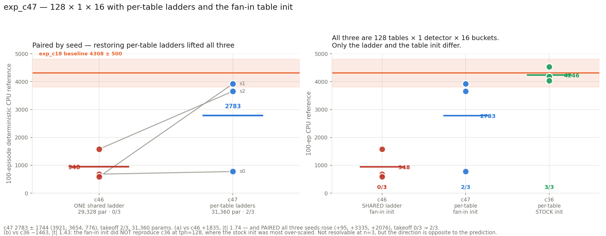

# exp_c47 — 128 × 1 × 16, per-table ladders, fan-in table init

`n_heads=1, tables_per_head=128, n_det=1, n_buckets=16, freeze_temperature=True,
delay_init_std=4`, `table_init_std = 0.1/√128 = 0.0088388`, **`share_betas=False`** —
`beta_base` (128,1,1), `beta_raw` (128,1,15).

**Result: 2783.5 ± 1743.6, takeoff 2/3.** Params **31,360** (exactly exp_c36's).
Parity **96/96**.

This run is two experiments at once, and they came out differently:
**(a) confirms the shared-ladder penalty**; **(b) contradicts the prediction for the fan-in
correction.**

---

## 1. Parameters — exactly c36's budget

| tensor | shape | params |
|---|---|---:|
| `delay` | (128, 1, 17) | 2,176 |
| `w_raw` | (128, 1, 17) | 2,176 |
| `tau_raw` | (128, 1) | 128 |
| `beta_base` | (128, 1, 1) | 128 |
| `beta_raw` | (128, 1, 15) | 1,920 |
| `log_T_cross`, `log_T_bkt` | (128,) ×2 | 256 (frozen) |
| `table` | (128, 16, 12) | 24,576 |
| **total** | | **31,360** (31,104 trainable) |

Front-end 6,784 = 111.9% of the 28,032 baseline; beta is back to **2,048** (30% of the
front-end), against c46's 16.

| | params | front-end | beta | ladder | table init |
|---|---:|---:|---:|---|---|
| c46 | 29,328 | 4,752 | 16 | shared | fan-in |
| **c47** | **31,360** | **6,784** | **2,048** | **per-table** | **fan-in** |
| c36 | 31,360 | 6,784 | 2,048 | per-table | stock 0.1 |

## 2. Parity — 96 checks

```
PARITY OK — 96 checks over 3 cases, all within 2e-05 relative
  run:       betas are PER-TABLE (not shared)   beta_base (128,1,1), beta_raw (128,1,15)
  run:       per-table ladders are INDEPENDENT  128 distinct ladders; spread 0.0
                                                (zero at init BY CONSTRUCTION)
  perturbed: per-table ladders are INDEPENDENT  spread 6.339e+00 (nonzero: they differ)
  perturbed: per-table ladders reach forward    one common spike time -> 6 DISTINCT
                                                digits across the 128 tables
  run:       all 15 boundaries non-decreasing   min gap 2.0 over 128x15 = 1792 gaps
  run:       summed mu-head output std ~0.1     0.1055  (stock would give 1.131)
```

**A methodological note on the "ladders differ" assertion.** Checking it only on the `run`
case would have been vacuous: at init every per-table ladder is *identical by construction*
(`beta_base=0`, `beta_raw=const`), so a shape check would pass while proving nothing about
whether the forward actually routes through distinct ladders. The assertion was therefore
extended to the `perturbed` case, where the parameters carry genuinely different values —
and there one common spike time produces **6 distinct digits** across the 128 tables. That
is the check that has teeth.

## 3. Result

| seed | CPU-ref 100 ep | ep-sd | full | velocity |
|---:|---:|---:|---:|---:|
| 1 | **3920.7** | 409.4 | 74/100 | 3.101 m/s |
| 2 | **3653.6** | 624.6 | 75/100 | 2.966 m/s |
| 0 | 776.1 | 231.1 | 7/100 | 1.394 m/s |

**2783.5 ± 1743.6, takeoff 2/3.**



### (a) The per-table control for c46 — confirmed, from the other direction

Paired by seed (the seed fixes both init and RL stream):

| seed | c46 shared | c47 per-table | Δ |
|---:|---:|---:|---:|
| 0 | 681.2 | 776.1 | **+94.9** |
| 1 | 585.8 | 3920.7 | **+3334.9** |
| 2 | 1577.5 | 3653.6 | **+2076.1** |

**+1835.3, Welch se 1055.1, |t| 1.74**, takeoff **0/3 → 2/3**, and **all three seeds rose**.
The shared-ladder penalty is now measured from both directions at 128 detectors: c36 → c46
gave −3298, c46 → c47 gives +1835. The two disagree in magnitude because c47 itself lands
below c36 — which is result (b).

### (b) The fan-in re-run of c36 — the prediction failed

c36 is the same 31,360-parameter shape with the same per-table ladders, differing only in
the table init: stock `0.1`, which at tph=128 puts the summed µ-head output std at ~1.13,
roughly **2× over-scaled**. The expectation was that the fan-in correction should help most
exactly here.

**It did not. −1462.6, Welch se 1021.3, |t| 1.43** — c47 lands *below* c36 (2783.5 vs
4246.1), and takeoff 2/3 against c36's 3/3.

The difference is not resolvable at n=3, and I am not claiming the fan-in correction is
harmful. But the direction is opposite to the prediction, and it is the second time this
correction has failed to deliver: exp_c42b already found it worth only +597 on the mean with
|t| 0.80 and 6/9 vs 4/9 takeoff (Fisher p = 0.637). **Taken together, the fan-in table init
should be regarded as principled but unproven — not as an established improvement.** It
fixes a real scaling bug and demonstrably produces smaller, smoother initial actions; it has
not yet produced a measurable gain in return anywhere, and here it is nominally negative at
the configuration where its case was strongest.

Two confounds worth naming rather than glossing: c47 also uses `delay_init_std=4`
(half-normal delays) where c36 used zeros, and c47 runs the unified `LIFMultiHeadLUT` class
where c36 ran the older `BucketLIFDetectorsMHL`. So c47-vs-c36 is not a clean single-variable
comparison — it is *three* changes at once, and the table init is only one of them.

### Where this leaves the detector-count reading

| | configs | Spearman ρ(detectors, mean) |
|---|:-:|---:|
| per-table-ladder family, with c47 | 10 | **+0.830** (was +0.812 over 9) |
| all, including c45 and c46 | 12 | **+0.512** (was +0.437 over 11) |

Adding c47 slightly *strengthens* the within-family ordering. The picture from c46 stands:
detector count orders the per-table family well and says little across the shared/per-table
boundary.

### Diagnostics — the mechanism check passed

| seed | eff cells | coverage | no-spike | digit (0–15) | best → final |
|---:|---:|---:|---:|---:|---|
| s0 | 3.28 | 0.722 | 0.105 | 12.17 | 838 → 838 |
| s1 | 3.19 | 0.825 | 0.043 | 10.99 | 3954 → 3954 |
| s2 | 3.10 | 0.770 | 0.200 | 11.14 | 3705 → 3705 |

**`digit` fell to 10.99–12.17, against c46's 12.46–13.61** on the identical scale — exactly
the predicted signature. With per-table ladders each detector can place its boundaries where
its own spike-time distribution sits, so fewer fall past the top boundary into the last
bucket. Coverage also rose (0.72–0.83 vs c46's 0.70–0.74).

**Freeze held exactly** — both temperatures 1.000 at all 20 evals in all three seeds.
**No terminal dip at all**: every seed ended exactly at its best.

## 4. Cost

3 seeds co-resident, **35 min wall** including the CPU references; ~0.21 s/iter,
~1,350 MiB per process. Parity ~5 min before any GPU.

## 5. Files

| file | what |
|---|---|
| `jax_mhl_lut.py`, `mhl_sac.py`, `eval_mhl_cpu.py` | port, trainer (`--share-betas 0`), CPU reference |
| `patch_torch_ref.py` | scratch /tmp torch patch (`+table_init_std +share_betas`) |
| `run_parity.sh`, `parity_check.py`, `torch_ref_dump.py` | the 96-check gate, with the per-table assertions extended to `perturbed` |
| `run_parallel_c47.sh`, `slack_bar_c47.py` | the run and its bar |
| `results.json`, `plot_c47.py`, `c47_result.png` | results and figure |

Nothing committed. nucstar's torch branch untouched — patched only in `/tmp/mhl_ref_c47`.
