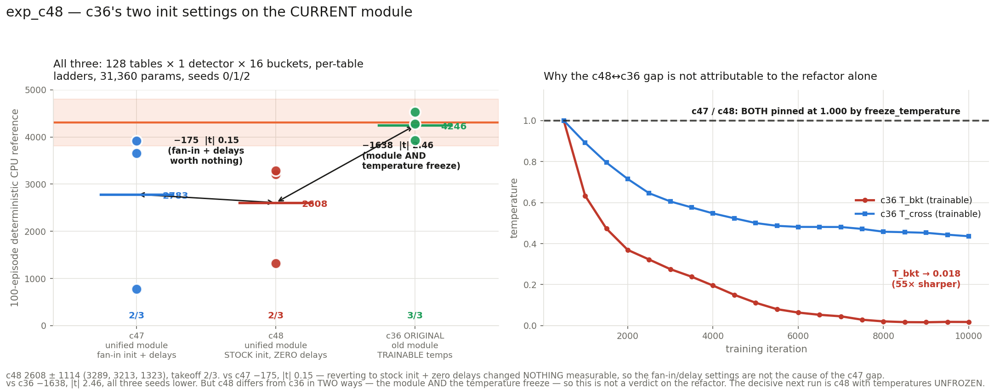

# exp_c48 — c36's two init settings on the CURRENT module

Current unified `LIFMultiHeadLUT` (**no rollback**), 1 head × 128 tables × 1 detector ×
16 buckets, per-table betas, `freeze_temperature=True`, `SORT_FORM="rank"`, seeds 0/1/2,
with exactly two settings reverted to c36's: **stock table init `0.1`** and **zero delays
(`delay_init_std=0`)**.

**Result: 2608.1 ± 1113.6, takeoff 2/3.** Params 31,360. Parity **97/97**.

**Verdict: no bug in the fan-in/delay settings — reverting them changed nothing
(−175, |t| 0.15). The c36 gap is elsewhere, and it is not cleanly attributable to the
refactor either, because c48 differs from c36 in two ways, not one.**

---

## 1. c36's original recipe, read off its own artefacts

From `exp_c36_bucket_tables/bucket_sac_c36_s0.json` and its logs:

| | c36 (original) | c48 |
|---|---|---|
| module | `BucketLIFDetectorsMHL` + `jax_bucket_lif.py` | **current `LIFMultiHeadLUT`** |
| **temperatures** | **TRAINABLE** | **FROZEN at 1.0** |
| table init | stock `0.1 * randn` | stock `0.1 * randn` ✓ |
| delays | zeros | zeros ✓ |
| betas | per-table (128, 15) | per-table (128, 15) ✓ |
| shape / params | 128 × 1 × 16, 31,360 | identical ✓ |
| seeds | 0, 1, 2 | identical ✓ |
| SAC | lr 3e-4, batch 512, warmup 500, 10k iters, 32 updates, 64 envs, γ 0.99, τ 0.005, target-entropy −6, row-clip 1.0 | identical ✓ |
| eval | 100-ep CPU ref, `default_rng(0+ep)`, 100/50 solver, mode="hard" | identical ✓ |

**c36's recorded per-seed numbers:** 4527.5 ±35.8 (100/100 full), 3933.2 ±407.7 (97/100),
4277.6 ±1181.0 (54/100) → **4246.1 ± 298.4**.

### The temperature finding

c36's own log:

```
[  500/10000] Tbkt 1.000 | Tcr 1.000
[ 1000/10000] Tbkt 0.634 | Tcr 0.892
[ 9500/10000] Tbkt 0.018 | Tcr 0.444      <- best MJX 4613
[10000/10000] Tbkt 0.018 | Tcr 0.436
```

**T_bkt annealed 1.000 → 0.018 (55× sharper); T_cross → 0.436.** The old
`BucketLIFDetectorsMHL` had no `freeze_temperature` option at all — it arrived with the
unified class, and every MHL run from c38 on pins both at exactly 1.000. So c36 self-annealed
its soft bucket partition to near-hard, and c48 cannot.

This was **not** in the c47 report's list of confounds. That report named three differences
between c47 and c36; there are four, and this is plausibly the largest.

## 2. Parity — 97 checks, and the gate earned its keep

```
PARITY OK — 97 checks over 3 cases, all within 2e-05 relative
  run: delays are EXACTLY zero (c36 setting)      max|delay| 0.000e+00 over 2176 entries
  run: summed mu-head std ~1.13 (STOCK, over-scaled)  1.1941
  run: betas are PER-TABLE (not shared)           (128,1,1) / (128,1,15)
  perturbed: per-table ladders reach the forward  one spike time -> 6 distinct digits
  run: all 15 boundaries non-decreasing           min gap 2.0 over 1792 gaps
```

**A real port bug, found here and only here.** The first parity run **FAILED**:
`grad delay  rel 7.633e-02`. Diagnosis: the reference's delay gradient was **exactly
2.000000×** ours on all 2,176 entries. Cause — `jnp.clip` lowers to `minimum(maximum(x,
lo), hi)`, and JAX defines the gradient of `maximum` **at an exact tie** as an even 0.5/0.5
split, whereas `torch.clamp`'s backward is `grad * ((x >= min) & (x <= max))`, a full 1.0 at
the boundary. With `delay_init_std=0` every delay sits *exactly* on the clamp, so the two
disagree by a factor of two.

**c38–c47 all used `delay_init_std=4`**, whose half-normal draws are strictly positive, so
the clamp was never active and the discrepancy could not appear. Fixed with a
`_clamp_like_torch` helper that reproduces the reference's boundary subgradient; the forward
is unchanged. `rel 7.6e-02 → 1.6e-07`.

Two notes on the check itself, since both were reversed for this run: the fan-in
"summed µ-head std ≈ 0.1" assertion **must not** be applied here — c36's 0.1 constant is
precisely the over-scaled behaviour being reproduced (√128 × 0.1 = 1.131), so asserting
≈0.1 would fail on a *correct* run. And the delay tensor is asserted exactly zero.

## 3. Result

| seed | c36 original | **c48 repro** | Δ | | c47 | c48 − c47 |
|---:|---:|---:|---:|---|---:|---:|
| 0 | 4527.5 | 3212.5 | −1315.0 | | 776.1 | +2436.4 |
| 1 | 3933.2 | 1323.0 | −2610.2 | | 3920.7 | −2597.7 |
| 2 | 4277.6 | 3288.9 | −988.7 | | 3653.6 | −364.7 |
| **mean** | **4246.1 ± 298.4** | **2608.1 ± 1113.6** | | | **2783.5 ± 1743.6** | |
| takeoff | 3/3 | 2/3 | | | 2/3 | |



### (a) vs c47 — the (fan-in + delays) effect is nothing

c47 and c48 are the same module, same shape, same 31,360 params, same seeds, differing in
**exactly** stock-init + zero-delays.

**−175.4, Welch se 1194.5, |t| 0.15.** Takeoff 2/3 both.

Reverting the fan-in table init and the delay draws changed **nothing measurable**. This
also rules them out as the cause of the c47↔c36 gap, and it is a third independent
observation that the fan-in correction has no detectable effect on return (after c42b's
+597 at |t| 0.80 and c47's −1463 at |t| 1.43).

### (b) vs c36 — a real gap, but NOT a clean verdict on the refactor

**−1638.0, Welch se 665.6, |t| 2.46**, and all three seeds are lower.

**c48 does not reproduce c36.** But the framing "c48 differs from c36 only in the
module/refactoring" is not correct: **it differs in the module AND the temperature freeze.**
c36's temperatures were trainable and annealed T_bkt to 0.018; c48's are pinned at 1.000. So
this gap has two candidate causes and this run cannot separate them.

**On the evidence, the temperature freeze is the stronger suspect.** T_bkt at 0.018 makes
the soft bucket partition almost perfectly hard, which sharpens the straight-through address
gradient by a factor of ~55 over the run — a large functional change, and one that acts on
exactly the addressing machinery this whole sub-line has been probing. A module refactor
that had silently regressed something would more likely show up in parity, which passes at
97/97 against the reference on three shapes.

**I am not calling it either way on n=3 with two changes confounded.** The decisive next run
is one line of config.

### Diagnostics

| seed | eff cells | coverage | no-spike | digit (0–15) | best → final |
|---:|---:|---:|---:|---:|---|
| s0 | 1.80 | 0.857 | 0.114 | 12.45 | 3704 → 3190 |
| s1 | 2.97 | 0.875 | 0.118 | 11.61 | 1870 → 1488 |
| s2 | 2.14 | 0.859 | 0.102 | 12.07 | 2810 → 2810 |

Effective cells **1.80–2.97** — back inside the 1.7–2.5 band every single-detector bucket
config c32b–c37 sat in, and notably *below* c47's 3.10–3.28. Coverage is the highest of the
128-table runs (0.86–0.88). **Freeze held exactly** (1.000 at all 20 evals, all seeds).
**Terminal dip in two seeds:** s0 3704 → 3190 (−14%), s1 1870 → 1488 (−20%); s2 ended at its
best.

## 4. Cost

3 seeds co-resident, **35 min wall** including CPU references; ~0.21 s/iter, ~1,350 MiB per
process. Parity ~5 min ×2 (once failing, once after the clamp fix).

An earlier faithful-rollback repro using c36's own old-module scripts was launched and then
**stopped** when the scope was revised — it would have taken ~4 h (c36's own log shows
240.5 min at iteration 10,000; it predates the `rank` sort). No result from it is reported.

## 5. Recommended next run

**c48 with `freeze_temperature=False`** — identical in every other respect. That isolates
the one remaining difference and would settle whether the refactor is implicated at all. If
it recovers ~4246, the answer is "the temperature freeze, not the refactor"; if it stays at
~2600, the module becomes the suspect and a component-level bisect is warranted.

## 6. Files

| file | what |
|---|---|
| `jax_mhl_lut.py` | JAX port + `_clamp_like_torch` (the boundary-subgradient fix) |
| `run_parity.sh`, `parity_check.py`, `torch_ref_dump.py`, `patch_torch_ref.py` | the 97-check gate, with the stock-init and zero-delay assertions |
| `mhl_sac.py`, `run_parallel_c48.sh`, `slack_bar_c48.py` | the run |
| `results.json`, `plot_c48.py`, `c48_result.png` | results and figure |

Nothing committed. nucstar's torch branch untouched — patched only in `/tmp/mhl_ref_c48`.
