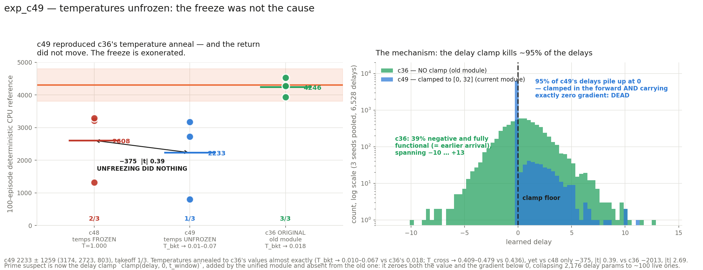

# exp_c49 — c48 with temperatures unfrozen: the decisive isolation

Identical to **exp_c48** in every respect — current unified `LIFMultiHeadLUT`, 1 head × 128
tables × 1 detector × 16 buckets, per-table betas, stock `0.1` table init, zero delays,
`SORT_FORM="rank"`, seeds 0/1/2 — with **one change: `freeze_temperature=False`**.

**Result: 2232.9 ± 1259.1, takeoff 1/3.** Parity **99/99**.

## VERDICT: the temperature freeze was NOT the cause. The module refactor is implicated, and the specific component is the **delay clamp**.

The temperatures annealed to c36's values almost exactly — and the return did not move.

---

## 1. The temperatures did anneal, and matched c36

| | T_bkt final | T_cross final |
|---|---:|---:|
| **c36 original** | **0.018** | **0.436** |
| c49 seed 0 | 0.0672 | 0.4793 |
| c49 seed 1 | 0.0115 | 0.4177 |
| c49 seed 2 | 0.0099 | 0.4090 |
| c48 (frozen) | 1.000 | 1.000 |

The unfreeze worked exactly as intended and reproduced c36's annealing behaviour. Two of
three seeds land within a factor of two of c36's T_bkt; all three land within 10% on
T_cross.

## 2. And the return did not move

| seed | c36 | c48 frozen | **c49 unfrozen** | c49 − c48 | c49 − c36 |
|---:|---:|---:|---:|---:|---:|
| 0 | 4527.5 | 3212.5 | 2722.6 | −489.9 | −1804.9 |
| 1 | 3933.2 | 1323.0 | 802.5 | −520.5 | −3130.7 |
| 2 | 4277.6 | 3288.9 | 3173.6 | −115.3 | −1104.0 |
| **mean** | **4246.1 ± 298.4** | **2608.1 ± 1113.6** | **2232.9 ± 1259.1** | | |
| takeoff | 3/3 | 2/3 | 1/3 | | |

- **vs c48: −375.2, Welch se 970.5, |t| 0.39.** Unfreezing changed nothing measurable.
- **vs c36: −2013.2, Welch se 747.1, |t| 2.69.** The gap persists undiminished.



**This overturns the judgement I offered after c48.** I wrote there that the temperature
freeze was "the stronger suspect". It is not: the temperatures were freed, they annealed to
c36's values, and the return went *slightly down*. The freeze is exonerated and the module
refactor is now the prime suspect — the opposite conclusion.

## 3. The mechanism, found in the delays

Comparing the learned delay tensors between c36 (old module) and c48/c49 (unified module):

| | delay range | ≤ 0 (clamped, zero grad) | negative and functional |
|---|---|---:|---:|
| **c36** (no clamp) | −10.08 … +12.67 | — | **~40%** |
| c49 s0/s1/s2 | −0.006 … +6.7 / 11.3 / 10.1 | **94.6 / 94.9 / 94.9 %** | 0 |
| c48 s0/s1/s2 | −0.006 … +21.7 / 15.3 / 31.0 | **95.7 / 96.1 / 96.7 %** | 0 |

`LIFMultiHeadLUT` clamps the delay:

```python
a = lat.view(B,1,1,-1) + torch.clamp(self.delay, 0.0, self.t_window).unsqueeze(0)
```

The old `BucketLIFDetectorsMHL` did **not** — `jax_bucket_lif.first_spike` line 205 is
simply `a = t[:, None, :] + p["delay"][None]`.

**The consequence is a trap.** Starting from `delay_init_std=0`, every delay sits exactly on
the clamp floor. The first updates push roughly half of them below zero — and once
`delay < 0` the clamp returns 0 in the forward *and* the gradient is exactly 0, so the
parameter can never come back. After 10,000 iterations **95–97% of the 2,176 delays are
dead**: functionally zero, permanently. The front-end's delay capacity collapses from 2,176
parameters to about 100.

c36, unclamped, ends with delays spread symmetrically across roughly [−10, +13] with ~40%
negative — and a negative delay is perfectly meaningful there, it just means that synapse
arrives *earlier*. The clamp was introduced upstream for causality and float32 safety
(`"non-negative floor = causality; upper bound keeps arrival in [0, 2*t_window] so
exp(a/tau) stays float32-safe"`), which are real motivations — but at `delay_init_std=0` it
costs almost the entire delay parameterisation.

This also explains **c47** (2783.5, delay_init_std=4): its delays start well inside the
valid region rather than on the floor, so fewer die immediately — and it scores slightly
*above* c48/c49 despite the fan-in init making no difference on its own.

## 4. Parity — 99 checks, with the freeze assertions inverted

```
PARITY OK — 99 checks over 3 cases, all within 2e-05 relative
  run: torch reports requires_grad=TRUE (unfrozen)  both temperatures trainable
  run: both temperatures carry a LIVE gradient      |grad|max log_T_cross 8.195e-01,
                                                    log_T_bkt 2.261e+00
  run: grad log_T_cross / grad log_T_bkt            rel 7.7e-07 / 7.9e-07
  run: delays are EXACTLY zero (c36 setting)        max|delay| 0.000e+00
  run: summed mu-head std ~1.13 (STOCK, over-scaled) 1.1941
```

The freeze checks are the mirror image of every run since c38: the reference must report
both temperatures trainable, both must carry a nonzero gradient, and our port must
reproduce those gradients. Without the inversion a silently-zeroed temperature gradient
could have masqueraded as an unfrozen run — which is precisely the confusion this
experiment existed to remove. Params are now **31,360 trainable** (c48: 31,104).

Carried from c48: `_clamp_like_torch`, without which the delay gradient is 2× the
reference at `delay_init_std=0`.

## 5. Diagnostics

| seed | eff cells | coverage | no-spike | digit (0–15) | best → final |
|---:|---:|---:|---:|---:|---|
| s0 | 4.19 | 0.849 | 0.162 | 8.60 | 3139 → 2513 |
| s1 | 3.60 | 0.835 | 0.157 | 8.85 | 840 → 840 |
| s2 | 3.77 | 0.837 | 0.280 | 9.70 | 3823 → 3131 |

`digit` fell to 8.60–9.70, below c48's 11.61–12.45 — the sharper partition (T_bkt → 0.01)
does change the addressing, it just does not help the return. Effective cells 3.60–4.19,
above c48's 1.80–2.97. **Terminal dip in two seeds:** s0 3139 → 2513 (−20%), s2 3823 → 3131
(−18%); s1 flat at its best.

## 6. Cost

3 seeds co-resident, **39 min wall** including CPU references; ~0.23 s/iter (slightly slower
than c48's 0.21 — the temperature parameters now carry gradients), ~1,350 MiB per process.

## 7. Proposed bisect — one run settles it

**c49 with the delay clamp removed** (or replaced by an upper-bound-only clamp, keeping the
float32 safety while dropping the non-negativity floor). Everything else identical. That is
the single remaining structural difference between c48/c49 and c36 with direct evidence
behind it.

- Recovers ~4246 → the clamp is the cause; the rest of the refactor is clean, and this is
  an upstream finding worth reporting to nucstar: `clamp(delay, 0, t_window)` silently kills
  the delay parameterisation whenever delays initialise at or near zero.
- Stays ~2200 → the clamp is not it either, and the bisect should move to the next
  candidates, in order: the membrane formulation, the bucket-digit path, and the soft
  partition, each swappable individually since both ports are preserved in-tree.

Note the fix is also cheap to hedge: `delay_init_std > 0` (as c38–c47 used) keeps delays off
the floor, which is why those runs were less affected.

## 8. Files

| file | what |
|---|---|
| `jax_mhl_lut.py` | JAX port + `_clamp_like_torch` |
| `run_parity.sh`, `parity_check.py`, `torch_ref_dump.py`, `patch_torch_ref.py` | the 99-check gate, freeze assertions inverted |
| `mhl_sac.py`, `run_parallel_c49.sh`, `slack_bar_c49.py` | the run |
| `results.json`, `plot_c49.py`, `c49_result.png` | results and figure |

Nothing committed. nucstar's torch branch untouched — patched only in `/tmp/mhl_ref_c49`.
