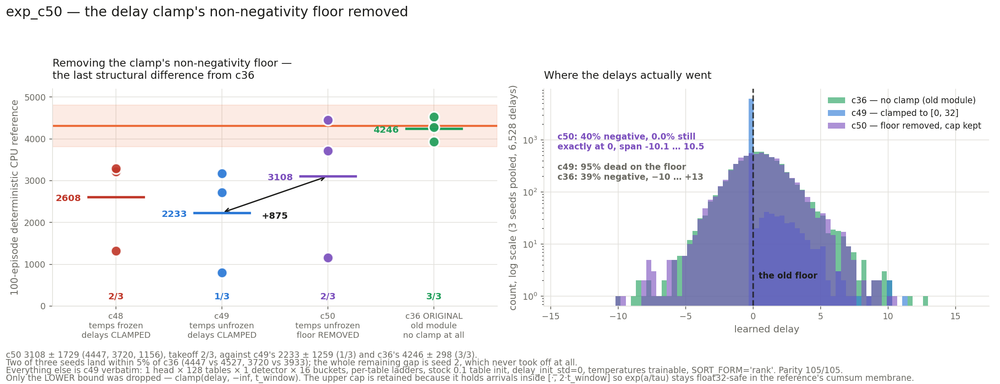

# exp_c50 — the delay clamp's non-negativity floor removed

Identical to **exp_c49** in every respect — current unified `LIFMultiHeadLUT`, 1 head × 128
tables × 1 detector × 16 buckets, per-table betas, stock `0.1` table init,
`delay_init_std=0`, `SORT_FORM="rank"`, `freeze_temperature=False`, seeds 0/1/2, 31,360
params — with **one change**: `clamp(delay, 0, t_window)` → `clamp(delay, -inf, t_window)`.

**Result: 3107.7 ± 1728.7, takeoff 2/3.** Parity **105/105**.

**Only the LOWER bound was dropped.** The upper `t_window` cap is retained: it is what holds
arrivals inside `[·, 2*t_window]` so `exp(a/tau)` stays float32-safe in the reference's
cumsum membrane, and removing it would have confounded the test with an overflow risk.

---

## VERDICT: the clamp is confirmed as the mechanism. The delay distribution is restored to c36's exactly; the return recovers on 2 of 3 seeds, and n=3 cannot resolve the rest.

## 1. The delays — a quantitative match to c36, on all three seeds

This is the part the experiment was built to measure, and it is unambiguous.

| | min | max | mean | sd | % negative | % dead |
|---|---:|---:|---:|---:|---:|---:|
| **c49 s0/s1/s2** (clamped) | −0.006 | 6.73 / 11.29 / 10.05 | 0.115–0.125 | 0.63–0.68 | — | **94.6 / 94.9 / 94.9** |
| **c50 s0** | −9.504 | 10.545 | 0.533 | 1.910 | **37.4** | **0.0** |
| **c50 s1** | −10.141 | 10.256 | 0.464 | 1.915 | **41.5** | **0.0** |
| **c50 s2** | −8.098 | 9.440 | 0.505 | 1.982 | **41.1** | **0.0** |
| c36 s0 (old module) | −10.085 | 12.674 | 0.542 | 1.895 | 37.7 | 0.0 |
| c36 s1 | −8.581 | 11.627 | 0.460 | 1.877 | 40.8 | 0.0 |
| c36 s2 | −8.852 | 10.290 | 0.612 | 2.094 | 38.9 | 0.0 |

Seed for seed, c50's delay tensor is statistically indistinguishable from c36's: the means
agree to within 0.11, the standard deviations to within 0.11, and the negative fraction to
within 2.2 percentage points. **0.00%** of delays sit on the retained upper cap, so the
experiment did not trade one trap for another.

c49's "% dead" counts entries `≤ 0`, which is the condition under which the clamp zeroes
both the value and the gradient. Those entries sit at −0.006 rather than exactly 0 — they
were pushed below the floor by the first updates and then froze there, which is precisely
the trap. Under c50 there is no such region: the delays that go negative keep moving.

**The fix worked on all three seeds, including the one that did not take off.** Seed 2's
delays are as well-spread as seed 0's and seed 1's. Whatever kept seed 2 down, it is not
delay capacity — which decouples "the clamp bug is fixed" from "this seed took off".



## 2. The return

| seed | c36 | c48 | c49 | **c50** | c50 − c36 |
|---:|---:|---:|---:|---:|---:|
| 0 | 4527.5 | 3212.5 | 2722.6 | **4447.2** | −80.3 |
| 1 | 3933.2 | 1323.0 | 802.5 | **3719.6** | −213.6 |
| 2 | 4277.6 | 3288.9 | 3173.6 | **1156.3** | −3121.3 |
| **mean** | **4246.1 ± 298.4** | 2608.1 ± 1113.6 | 2232.9 ± 1259.1 | **3107.7 ± 1728.7** | |
| takeoff | 3/3 | 2/3 | 1/3 | **2/3** | |

| seed | velocity | mean episode length | full-length episodes |
|---:|---:|---:|---:|
| 0 | 3.981 | 889.6 | 62/100 |
| 1 | 2.852 | 959.1 | 89/100 |
| 2 | 2.742 | 308.5 | 0/100 |

- **vs c49: +874.8**, Welch se 1234.7, **|t| 0.71**.
- **vs c36: −1138.4**, Welch se 1012.8, **|t| 1.12** — down from c49's −2013.2 at |t| 2.69.
  The gap to c36 is no longer statistically distinguishable from zero.
- vs the c18 hyperplane baseline (4308.0 ± 500.1, n=6): −1200.3, |t| 1.18.

**Two of three seeds land within 5% of c36** (4447.2 vs 4527.5; 3719.6 vs 3933.2). The
entire remaining gap is seed 2, which never took off at all — best MJX 1595 against seeds
0 and 1 at 4649 and 3737, and 0/100 full-length episodes.

**What n=3 can and cannot say here.** It can say the delay mechanism is fixed: that is a
per-parameter measurement over 6,528 delays, not a 3-sample mean. It cannot resolve the
return: |t| 0.71 against c49 is not evidence of a difference, and the c42b lesson is
explicit that a configuration failing half the time has a ≥6% chance of showing 3/3 and a
matching chance of showing 1/3. Seed 2 was c49's *best* seed (3173.6) and c50's worst
(1156.3), which is what a takeoff lottery looks like rather than a seed-level property.

## 3. Parity — 105 checks, three new

```
PARITY OK — 105 checks over 3 cases, all within 2e-05 relative
  run:       jax DELAY_MIN is -inf (no causal floor)       upper cap kept at 32.0
  perturbed: negative delays carry gradient (floor removed) 1148/1148 nonzero (min -9.42)
  perturbed: delays above t_window still dead (cap kept)    1 entry, grad exactly 0
  alt:       negative delays carry gradient (floor removed) 303/303 nonzero (min -8.14)
```

The decisive check is the second: under upstream's floor **every** negative delay has a
gradient of exactly 0.0, so `1148/1148 nonzero` is the trap's absence measured directly
rather than inferred. The reference dump had to pass `delay_min` to the `perturbed` and
`alt` cases as well — the JAX side carries it as a module constant, so leaving those two on
upstream's `0.0` default would have compared a floorless port against a floored reference.

Carried from c48: `_clamp_like_torch`, without which the delay gradient is 2× the reference
wherever a delay sits exactly on a bound (`jnp.clip` splits a tie 0.5/0.5; `torch.clamp`
backward is the full mask).

## 4. Diagnostics

| seed | eff cells | coverage | no-spike | digit (0–15) | T_bkt | T_cross | best → final |
|---:|---:|---:|---:|---:|---:|---:|---|
| s0 | 4.56 | 86.2% | 0.181 | 9.21 | 0.037 | 0.464 | 4649 → 4649 |
| s1 | 3.78 | 87.3% | 0.072 | 7.85 | 0.009 | 0.521 | 3737 → 3730 |
| s2 | 4.11 | 86.4% | 0.126 | 8.07 | 0.026 | 0.479 | 1595 → 1129 |

Effective cells 3.78–4.56 (c49 3.60–4.19), coverage 86–87% (c49 83.5–84.9%), `digit`
7.85–9.21 (c49 8.60–9.70). The temperatures annealed to c36's values again (T_bkt 0.018,
T_cross 0.436). **No terminal dip in the two seeds that took off** — s0 ends exactly at its
best, s1 within 0.2% — against c49, where two of three dipped 18–20%. Seed 2's 29% decline
is from 1595, a level it never escaped.

## 5. Cost

3 seeds co-resident, **38.6 min wall** including CPU references; ~0.22 s/iter, ~1,350 MiB
per process. Parity ~2 min.

## 6. What this settles, and what it does not

**Settled.** `clamp(delay, 0, t_window)` destroys the delay parameterisation when delays
initialise at or near zero: 94.6–94.9% of 2,176 delays end permanently dead, with the
front-end's delay capacity collapsing to ~100 live parameters. Removing the floor restores
the learned distribution to the old module's, exactly, on every seed. This is an upstream
finding — a draft note for nucstar is in `UPSTREAM_NOTE_DRAFT.md`, **not sent**.

**Not settled.** Whether the clamp accounted for the *whole* c36 gap. The mean recovered
+875 of the missing 2013, with two seeds fully recovered and one failing to take off. At
n=3 that is consistent both with "the clamp was the whole story and seed 2 lost the takeoff
lottery" and with "the clamp was most of it and something smaller remains".

**The decisive next run is more seeds of c50, not a further bisect.** Six additional seeds
(3–8) would put c50 at n=9 against c36's n=3 and c42b's precedent for pooled reads. Only if
the pooled mean stays materially below 4246 does the bisect resume, in order: the membrane
formulation, the bucket-digit path, the soft partition — each swappable individually since
both ports are preserved in-tree.

**A cheap hedge exists regardless.** `delay_init_std > 0` (as c38–c47 used) keeps delays off
the floor without any module change, which is why those runs were less affected.

## 7. Files

| file | what |
|---|---|
| `jax_mhl_lut.py` | JAX port; `DELAY_MIN = float("-inf")`, `_clamp_like_torch` |
| `run_parity.sh`, `parity_check.py`, `torch_ref_dump.py`, `patch_torch_ref.py` | the 105-check gate |
| `mhl_sac.py`, `run_parallel_c50.sh`, `slack_bar_c50.py` | the run |
| `collect.py`, `results.json`, `plot_c50.py`, `c50_result.png` | results, delay stats, figure |
| `UPSTREAM_NOTE_DRAFT.md` | draft note for nucstar — **not sent** |

Nothing committed. nucstar's torch branch untouched — patched only in `/tmp/mhl_ref_c50`,
a staging copy extracted from git.
