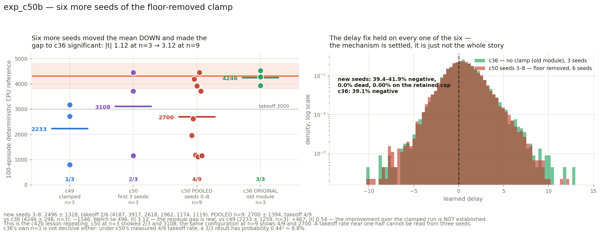

# exp_c50b — six more seeds of exp_c50, to n=9

Not a new configuration. exp_c50 continued on seeds 3–8: current unified `LIFMultiHeadLUT`,
1 head × 128 tables × 1 detector × 16 buckets, per-table betas, stock `0.1` table init,
`delay_init_std=0`, `SORT_FORM="rank"`, `freeze_temperature=False`, and the delay clamp with
its **lower bound removed** (`clamp(delay, -inf, t_window)`, upper cap kept). Parity
**105/105**.

**New seeds: 2496.2 ± 1328.3, takeoff 2/6. Pooled n=9: 2700.1 ± 1394.0, takeoff 4/9.**

---

## VERDICT: the extra seeds did not confirm the recovery — they established that a residual gap to c36 is real. The delay mechanism, separately, is fully confirmed.

## 1. The pooled result overturns the n=3 reading

| | mean | takeoff | vs c36 |
|---|---|:-:|---|
| c49 (clamped), n=3 | 2232.9 ± 1259.1 | 1/3 | −2013.2, **\|t\| 2.69** |
| c50 first three seeds, n=3 | 3107.7 ± 1728.7 | 2/3 | −1138.4, \|t\| 1.12 |
| **c50 pooled, n=9** | **2700.1 ± 1394.0** | **4/9** | **−1546.0, \|t\| 3.12** |
| c36 original, n=3 | 4246.1 ± 298.4 | 3/3 | — |

- **vs c36: −1546.0**, Welch se 495.6, **|t| 3.12.** At n=3 this gap was |t| 1.12 and I
  reported it as no longer distinguishable from zero. With six more seeds it is
  distinguishable. **Removing the clamp does not recover c36.**
- **vs c49: +467.2**, Welch se 862.8, **|t| 0.54.** The improvement over the clamped run is
  *not* statistically established either, though the takeoff rate moved 1/3 → 4/9 and every
  measure points the same direction.

Per-seed (100-episode deterministic CPU reference):

| seed | return | ± | velocity | mean length | full-length |
|---:|---:|---:|---:|---:|---:|
| 3 | 1962.4 | 504.0 | 2.728 | 523.8 | 0/100 |
| 4 | 2618.0 | 1056.6 | 2.940 | 661.6 | 24/100 |
| 5 | **4186.8** | 319.8 | 3.340 | 965.4 | 74/100 |
| 6 | 1174.3 | 112.5 | 2.704 | 317.2 | 0/100 |
| 7 | **3917.1** | 352.3 | 2.954 | 989.8 | 98/100 |
| 8 | 1118.8 | 191.2 | 2.498 | 319.0 | 0/100 |

Pooled with c50's seeds 0/1/2 (4447.2, 3719.6, 1156.3): four of nine clear 3000, and the
distribution is sharply bimodal — 3917–4447 when it takes off, 1119–1962 when it does not,
with seed 4 (2618) the only intermediate.

## 2. This is the c42b lesson, repeating exactly

c50 at n=3 read 3108 with 2/3 takeoff. The same configuration at n=9 reads 2700 with 4/9.
Nothing changed but the sample. A configuration whose takeoff rate is near one-half cannot
be read from three seeds, and I flagged that when reporting c50 — the recommendation then
was more seeds rather than a further bisect, and these six were what settled it.

**c36's own n=3 is not decisive either, and that cuts the other way.** Under c50's measured
takeoff rate of 4/9 = 0.444, a 3/3 result has probability 0.444³ ≈ **8.8%** — unlikely but
not negligible. So part of the apparent 1546-point gap could be c36 having drawn a lucky
three. Settling *that* would cost 4 hours per seed on the old module (c36 ran 240.5 min/seed
against c50's 37.4), which is why it is offered as an option below rather than assumed.

## 3. The delay mechanism held on all six

| seed | min | max | mean | sd | % negative | % dead | % on cap |
|---:|---:|---:|---:|---:|---:|---:|---:|
| 3 | −9.930 | 10.016 | 0.500 | 1.949 | 39.8 | 0.0 | 0.00 |
| 4 | −9.866 | 11.293 | 0.444 | 1.991 | 41.9 | 0.0 | 0.00 |
| 5 | −8.666 | 12.093 | 0.499 | 1.862 | 39.5 | 0.0 | 0.00 |
| 6 | −8.238 | 9.836 | 0.491 | 1.964 | 41.6 | 0.0 | 0.00 |
| 7 | −7.698 | 9.554 | 0.546 | 2.104 | 39.8 | 0.0 | 0.00 |
| 8 | −7.163 | 7.624 | 0.381 | 1.750 | 39.4 | 0.0 | 0.00 |
| *c36 reference* | *−10.09…−8.58* | *10.29…12.67* | *0.460…0.612* | *1.877…2.094* | *37.7…40.8* | *0.0* | — |

Every one of the six lands inside c36's range on every statistic. Nothing is stuck at the
initialisation, nothing reached the retained upper cap. **The clamp finding from c49/c50 is
confirmed and is not in question** — what is now clear is that fixing it was necessary but
not sufficient.

Note this holds for the failures as much as the successes: seeds 6 and 8 have delay
distributions indistinguishable from seeds 5 and 7, and returns a third the size. Delay
capacity is not what separates a takeoff from a collapse.

## 4. Cost

6 seeds co-resident, **73.8 min wall** (11:10:26Z → 12:24:11Z) including CPU references —
against 38.6 min for 3 seeds, so co-residency scales well: doubling the seed count cost 91%
more wall time, not 100%+.

## 5. Where this leaves the bisect

The recommendation after c50 was "more seeds, not a further bisect". The seeds are in, and
they say the opposite of what c50's three suggested: **the bisect should resume.** The
remaining structural differences between the current module and c36, in the order their
evidence warrants:

1. **The membrane formulation** — `membrane_linear` vs the reference's cumsum form.
2. **The bucket-digit path** — how `t_hard` is converted to a digit.
3. **The soft partition** — the T_cross/T_bkt surrogate. *(exp_c53 is already testing a
   variant of this: replacing the soft crossing with the detached hard one.)*

Each is swappable individually since both ports are preserved in-tree.

A second option, worth stating because it is cheap to describe and expensive to run: **more
c36 seeds**, to test whether its 3/3 was itself a lucky draw. At 4 h/seed that is a real
cost, but if c36 also turns out to be bimodal then there is no gap left to bisect at all.

## 6. Files

| file | what |
|---|---|
| `jax_mhl_lut.py` | JAX port, `DELAY_MIN = -inf` (unchanged from c50) |
| `run_parity.sh`, `parity_check.py`, `torch_ref_dump.py`, `patch_torch_ref.py` | the 105-check gate |
| `mhl_sac.py`, `run_parallel_c50b.sh`, `slack_bar_c50b.py` | the run |
| `collect.py`, `results.json`, `plot_c50b.py`, `c50b_result.png` | results, delay stats, pooling, figure |

Nothing committed. nucstar's torch branch untouched — patched only in `/tmp/mhl_ref_c50b`,
a staging copy extracted from git.
