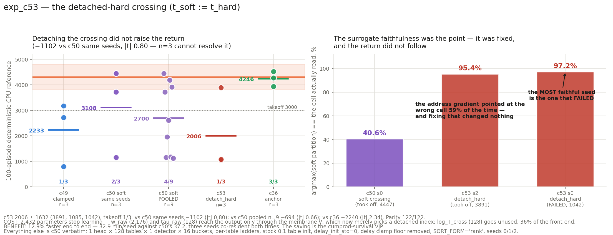

# exp_c53 — the detached-hard crossing: `t_soft := t_hard`

Identical to **exp_c50** except that the soft bucket partition is fed the **actual
first-crossing arrival** instead of the T_cross-weighted expectation over all N arrivals:
1 head × 128 tables × 1 detector × 16 buckets, per-table betas, stock `0.1` table init,
`delay_init_std=0`, `SORT_FORM="rank"`, `freeze_temperature=False`, delay clamp with the
lower bound removed and the upper cap kept, seeds 0/1/2.

**Result: 2006.0 ± 1632.5, takeoff 1/3.** Parity **122/122**.

---

## VERDICT: the address surrogate was genuinely broken, this genuinely fixes it, and the return did not follow. Modestly faster (12.9%), at the cost of 2,432 parameters.

## 0. First, a correction to the premise

The task framed this as "stop_gradient on the ordering". **That is a no-op in this module.**
Wrapping the permutation in an explicit `stop_gradient` changes *no* gradient in either
variant — `0.000e+00` across all 8 parameters (`detach_diff.py`, §1). The reorder decision
was never differentiable: `rank` builds its permutation from integer comparisons, `argsort`
from integer indices, and exp_c52's `sort_equivalence.py` showed those two give bit-identical
gradients even when 100% of arrival pairs are tied.

What this variant actually removes is the **soft crossing** — the T_cross sigmoid-survival
average. That is the change implemented and measured here.

## 1. The thing it was supposed to fix was real

The soft partition `g` **is** the entire address-gradient path. Measured on trained weights,
`argmax(g)` versus the cell the table actually reads:

| weights | agreement |
|---|---:|
| c50 s0, soft crossing (took off, 4447) | **40.61%** |
| c53 s2, detach_hard (took off, 3891) | **95.38%** |
| c53 s0, detach_hard (**failed**, 1042) | **97.24%** |

Under the soft crossing the address gradient pointed at the wrong cell **59% of the time**,
with `t_soft` sitting a mean of 2.60 (max 23.2) away from the real crossing. This variant
fixes it almost completely — and **the seed where it is most faithful is the one that
failed.** Surrogate faithfulness is not what drives takeoff.

## 2. The return

| | mean | takeoff |
|---|---|:-:|
| c49 clamped, n=3 | 2232.9 ± 1259.1 | 1/3 |
| c50 soft, same seeds, n=3 | 3107.7 ± 1728.7 | 2/3 |
| c50 soft, pooled n=9 | 2700.1 ± 1394.0 | 4/9 |
| **c53 detach_hard, n=3** | **2006.0 ± 1632.5** | **1/3** |
| c36 anchor, n=3 | 4246.1 ± 298.4 | 3/3 |

| seed | c50 | **c53** | Δ | velocity | length | full |
|---:|---:|---:|---:|---:|---:|---:|
| 0 | 4447.2 | 1042.4 | −3404.8 | 2.099 | 335.6 | 0/100 |
| 1 | 3719.6 | 1084.7 | −2634.9 | 2.607 | 300.3 | 0/100 |
| 2 | 1156.3 | **3890.9** | +2734.6 | 2.985 | 977.0 | 90/100 |

- vs c50 same seeds: **−1101.7**, Welch se 1372.8, **|t| 0.80**
- vs c50 pooled n=9: **−694.1**, se 1050.8, **|t| 0.66**
- vs c36: **−2240.1**, se 958.1, **|t| 2.34**

**No evidence it helps; the point estimate is lower; at n=3 the difference is not
resolvable.** Note the per-seed inversion: c53 rescued the seed c50 failed on (s2) and lost
both seeds c50 succeeded on. That is the bimodal takeoff lottery reshuffling, not a
seed-level property — the same pattern seen when c49's best seed became c50's worst.

## 3. What it costs: 2,432 parameters stop learning

`w_raw` (2,176) and `tau_raw` (128) reach the output **only** through the membrane potential
V, and V is now used only to pick a detached index — so the synaptic weights and time
constants receive exactly zero gradient. `log_T_cross` (128) goes unused. That is **36% of
the 6,784-parameter front-end**, dead by construction.

This is asserted in the parity gate rather than left to an autopsy: both sides must report
the identical dead set, so it registers as a property of the variant and not a porting
error. `Tcr` stayed pinned at 1.000 for all 10,000 iterations of every seed, confirming the
detach took.

## 4. What it buys: 12.9% faster end to end

| | per seed | s/iter |
|---|---:|---:|
| c50 (soft) | 37.4 / 36.9 / 37.2 min | ~0.223 |
| **c53 (detach_hard)** | **32.9 / 32.7 / 33.2 min** | **~0.198** |

Three seeds co-resident in both cases, same box. **1.13× faster.**

The microbenchmark **under-predicted this** and should be read with care: it put the
isolated `first_spike` value+grad at 1.33× but the whole module at 1.01×, implying ~0.1%
end to end. The end-to-end measurement is the trustworthy one. Sub-millisecond
microbenchmarks of this module are unreliable because XLA folds the straight-through
`soft − stop_gradient(soft)` pair differently between traces — the first two versions of
`bench_spike_form.py` derived a *negative* backward cost from `vgrad − forward`, which is
what exposed the problem. The saving is real and is in the cumprod-survival VJP.

## 5. Delays

| seed | min | max | mean | sd | % negative | % dead | % on cap |
|---:|---:|---:|---:|---:|---:|---:|---:|
| 0 | −10.079 | 15.728 | 0.161 | 2.121 | 44.5 | 0.0 | 0.00 |
| 1 | −10.671 | 14.592 | 0.136 | 2.178 | 45.1 | 0.0 | 0.00 |
| 2 | −8.586 | 8.301 | 0.083 | 1.997 | 45.8 | 0.0 | 0.00 |

Slightly *more* negative than c50 (37.4–41.5%) and c36 (37.7–40.8%), with a wider positive
tail. Nothing dead, nothing on the retained cap. Delay learning is unaffected by the change,
as intended — the gradient still reaches the delays through the gathered arrival value.

## 6. Files

| file | what |
|---|---|
| `jax_mhl_lut.py` | JAX port; `SPIKE_FORM = "detach_hard"`, `DELAY_MIN = -inf` |
| `run_parity.sh`, `parity_check.py`, `torch_ref_dump.py`, `patch_torch_ref.py` | the 122-check gate, with the dead-set assertions |
| `detach_diff.py` | the three CPU checks: ordering-gradient no-op, address divergence, dead-parameter count |
| `bench_spike_form.py`, `bench_c53.log` | the speed attribution (read §4 on its limits) |
| `mhl_sac.py`, `run_parallel_c53.sh`, `slack_bar_c53.py` | the run |
| `collect.py`, `results.json`, `plot_c53.py`, `c53_result.png` | results, delay stats, figure |

Nothing here modifies the torch reference — patched only in `/tmp/mhl_ref_c53`, a staging
copy extracted read-only from git.
