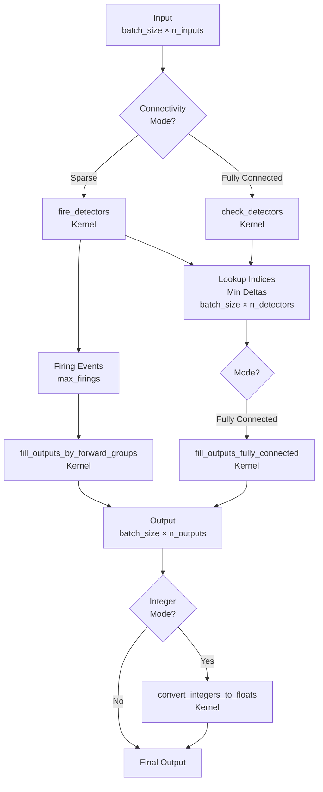
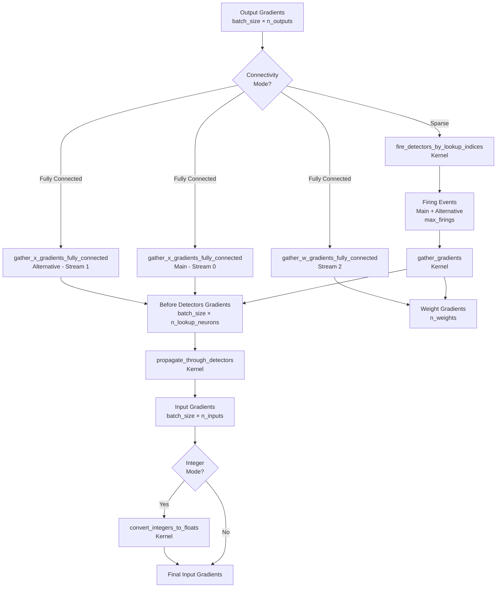
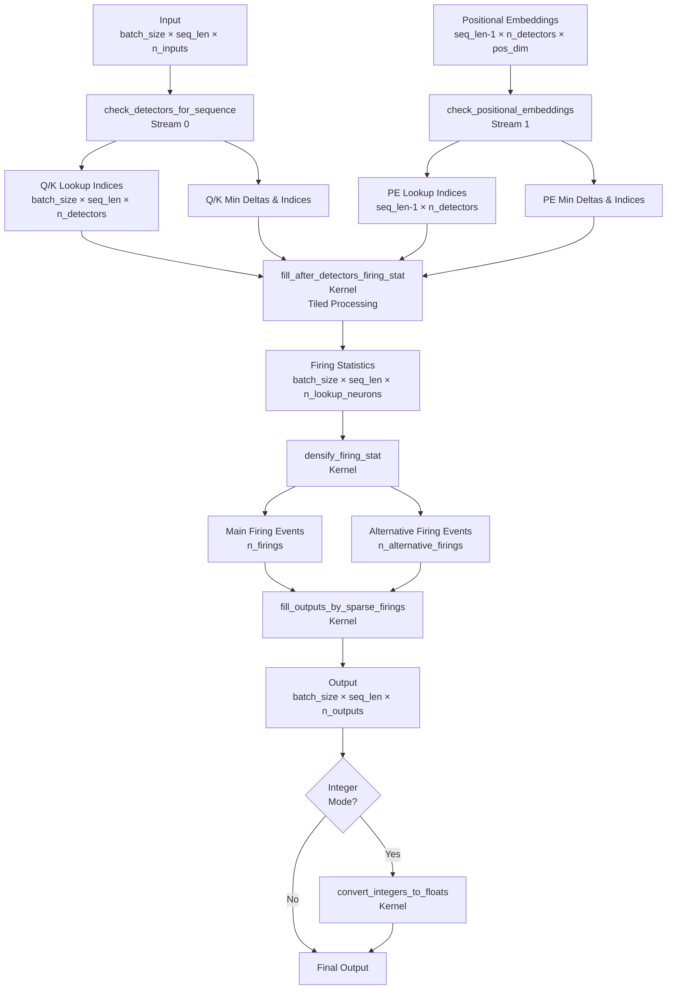
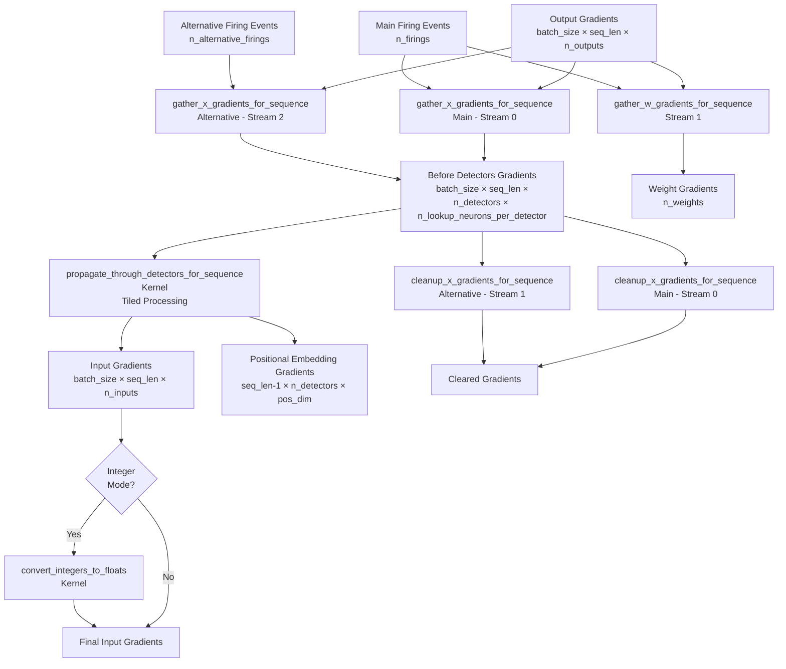
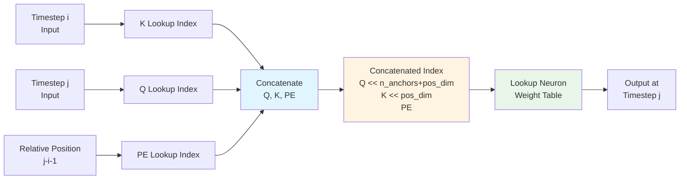

# LUT Runtime Data Flow

This document describes the data flow for both non-concatenated (single timestep) and concatenated (sequence processing) modes in the LUT runtime system.

## Visual Data Flow Diagrams

### Non-Concatenated Mode - Forward Pass



### Non-Concatenated Mode - Backward Pass



### Concatenated Mode - Forward Pass



### Concatenated Mode - Backward Pass



### Concatenated Mode - Attention Pair Processing



## Non-Concatenated Mode (`sequence_length == 1`)

### Forward Pass

```
Input [batch_size × n_inputs]
  ↓
[check_detectors / fire_detectors]
  ↓
Lookup Indices [batch_size × n_detectors]
Min Anchor Deltas [batch_size × n_detectors]
Min Anchor Delta Indices [batch_size × n_detectors]
  ↓
┌─────────────────────────────────────┐
│  Sparse Connectivity Mode           │
│  (if lookup_neuron_synapses_infos)  │
└─────────────────────────────────────┘
  ↓
Firing Events [max_firings]
  ↓
[fill_outputs_by_forward_groups]
  ↓
Output [batch_size × n_outputs]

┌─────────────────────────────────────┐
│  Fully Connected Mode               │
│  (if !lookup_neuron_synapses_infos) │
└─────────────────────────────────────┘
  ↓
[fill_outputs_fully_connected]
  ↓
Output [batch_size × n_outputs]
```

**Kernel Sequence:**
1. **`check_detectors`** (fully connected) or **`fire_detectors`** (sparse)
   - Computes lookup indices from input anchor comparisons
   - Outputs: `lookup_indices`, `min_anchor_deltas`, `min_anchor_delta_indices`

2. **`fill_outputs_by_forward_groups`** (sparse) or **`fill_outputs_fully_connected`** (fully connected)
   - Accumulates outputs from lookup table weights
   - Sparse: processes firing events through synapse groups
   - Fully connected: directly accesses weight tables using lookup indices

3. **`convert_integers_to_floats`** (if using integer arithmetic)
   - Converts accumulated integer values to floating point

---

### Backward Pass

```
Output Gradients [batch_size × n_outputs]
  ↓
┌─────────────────────────────────────┐
│  Sparse Connectivity Mode           │
└─────────────────────────────────────┘
  ↓
[fire_detectors_by_lookup_indices]
  ↓
Firing Events (main + alternative) [max_firings]
  ↓
[gather_gradients]
  ↓
Before Detectors Gradients [batch_size × n_lookup_neurons]
Weight Gradients [n_weights] (optional)

┌─────────────────────────────────────┐
│  Fully Connected Mode               │
└─────────────────────────────────────┘
  ↓
[gather_x_gradients_fully_connected] (main)
[gather_x_gradients_fully_connected] (alternative, parallel)
[gather_w_gradients_fully_connected] (parallel)
  ↓
Before Detectors Gradients [batch_size × n_detectors × n_lookup_neurons_per_detector]
Weight Gradients [n_weights] (optional)
  ↓
[propagate_through_detectors]
  ↓
Input Gradients [batch_size × n_inputs]
```

**Kernel Sequence:**
1. **Gradient Gathering:**
   - **Sparse**: `fire_detectors_by_lookup_indices` → `gather_gradients`
     - Generates firing events for main and alternative lookup indices
     - Accumulates gradients from output gradients through synapse groups
   - **Fully Connected**: Three parallel kernels
     - `gather_x_gradients_fully_connected` (main lookup index)
     - `gather_x_gradients_fully_connected` (alternative lookup index, stream 1)
     - `gather_w_gradients_fully_connected` (weight gradients, stream 2)

2. **`propagate_through_detectors`**
   - Computes gradient difference between main and alternative lookup neurons
   - Applies up() function gradient: `0.5 * sign(delta) / (1 + |delta|)^2`
   - Propagates to input anchors (adds to anchor1, subtracts from anchor2)
   - Clears gradient buffers

3. **`convert_integers_to_floats`** (if using integer arithmetic)
   - Converts integer gradients to floating point

---

## Concatenated Mode (`sequence_length > 1`)

### Forward Pass

```
Input [batch_size × sequence_length × n_inputs]
Positional Embeddings [(sequence_length - 1) × n_detectors × positional_dim]
  ↓
[check_detectors_for_sequence] (stream 0)
[check_positional_embeddings] (stream 1, parallel)
  ↓
Q/K Lookup Indices [batch_size × sequence_length × n_detectors]
PE Lookup Indices [(sequence_length - 1) × n_detectors]
Min Deltas & Indices (for Q, K, PE)
  ↓
[fill_after_detectors_firing_stat]
  ↓
Firing Statistics [batch_size × sequence_length × n_lookup_neurons]
  ↓
[densify_firing_stat]
  ↓
Sparse Firing Events [n_firings]
Alternative Firing Events [n_alternative_firings] (optional)
  ↓
[fill_outputs_by_sparse_firings]
  ↓
Output [batch_size × sequence_length × n_outputs]
```

**Kernel Sequence:**
1. **`check_detectors_for_sequence`** (stream 0)
   - Computes Q and K lookup indices for all timesteps
   - Outputs: `lookup_indices`, `min_anchor_deltas`, `min_anchor_delta_indices`

2. **`check_positional_embeddings`** (stream 1, parallel)
   - Computes PE lookup indices for relative positions
   - Outputs: `positional_lookup_indices`, `positional_min_deltas`, `positional_min_delta_indices`

3. **`fill_after_detectors_firing_stat`**
   - Processes attention pairs (i, j) where i < j in tiled manner
   - Concatenates Q (from timestep j), K (from timestep i), PE (from j-i-1)
   - Forms concatenated lookup index: `(Q << (n_anchors + positional_dim)) | (K << positional_dim) | PE`
   - Increments firing statistics for main and alternative concatenated neurons

4. **`densify_firing_stat`**
   - Converts dense firing statistics to sparse firing events
   - Main firings: `firing_stat >= 1.0`
   - Alternative firings: `0 < firing_stat < 1.0` (for gradient computation)

5. **`fill_outputs_by_sparse_firings`**
   - Processes sparse firing events
   - Accumulates outputs using weights from lookup neurons
   - Handles sequence dimension through `firing.shift` field

6. **`convert_integers_to_floats`** (if using integer arithmetic)

---

### Backward Pass

```
Output Gradients [batch_size × sequence_length × n_outputs]
Sparse Firing Events [n_firings]
Alternative Firing Events [n_alternative_firings]
  ↓
[gather_x_gradients_for_sequence] (main, stream 0)
[gather_w_gradients_for_sequence] (stream 1, parallel)
[gather_x_gradients_for_sequence] (alternative, stream 2, parallel)
  ↓
Before Detectors Gradients [batch_size × sequence_length × n_detectors × n_lookup_neurons_per_detector]
Weight Gradients [n_weights] (optional)
  ↓
[propagate_through_detectors_for_sequence]
  ↓
Input Gradients [batch_size × sequence_length × n_inputs]
Positional Embedding Gradients [(sequence_length - 1) × n_detectors × positional_dim]
  ↓
[cleanup_x_gradients_for_sequence] (main + alternative, parallel)
```

**Kernel Sequence:**
1. **Gradient Gathering (three parallel streams):**
   - **Stream 0**: `gather_x_gradients_for_sequence` (main firings)
     - Accumulates gradients to lookup neurons from main firing events
   - **Stream 1**: `gather_w_gradients_for_sequence` (main firings)
     - Accumulates weight gradients from main firing events
   - **Stream 2**: `gather_x_gradients_for_sequence` (alternative firings)
     - Accumulates gradients to lookup neurons from alternative firing events

2. **`propagate_through_detectors_for_sequence`**
   - Processes attention pairs (i, j) in tiled manner
   - For each pair, computes gradient differences between:
     - Main concatenated neuron: `(Q, K, PE)`
     - Alternative concatenated neurons: `(Q', K, PE)`, `(Q, K', PE)`, `(Q, K, PE')`
   - Propagates gradients to:
     - Input anchors (for Q and K components)
     - Positional embeddings (for PE component)
   - Uses up() function gradient for each component

3. **`cleanup_x_gradients_for_sequence`** (two parallel streams)
   - Clears gradient buffers for processed neurons
   - Stream 0: main firings
   - Stream 1: alternative firings

4. **`convert_integers_to_floats`** (if using integer arithmetic)

---

## Key Differences

### Non-Concatenated Mode
- **Single timestep**: `sequence_length == 1`
- **Simple lookup**: Direct mapping from input to output via lookup table
- **Two connectivity modes**: Sparse (via synapse groups) or Fully Connected (direct weight access)
- **Backward**: Single gradient path through detectors

### Concatenated Mode
- **Multiple timesteps**: `sequence_length > 1`
- **Attention mechanism**: Processes all pairs (i, j) where i < j
- **Three components**: Q (query from timestep j), K (key from timestep i), PE (positional encoding)
- **Concatenated lookup**: `(Q << (n_anchors + positional_dim)) | (K << positional_dim) | PE`
- **Tiled processing**: Uses TILE×TILE blocks for efficient attention matrix processing
- **Backward**: Three gradient paths (Q, K, PE) propagated separately
- **Parallel streams**: Uses multiple CUDA streams for concurrent processing

---

## Data Structures

### Firing Events
- **Non-concatenated**: `Firing { batch_index, payload, data_id }`
- **Concatenated**: `NeuronShiftFiring { batch_index, payload, neuron_id, shift }`
  - `shift` field encodes the timestep for sequence processing

### Lookup Indices
- **Non-concatenated**: Single lookup index per detector
- **Concatenated**: 
  - Q/K indices: `[batch_size × sequence_length × n_detectors]`
  - PE indices: `[(sequence_length - 1) × n_detectors]`
  - Concatenated index: `(Q << (n_anchors + positional_dim)) | (K << positional_dim) | PE`

### Gradient Buffers
- **Before detectors**: Gradients accumulated at lookup neurons before propagation through detectors
- **After propagation**: Gradients propagated to inputs/positional embeddings via up() function

