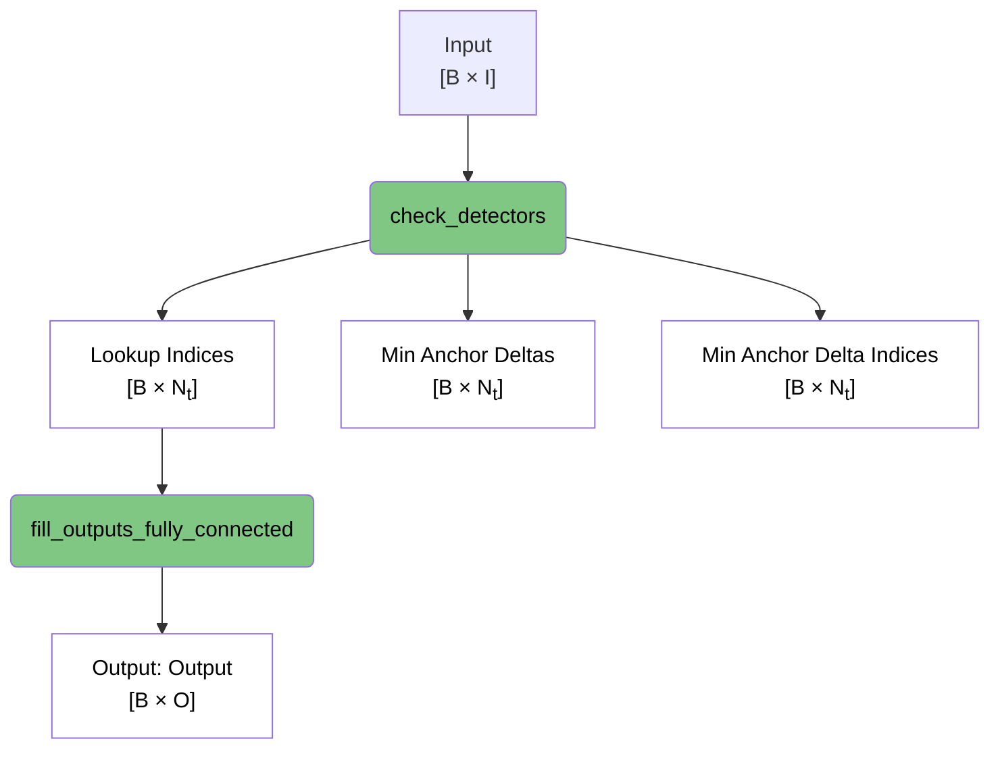
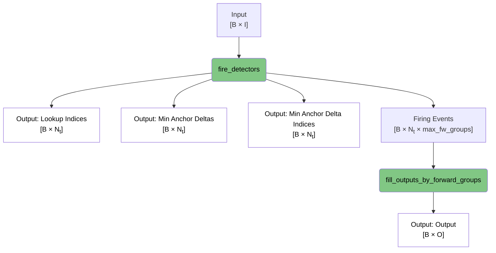
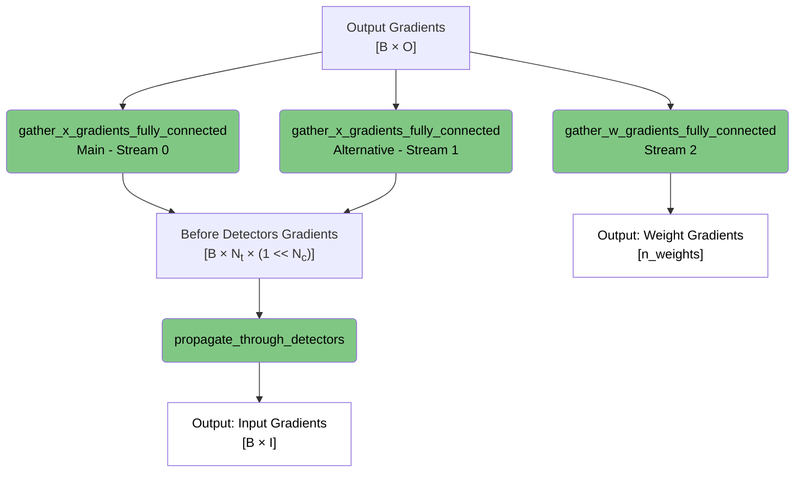
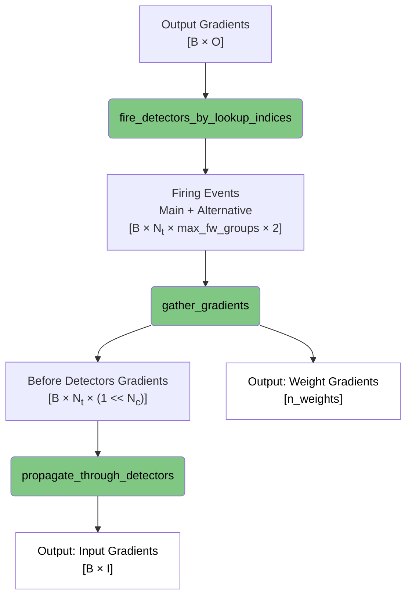
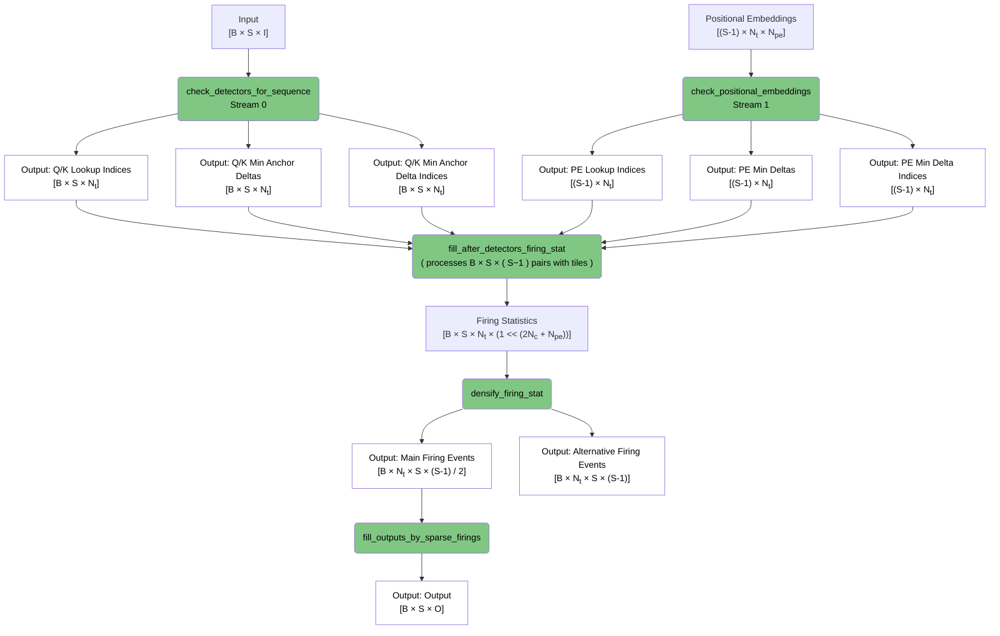
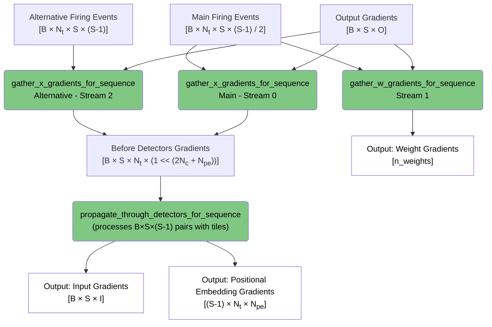

# LUT Runtime Data Flow

This document describes the data flow for both non-sequential (single timestep) and sequential (sequence processing) modes in the LUT runtime system.

## Non-Sequential Mode - Forward Pass

### Fully Connected Mode

### Sparse Connectivity Mode

## Non-Sequential Mode - Backward Pass

### Fully Connected Mode

### Sparse Connectivity Mode

## Sequential Mode - Forward Pass

## Sequential Mode - Backward Pass

