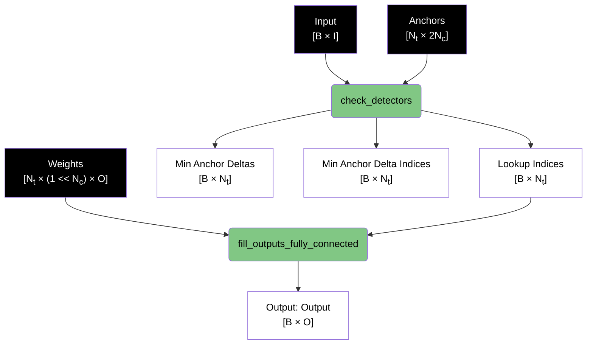
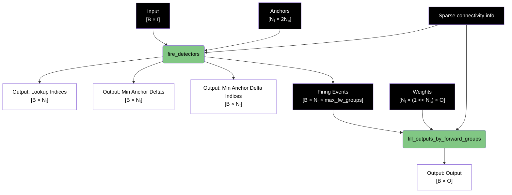
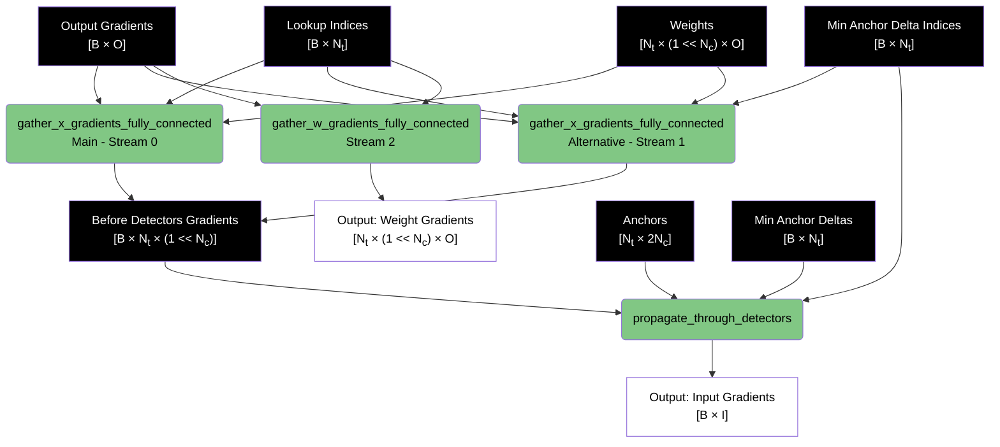
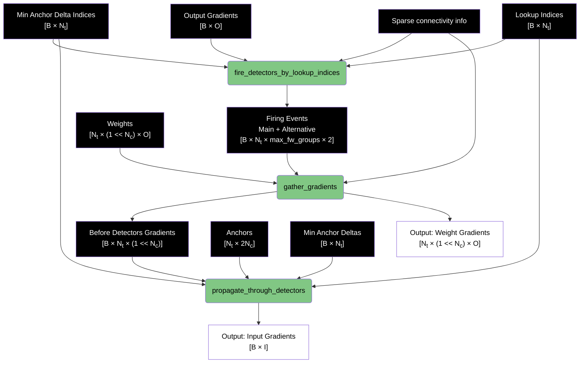
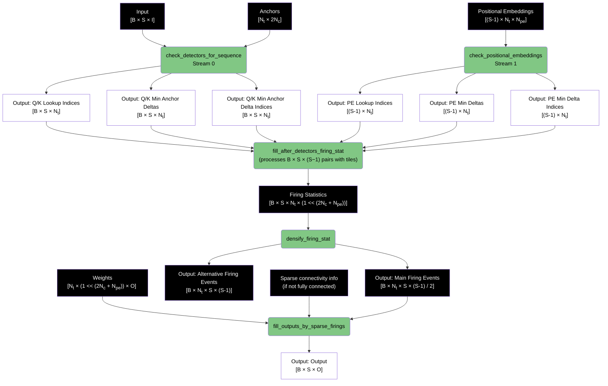
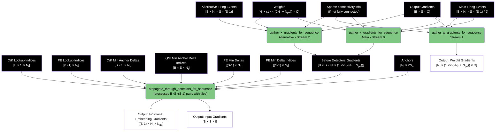

# LUT Runtime Data Flow

## Notation

- **B**: Batch size
- **I**: Number of input dimensions
- **O**: Number of output dimensions
- **S**: Sequence length
- **Nt**: Number of detectors
- **Nc**: Number of anchor pairs per detector (determines lookup table size: 2Nc)
- **Npe**: Positional embedding dimension

## Non-Sequential Mode - Forward Pass

### Fully Connected Case

### Sparse Connectivity Case

## Non-Sequential Mode - Backward Pass

### Fully Connected Case

### Sparse Connectivity Case

## Sequential Mode - Forward Pass

## Sequential Mode - Backward Pass

